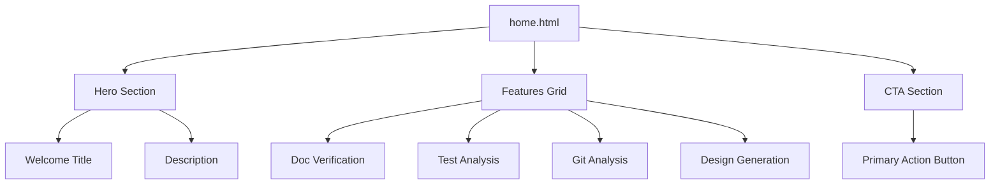
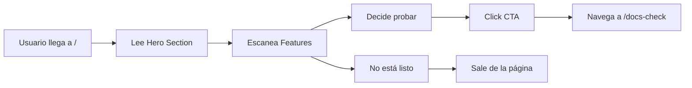

# Home.html - Página de Inicio

## 🎯 Propósito
Este archivo define la página principal de la aplicación: el landing page de autocode. Su propósito es ofrecer una vista de bienvenida que presenta las características principales del sistema, proporciona una introducción clara a las funcionalidades disponibles y guía al usuario hacia la acción principal (verificar documentación).

## 🏗️ Arquitectura


## 📋 Responsabilidades
- **Landing page**: Página de entrada principal para nuevos usuarios
- **Feature showcase**: Presentación clara de las 4 funcionalidades principales
- **User onboarding**: Introducción intuitiva al sistema autocode
- **Call-to-action**: Dirección clara hacia la funcionalidad principal
- **Visual hierarchy**: Estructura clara que guía la atención del usuario

## 🔗 Dependencias
### Internas
- `base.html` - Hereda estructura y layout base
- `components/button.html` - NO utilizado (usa enlace directo)
- `/docs-check` - Ruta de destino del CTA

### Externas
- **Jinja2** - Para herencia de templates (``)
- **Tailwind CSS** - Para styling responsive y componentes visuales

## 📊 Interfaces Públicas
### Template Blocks
- `Inicio` - Título específico de la página
- `` - Contenido principal de la landing page

### Content Sections
1. **Hero Section**: Título principal, subtítulo y descripción
2. **Features Grid**: Grid 2x2 con las 4 funcionalidades principales
3. **CTA Section**: Llamada a la acción para comenzar

## 🔧 Configuración
### Hero Section
```html
<div class="text-center py-12">
  <h1 class="text-4xl font-bold text-gray-900 mb-4">
    Bienvenido a Autocode
  </h1>
  <p class="text-xl text-gray-600 mb-8">
    Herramientas automatizadas para la calidad del código y el desarrollo
  </p>
</div>
```

### Features Grid Layout
```html
<div class="grid md:grid-cols-2 gap-8 mb-12">
  <!-- 4 feature cards -->
</div>
```

### Feature Cards Structure
- **Icon**: Emoji como icono visual
- **Title**: Título descriptivo de la funcionalidad
- **Description**: Breve explicación de qué hace cada herramienta

## 💡 Patrones de Uso
### Template Inheritance
```html


Inicio


<!-- Landing page content -->

```

### Responsive Grid
```html
<!-- Mobile: 1 column, Desktop: 2 columns -->
<div class="grid md:grid-cols-2 gap-8">
  <div class="bg-white p-6 rounded-lg shadow-md">
    <!-- Feature card content -->
  </div>
</div>
```

## ⚠️ Consideraciones
### Content Strategy
- **Progressive disclosure**: Información de alto nivel primero
- **Scan-friendly**: Headers y estructura fácil de escanear
- **Action-oriented**: CTA claro para empezar a usar la app

### Visual Design
- **Card layout**: Cada feature en una tarjeta con sombra y padding
- **Consistent spacing**: Uso de classes Tailwind para espaciado uniforme
- **Typography hierarchy**: H1 para título principal, diferentes tamaños para jerarquía

### User Experience
- **Single CTA**: Solo una acción principal para evitar decision paralysis
- **Feature preview**: Vista rápida de todas las capacidades
- **Entry point**: Diseñado como punto de entrada natural para nuevos usuarios

## 🧪 Testing
### Content Testing
1. **Hero section**: Verificar que título y subtítulo se muestran correctamente
2. **Features grid**: Comprobar que las 4 features se muestran en grid
3. **CTA button**: Validar que el enlace navega a `/docs-check`
4. **Responsive**: Verificar que grid colapsa a 1 columna en móvil

### Visual Testing
- **Cards**: Verificar sombras y bordes redondeados
- **Spacing**: Validar padding y margins consistentes
- **Typography**: Comprobar jerarquía de tamaños de texto

## 🔄 Flujo de Usuario


## 📋 Content Overview
### Features Presentadas
1. **📋 Verificación de Documentación**
   - Analiza estado de documentación
   - Identifica archivos desactualizados/faltantes

2. **🧪 Análisis de Tests**
   - Verifica cobertura de tests
   - Detecta código sin tests

3. **🔍 Análisis de Git**
   - Examina cambios en repositorio
   - Genera resúmenes para commits

4. **🎨 Generación de Diseño**
   - Crea diagramas automáticamente
   - Documentación de diseño desde código

### Call-to-Action
- **Primary action**: "Comenzar con Docs Check"
- **Target**: `/docs-check` - La funcionalidad más representativa
- **Styling**: Botón azul prominente con hover effects

## 🚀 Mejoras Futuras
- **Interactive demos**: Previews o GIFs de cada funcionalidad
- **User testimonials**: Casos de uso reales o testimonios
- **Getting started guide**: Onboarding más detallado
- **Feature comparison**: Tabla comparativa con otras herramientas
- **Screenshots**: Capturas de pantalla de la interfaz en acción
- **Analytics**: Tracking de conversión del CTA
- **A/B testing**: Testing de diferentes versiones del copy
