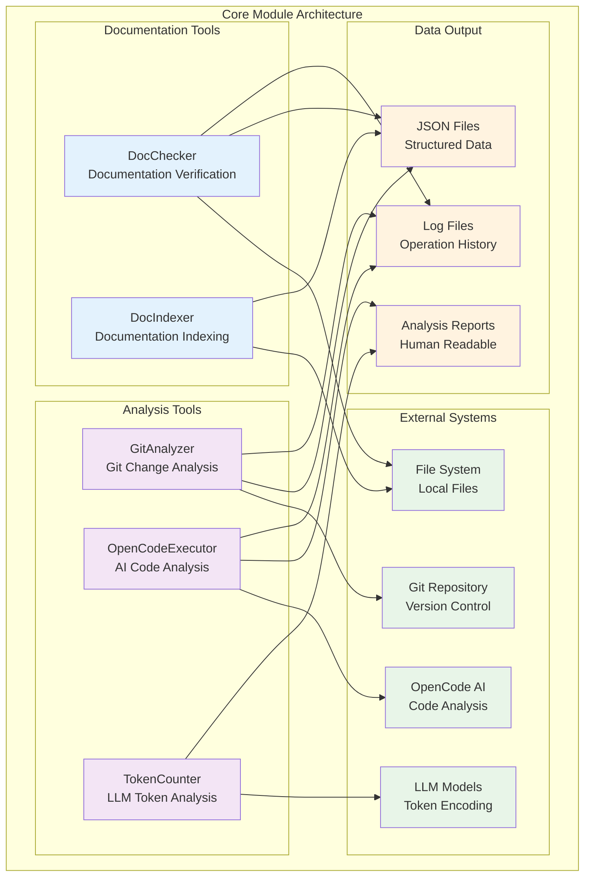
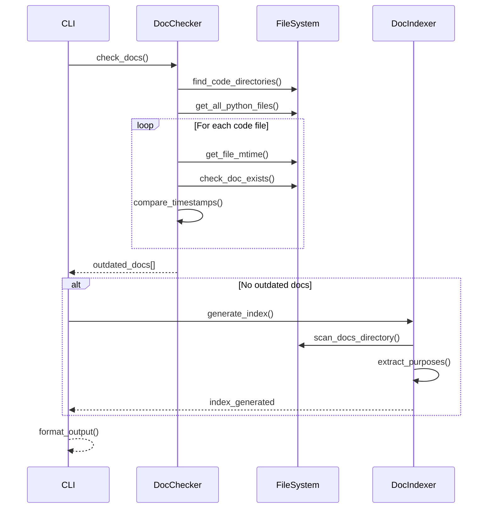
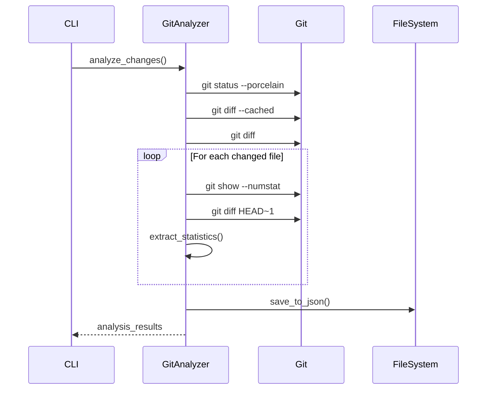
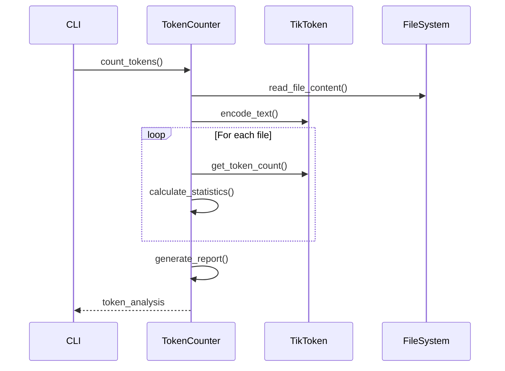

# Core Module - Documentación

## 🎯 Propósito del Módulo

El módulo `core` contiene las herramientas fundamentales del sistema autocode. Su responsabilidad principal es proporcionar los componentes básicos para análisis y verificación de código, incluyendo verificación de documentación, análisis de cambios git, integración con OpenCode AI, conteo de tokens para LLM, y generación de índices de documentación.

## 🏗️ Arquitectura del Módulo



## 📁 Componentes del Módulo

### `doc_checker.py` - Verificador de Documentación
**Propósito**: Compara fechas de modificación entre código fuente y documentación modular
**Documentación**: [doc_checker.md](doc_checker.md)

**Funcionalidades principales**:
- Detección automática de directorios de código
- Mapeo de archivos de código a documentación esperada
- Verificación de fechas de modificación
- Soporte para estructura modular (_index.md, _module.md, archivo.md)
- Formato de salida legible para humanos

### `doc_indexer.py` - Indexador de Documentación
**Propósito**: Genera índices estructurados de documentación modular en formato JSON
**Documentación**: [doc_indexer.md](doc_indexer.md)

**Funcionalidades principales**:
- Generación automática de índices de documentación
- Extracción de propósitos de archivos de documentación
- Estructura jerárquica de documentación
- Salida en formato JSON para procesamiento automatizado
- Integración con sistema de verificación de documentación

### `git_analyzer.py` - Analizador de Cambios Git
**Propósito**: Analiza cambios en el repositorio git para generar información útil
**Documentación**: [git_analyzer.md](git_analyzer.md)

**Funcionalidades principales**:
- Análisis de archivos modificados, añadidos y eliminados
- Extracción de diffs detallados
- Generación de estadísticas de cambios
- Exportación a JSON para procesamiento posterior
- Soporte para análisis de commits y staging

### `opencode_executor.py` - Ejecutor de OpenCode AI
**Propósito**: Integración con OpenCode AI para análisis inteligente de código
**Documentación**: [opencode_executor.md](opencode_executor.md)

**Funcionalidades principales**:
- Ejecución de OpenCode en modo headless (sin interfaz gráfica)
- Gestión de configuración YAML para OpenCode
- Sistema de prompts predefinidos para análisis
- Validación de setup y configuración
- Formato de salida JSON y texto para automatización

### `token_counter.py` - Contador de Tokens LLM
**Propósito**: Análisis y conteo de tokens para modelos de lenguaje grandes
**Documentación**: [token_counter.md](token_counter.md)

**Funcionalidades principales**:
- Conteo preciso de tokens usando tiktoken
- Análisis de costos de API para diferentes modelos
- Verificación de límites de contexto
- Estadísticas detalladas de archivos y proyectos
- Soporte para múltiples modelos de LLM (GPT-4, GPT-3.5, etc.)

### `test_checker.py` - Verificador de Tests
**Propósito**: Verificación del estado de tests siguiendo estructura modular
**Documentación**: [test_checker.md](test_checker.md)

**Funcionalidades principales**:
- Detección automática de tests faltantes para código Python
- Mapeo de archivos de código a tests unitarios esperados
- Mapeo de directorios a tests de integración esperados
- Ejecución de pytest para validar tests existentes
- Identificación de tests huérfanos que ya no corresponden a código
- Soporte para estructura modular de tests (unit + integration)

## 🔗 Dependencias del Módulo

### Internas (otros módulos del proyecto)
- **Ninguna**: Los componentes core son independientes entre sí

### Externas por Componente

#### DocChecker Dependencies
- `pathlib`: Manipulación de rutas de archivos
- `json`: Serialización de datos
- `typing`: Type hints
- `datetime`: Manejo de fechas de modificación

#### DocIndexer Dependencies
- `pathlib`: Manipulación de rutas de archivos
- `json`: Serialización de datos
- `typing`: Type hints
- `datetime`: Timestamps para metadatos

#### GitAnalyzer Dependencies
- `subprocess`: Ejecución de comandos git
- `pathlib`: Manipulación de rutas
- `json`: Serialización de datos
- `typing`: Type hints

#### OpenCodeExecutor Dependencies
- `subprocess`: Ejecución de OpenCode
- `pathlib`: Manipulación de rutas
- `json`: Procesamiento de configuración
- `yaml`: Configuración de OpenCode
- `typing`: Type hints

#### TokenCounter Dependencies
- `tiktoken`: Conteo de tokens para modelos LLM
- `pathlib`: Manipulación de archivos
- `typing`: Type hints
- `json`: Serialización de estadísticas

## 💡 Flujo de Trabajo Típico

### Verificación de Documentación


### Análisis de Cambios Git


### Análisis de Tokens


## 🔧 Configuración del Módulo

### Configuración General
Los componentes core generalmente no requieren configuración específica, pero pueden ser configurados a través del archivo `autocode_config.yml` del proyecto principal.

### Configuración por Componente

#### DocChecker
```yaml
doc_checker:
  enabled: true
  exclude_patterns:
    - "__pycache__"
    - "*.pyc"
    - ".git"
    - "*.egg-info"
```

#### DocIndexer
```yaml
doc_index:
  enabled: true
  auto_generate: true
  output_path: ".clinerules/docs_index.json"
```

#### GitAnalyzer
```yaml
git_analyzer:
  enabled: true
  include_diffs: true
  max_diff_size: 10000
```

#### OpenCodeExecutor
```yaml
opencode:
  enabled: true
  config_file: ".opencode.json"
  prompts_dir: "autocode/prompts"
  debug: false
  quiet: false
```

#### TokenCounter
```yaml
token_counter:
  enabled: true
  default_model: "gpt-4"
  warning_threshold: 100000
  models:
    - "gpt-4"
    - "gpt-3.5-turbo"
    - "claude-3-opus"
```

## ⚠️ Consideraciones Especiales

### Detección de Archivos
- **Auto-discovery**: DocChecker detecta automáticamente directorios con código
- **Filtros**: Ignora archivos `__init__.py` y otros patrones configurables
- **Extensiones**: Principalmente optimizado para archivos `.py`

### Dependencias del Sistema
- **Git**: GitAnalyzer requiere git instalado y repositorio inicializado
- **OpenCode**: OpenCodeExecutor requiere OpenCode AI instalado y configurado
- **TikToken**: TokenCounter requiere tiktoken para conteo de tokens

### Limitaciones de Rendimiento
- **Archivos Grandes**: TokenCounter puede ser lento con archivos muy grandes
- **Muchos Archivos**: DocChecker puede ser lento con muchos archivos
- **Diffs Grandes**: GitAnalyzer puede consumir memoria con diffs grandes

### Consideraciones de Seguridad
- **Ejecución de Comandos**: GitAnalyzer y OpenCodeExecutor ejecutan comandos del sistema
- **Archivos Temporales**: Algunos componentes pueden crear archivos temporales
- **Validación de Entrada**: Todos los componentes validan parámetros de entrada

## 🧪 Testing y Validación

### Verificar Componentes Individuales
```python
from autocode.core.doc_checker import DocChecker
from autocode.core.git_analyzer import GitAnalyzer
from autocode.core.token_counter import TokenCounter

# Test DocChecker
checker = DocChecker()
outdated = checker.get_outdated_docs()
print(f"Outdated docs: {len(outdated)}")

# Test GitAnalyzer
analyzer = GitAnalyzer()
changes = analyzer.get_changes_summary()
print(f"Modified files: {changes['total_files']}")

# Test TokenCounter
counter = TokenCounter()
stats = counter.get_token_statistics("main.py")
print(f"Tokens: {stats['token_count']}")
```

### Validación de Funcionamiento
```bash
# Test de funcionalidad básica
python -c "
from autocode.core.doc_checker import DocChecker
checker = DocChecker()
print(f'Code directories found: {len(checker.find_code_directories())}')
"

# Test de integración
python -c "
from autocode.core.git_analyzer import GitAnalyzer
analyzer = GitAnalyzer()
status = analyzer.get_repository_status()
print(f'Repository status: {status}')
"
```

## 🔄 Flujo de Datos

### Entrada de Datos
1. **File System**: Archivos de código fuente y documentación
2. **Git Repository**: Estado actual del repositorio
3. **Configuration**: Archivos de configuración del proyecto
4. **User Input**: Parámetros de línea de comandos

### Procesamiento Interno
1. **File Discovery**: Encontrar archivos relevantes automáticamente
2. **Content Analysis**: Analizar contenido de archivos
3. **Timestamp Comparison**: Comparar fechas de modificación
4. **Data Extraction**: Extraer información relevante
5. **Statistics Generation**: Generar estadísticas y métricas

### Salida de Datos
1. **JSON Files**: Datos estructurados para procesamiento automatizado
2. **Console Output**: Información formateada para humanos
3. **Log Files**: Registros de operaciones realizadas
4. **Analysis Reports**: Reportes detallados de análisis

## 📖 Navegación Detallada

### Documentación de Componentes
- [DocChecker Documentation](doc_checker.md) - Verificación de documentación modular
- [DocIndexer Documentation](doc_indexer.md) - Generación de índices de documentación
- [GitAnalyzer Documentation](git_analyzer.md) - Análisis de cambios git
- [OpenCodeExecutor Documentation](opencode_executor.md) - Integración con OpenCode AI
- [TokenCounter Documentation](token_counter.md) - Análisis de tokens LLM

### Casos de Uso Comunes
- **Pre-commit Hooks**: Verificar documentación antes de commits
- **CI/CD Integration**: Validar documentación en pipelines
- **Code Quality Analysis**: Análisis automatizado de calidad
- **LLM Integration**: Preparar código para análisis con LLM

## 🚀 Extensibilidad

### Añadir Nuevos Analizadores
```python
# Crear nuevo analizador siguiendo el patrón
class CodeComplexityAnalyzer:
    def __init__(self, project_root: Path):
        self.project_root = project_root
    
    def analyze_complexity(self):
        # Lógica de análisis
        pass
    
    def generate_report(self):
        # Generar reporte
        pass
```

### Integración con Otros Sistemas
```python
# Usar componentes core en otros sistemas
from autocode.core.doc_checker import DocChecker
from autocode.core.git_analyzer import GitAnalyzer

class ProjectHealthChecker:
    def __init__(self):
        self.doc_checker = DocChecker()
        self.git_analyzer = GitAnalyzer()
    
    def check_project_health(self):
        docs_ok = len(self.doc_checker.get_outdated_docs()) == 0
        git_clean = self.git_analyzer.is_repository_clean()
        return docs_ok and git_clean
```

### Nuevas Funcionalidades
```python
# Extender funcionalidad existente
class EnhancedDocChecker(DocChecker):
    def check_doc_quality(self):
        """Verificar calidad de documentación además de fechas"""
        # Implementar verificación de calidad
        pass
    
    def suggest_improvements(self):
        """Sugerir mejoras para documentación"""
        # Implementar sugerencias
        pass
```

## 📈 Métricas y Monitoreo

### Métricas Disponibles
- **Documentation Coverage**: Porcentaje de archivos documentados
- **Documentation Freshness**: Tiempo desde última actualización
- **Git Activity**: Frecuencia de cambios en el repositorio
- **Token Usage**: Análisis de tokens por archivo y proyecto
- **Performance**: Tiempo de ejecución de análisis

### Indicadores de Calidad
- **Outdated Documentation**: Número de archivos con documentación desactualizada
- **Missing Documentation**: Archivos sin documentación
- **Code Churn**: Frecuencia de cambios en archivos
- **Token Efficiency**: Optimización de tokens para LLM

### Alertas y Notificaciones
- **Documentation Drift**: Cuando documentación se desactualiza
- **High Token Usage**: Archivos que exceden límites de tokens
- **Missing Documentation**: Nuevos archivos sin documentación
- **System Errors**: Errores en el proceso de análisis
