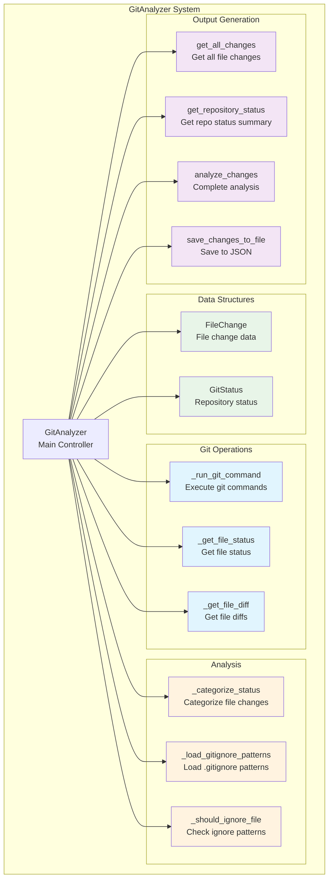
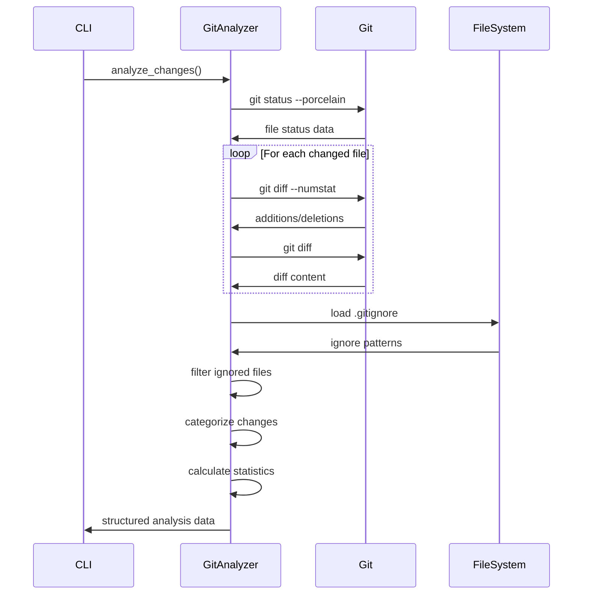

# GitAnalyzer - Analizador de Cambios Git

## 🎯 Propósito
GitAnalyzer es el componente responsable de analizar cambios en el repositorio git para extraer información útil sobre modificaciones, estadísticas y diffs detallados. Su principal uso es generar datos estructurados que pueden ayudar en la creación de mensajes de commit descriptivos y análisis de cambios del proyecto.

## 🏗️ Arquitectura


## 📋 Responsabilidades
- **Análisis de cambios git**: Identificar archivos modificados, añadidos, eliminados y renombrados
- **Extracción de diffs**: Obtener diferencias detalladas de cada archivo
- **Categorización de estado**: Clasificar tipos de cambios (staged, unstaged, untracked)
- **Respeto de .gitignore**: Filtrar archivos según patrones de .gitignore
- **Generación de estadísticas**: Calcular métricas de cambios en el repositorio
- **Exportación JSON**: Crear archivos estructurados para análisis posterior

## 🔗 Dependencias
### Internas
- Ninguna (módulo independiente)

### Externas
- `subprocess`: Ejecución de comandos git
- `json`: Serialización de datos de análisis
- `pathlib`: Manipulación de rutas
- `fnmatch`: Matching de patrones de .gitignore
- `datetime`: Timestamps de análisis

## 📊 Interfaces Públicas

### Estructuras de Datos
```python
class FileChange(NamedTuple):
    """Representa un cambio en un archivo."""
    file: str           # Ruta del archivo
    status: str         # Estado del cambio
    staged: bool        # Si está en staging area
    additions: int      # Líneas añadidas
    deletions: int      # Líneas eliminadas
    diff: str          # Diferencias del archivo

class GitStatus(NamedTuple):
    """Representa resumen del estado del repositorio."""
    total_files: int    # Total de archivos modificados
    modified: int       # Archivos modificados
    added: int         # Archivos añadidos
    deleted: int       # Archivos eliminados
    untracked: int     # Archivos sin seguimiento
    renamed: int       # Archivos renombrados
```

### Clase Principal
```python
class GitAnalyzer:
    """Analiza cambios git y genera datos estructurados."""
    
    def __init__(self, project_root: Path):
        """Inicializar analizador git."""
    
    def analyze_changes(self) -> Dict:
        """Analizar todos los cambios git y retornar datos estructurados."""
    
    def save_changes_to_file(self, output_path: Path) -> Dict:
        """Analizar cambios y guardar en archivo JSON."""
```

### Métodos de Análisis
```python
def get_all_changes(self) -> List[FileChange]:
    """Obtener todos los cambios de archivos (staged y unstaged)."""

def get_repository_status(self, changes: List[FileChange]) -> GitStatus:
    """Obtener resumen del estado del repositorio."""

def _get_file_status(self) -> Dict[str, tuple]:
    """Obtener estado de todos los archivos modificados."""

def _get_file_diff(self, filepath: str, staged: bool = False) -> tuple:
    """Obtener diff para un archivo específico."""
```

### Métodos de Filtrado
```python
def _load_gitignore_patterns(self) -> Set[str]:
    """Cargar patrones del archivo .gitignore."""

def _should_ignore_file(self, filepath: str) -> bool:
    """Verificar si un archivo debe ser ignorado."""

def _categorize_status(self, index_status: Optional[str], worktree_status: Optional[str]) -> str:
    """Categorizar estado del archivo basado en formato porcelain."""
```

## 🔧 Configuración
### Estados de Archivo Soportados
```python
# Estados principales
"modified"    # Archivo modificado
"added"       # Archivo añadido (nuevo)
"deleted"     # Archivo eliminado
"untracked"   # Archivo sin seguimiento
"renamed"     # Archivo renombrado
"copied"      # Archivo copiado
"unknown"     # Estado desconocido
```

### Formato de Salida JSON
```json
{
  "timestamp": "2025-01-01T12:00:00",
  "repository_status": {
    "total_files": 5,
    "modified": 2,
    "added": 2,
    "deleted": 0,
    "untracked": 1,
    "renamed": 0
  },
  "modified_files": [
    "autocode/cli.py",
    "autocode/core/git_analyzer.py",
    "docs/autocode/cli.md",
    "new_file.py"
  ],
  "changes": [
    {
      "file": "autocode/cli.py",
      "status": "modified",
      "staged": true,
      "additions": 15,
      "deletions": 3,
      "diff": "@@ -1,10 +1,22 @@\n..."
    }
  ]
}
```

## 💡 Patrones de Uso

### Análisis Básico de Cambios
```python
from autocode.core.git_analyzer import GitAnalyzer

# Inicializar analizador
analyzer = GitAnalyzer(project_root=Path.cwd())

# Analizar cambios
changes_data = analyzer.analyze_changes()

# Acceder a estadísticas
status = changes_data["repository_status"]
print(f"Total files changed: {status['total_files']}")
print(f"Added: {status['added']}, Modified: {status['modified']}")
```

### Generación de Archivo de Análisis
```python
# Guardar análisis en archivo
output_file = Path("git_changes.json")
changes_data = analyzer.save_changes_to_file(output_file)

print(f"Analysis saved to: {output_file}")
print(f"Modified files: {changes_data['modified_files']}")
```

### Análisis Detallado de Cambios
```python
# Obtener cambios individuales
changes = analyzer.get_all_changes()

# Filtrar por tipo
staged_changes = [c for c in changes if c.staged]
unstaged_changes = [c for c in changes if not c.staged]
untracked_files = [c for c in changes if c.status == 'untracked']

# Estadísticas detalladas
for change in changes:
    print(f"{change.file}: {change.status}")
    print(f"  +{change.additions} -{change.deletions}")
    if change.staged:
        print("  [STAGED]")
```

### Integración con CLI
```python
# Uso en autocode CLI
def git_changes_command(args) -> int:
    analyzer = GitAnalyzer(project_root)
    changes_data = analyzer.save_changes_to_file(output_file)
    
    # Mostrar resumen
    status = changes_data["repository_status"]
    print(f"📊 Repository Status:")
    print(f"   Total files changed: {status['total_files']}")
    print(f"   Modified: {status['modified']}")
    
    return 0
```

## ⚠️ Consideraciones
- **Dependencia de Git**: Requiere que el directorio sea un repositorio git válido
- **Encoding**: Maneja correctamente archivos con caracteres especiales
- **Archivos binarios**: Detecta y maneja archivos binarios apropiadamente
- **Patrones .gitignore**: Respeta patrones de exclusión automáticamente
- **Archivos grandes**: Puede ser lento con archivos muy grandes o muchos cambios
- **Permisos**: Requiere permisos de lectura en el repositorio git

## 🧪 Testing
### Verificar Detección de Cambios
```python
# Crear archivos de prueba
test_file = project_root / "test_file.py"
test_file.write_text("print('hello world')")

# Ejecutar git add
subprocess.run(["git", "add", "test_file.py"], cwd=project_root)

# Analizar cambios
analyzer = GitAnalyzer(project_root)
changes = analyzer.get_all_changes()

# Verificar detección
added_files = [c for c in changes if c.status == 'added' and c.file == 'test_file.py']
assert len(added_files) > 0
```

### Verificar Filtrado de .gitignore
```python
# Crear archivo .gitignore
gitignore = project_root / ".gitignore"
gitignore.write_text("*.pyc\n__pycache__/\n")

# Crear archivo que debe ser ignorado
pyc_file = project_root / "test.pyc"
pyc_file.write_text("compiled")

# Verificar que se ignora
analyzer = GitAnalyzer(project_root)
assert analyzer._should_ignore_file("test.pyc") == True
assert analyzer._should_ignore_file("__pycache__/file.pyc") == True
```

### Verificar Estadísticas
```python
# Crear varios tipos de cambios y verificar estadísticas
changes = [
    FileChange("file1.py", "modified", True, 10, 2, "diff1"),
    FileChange("file2.py", "added", False, 20, 0, "diff2"),
    FileChange("file3.py", "deleted", True, 0, 15, "diff3")
]

status = analyzer.get_repository_status(changes)
assert status.total_files == 3
assert status.modified == 1
assert status.added == 1
assert status.deleted == 1
```

## 🔄 Flujo de Datos


## 🚀 Casos de Uso Principales

### Generación de Mensajes de Commit
```bash
# Generar análisis para commit
uv run -m autocode.cli git-changes --output git_changes.json

# Usar con herramientas de IA para generar mensaje
# El archivo JSON contiene toda la información necesaria
```

### Monitoreo de Desarrollo
```python
# Análisis periódico de cambios
analyzer = GitAnalyzer(project_root)
changes_data = analyzer.analyze_changes()

# Alertas basadas en estadísticas
if changes_data["repository_status"]["total_files"] > 50:
    print("⚠️ Many files changed, consider splitting commit")

# Análisis de patrones
modified_files = changes_data["modified_files"]
if any("requirements" in f for f in modified_files):
    print("📦 Dependencies changed, update documentation")
```

### Integración con CI/CD
```yaml
# GitHub Actions example
- name: Analyze Git Changes
  run: |
    uv run -m autocode.cli git-changes
    # Use git_changes.json for automated analysis
```

### Análisis de Productividad
```python
# Estadísticas de desarrollo
changes_data = analyzer.analyze_changes()
total_additions = sum(c["additions"] for c in changes_data["changes"])
total_deletions = sum(c["deletions"] for c in changes_data["changes"])

print(f"Code churn: +{total_additions} -{total_deletions}")
print(f"Net change: {total_additions - total_deletions} lines")
```

## 🔧 Comandos Git Utilizados
### Comandos Principales
```bash
# Estado del repositorio
git status --porcelain

# Diferencias numéricas
git diff --numstat [--cached] [-- file]

# Contenido de diferencias
git diff [--cached] [-- file]

# Para archivos sin seguimiento
git diff --no-index /dev/null file
```

### Manejo de Casos Especiales
- **Archivos renombrados**: Detecta formato "R old -> new"
- **Directorios sin seguimiento**: Expande recursivamente
- **Archivos binarios**: Maneja apropiadamente
- **Archivos grandes**: Trunca diffs si es necesario

El GitAnalyzer es una herramienta esencial para el análisis automatizado de cambios en el repositorio, proporcionando datos estructurados que facilitan la generación inteligente de mensajes de commit y el monitoreo del desarrollo.
