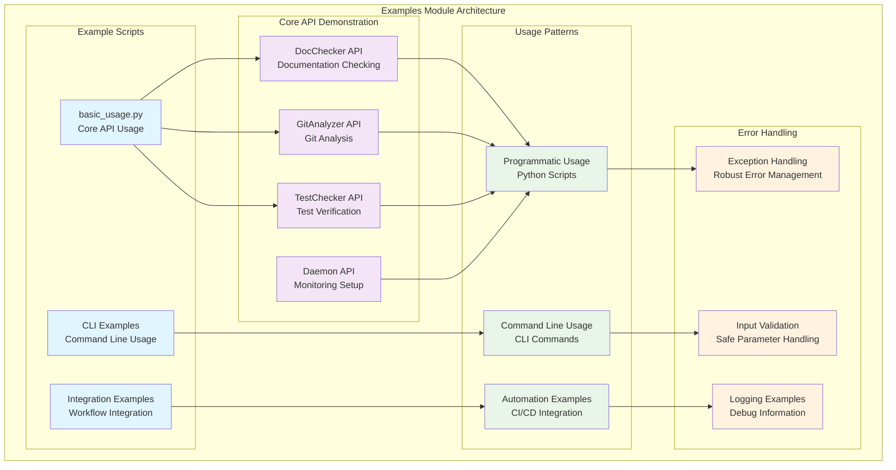
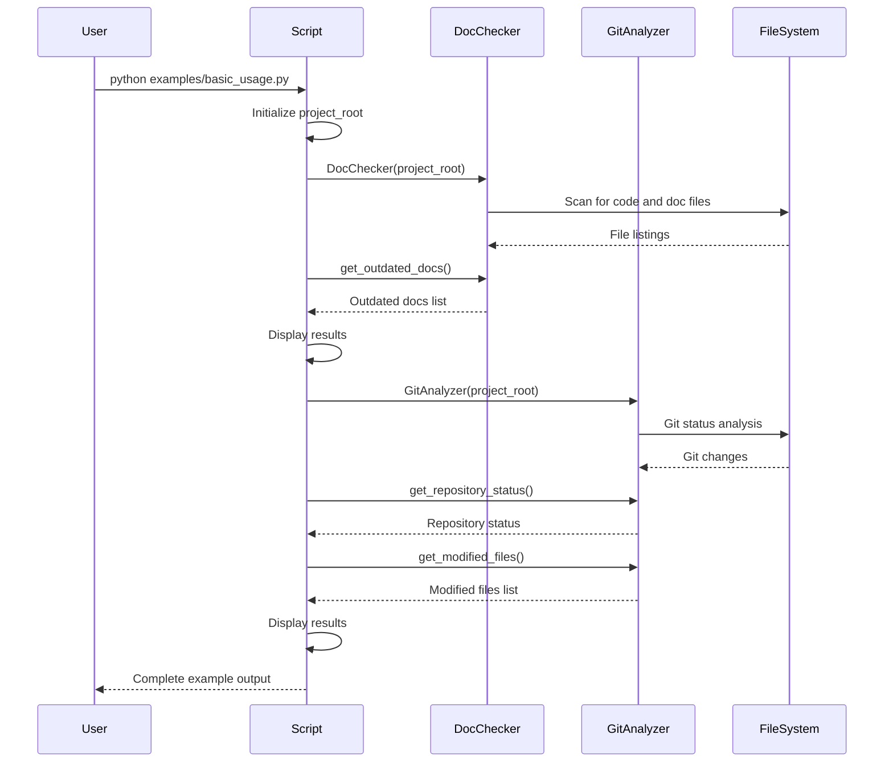
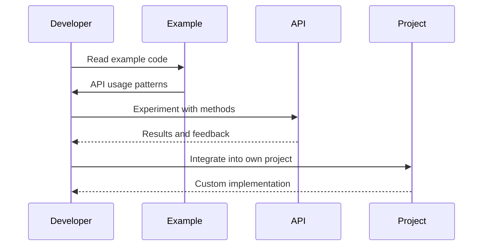

# Examples Module - Documentación

## 🎯 Propósito del Módulo

El módulo `examples` contiene ejemplos prácticos y casos de uso que demuestran cómo utilizar autocode tanto programáticamente como desde la línea de comandos. Su responsabilidad principal es proporcionar código ejecutable que sirva como referencia, tutorial, y punto de partida para desarrolladores que quieran integrar autocode en sus proyectos o flujos de trabajo.

## 🏗️ Arquitectura del Módulo



## 📁 Componentes del Módulo

### `basic_usage.py` - Ejemplo de Uso Básico
**Propósito**: Demuestra el uso programático fundamental de autocode con DocChecker y GitAnalyzer
**Documentación**: [basic_usage.md](basic_usage.md)

**Características implementadas**:
- **Inicialización de componentes**: Configuración básica de DocChecker y GitAnalyzer
- **Verificación de documentación**: Detección de documentación desactualizada
- **Análisis de cambios git**: Obtención de estado del repositorio y archivos modificados
- **Manejo de errores**: Exceptions handling con mensajes informativos
- **Output formateado**: Presentación clara de resultados con emojis y estructura

**Funcionalidades demostradas**:
- **DocChecker.get_outdated_docs()**: Verificación de documentación actualizada
- **GitAnalyzer.get_repository_status()**: Estadísticas del repositorio
- **GitAnalyzer.get_modified_files()**: Lista de archivos modificados
- **Error handling**: Manejo robusto de excepciones
- **CLI recommendations**: Sugerencias para uso via línea de comandos

## 🔗 Dependencias del Módulo

### Internas (otros módulos del proyecto)
- **autocode.core.doc_checker**: DocChecker para verificación de documentación
- **autocode.core.git_analyzer**: GitAnalyzer para análisis de cambios git
- **autocode.core.test_checker**: TestChecker para verificación de tests (futuro)
- **autocode.orchestration.daemon**: AutocodeDaemon para monitoreo (futuro)

### Externas
- **pathlib**: Manipulación de rutas de archivos
- **Python 3.12+**: Versión mínima requerida del intérprete
- **Git**: Sistema de control de versiones (requerido para GitAnalyzer)

### Dependencias del Sistema
- **Git repository**: Los ejemplos asumen un repositorio git inicializado
- **Project structure**: Estructura de proyecto con código fuente para analizar
- **Documentation files**: Archivos de documentación para verificar

## 💡 Flujo de Trabajo Típico

### Ejecución del Ejemplo Básico


### Flujo de Aprendizaje


## 🔧 Configuración del Módulo

### Estructura de Archivos
```
examples/
└── basic_usage.py    # Ejemplo básico de uso programático
```

### Requisitos de Ejecución
```bash
# Desde directorio del proyecto
python examples/basic_usage.py

# O usando uv
uv run examples/basic_usage.py
```

### Configuración del Entorno
```python
# En basic_usage.py
from pathlib import Path
from autocode.core.doc_checker import DocChecker
from autocode.core.git_analyzer import GitAnalyzer

# Configuración automática basada en directorio actual
project_root = Path.cwd()
```

## ⚠️ Consideraciones Especiales

### Requisitos del Sistema
- **Git Repository**: Los ejemplos asumen un repositorio git inicializado
- **Python Environment**: Entorno Python con autocode instalado
- **File Permissions**: Permisos de lectura para archivos del proyecto
- **Git Configuration**: Git configurado correctamente en el sistema

### Casos de Error Comunes
- **No Git Repository**: Error si no hay repositorio git
- **Missing Dependencies**: Error si autocode no está instalado
- **Permission Errors**: Error si no hay permisos para leer archivos
- **Empty Project**: Comportamiento con proyectos sin archivos

### Limitaciones Conocidas
- **Git Dependency**: Requiere git para funcionar correctamente
- **Project Structure**: Asume estructura de proyecto estándar
- **Documentation Patterns**: Basado en patrones de documentación específicos
- **Language Support**: Enfocado principalmente en proyectos Python

## 🧪 Testing y Validación

### Pruebas Manuales
```bash
# Ejecutar ejemplo básico
python examples/basic_usage.py

# Verificar output esperado:
# 1. Información del proyecto
# 2. Estado de documentación
# 3. Análisis de cambios git
# 4. Recomendaciones CLI
```

### Validación de Funcionalidad
```python
# Test de funcionalidad básica
def test_basic_usage():
    from examples.basic_usage import main
    
    # Ejecutar ejemplo sin errores
    try:
        main()
        print("✅ Basic usage example works")
    except Exception as e:
        print(f"❌ Basic usage example failed: {e}")
```

### Verificación de Dependencias
```bash
# Verificar que todas las dependencias están disponibles
python -c "from autocode.core.doc_checker import DocChecker; print('DocChecker OK')"
python -c "from autocode.core.git_analyzer import GitAnalyzer; print('GitAnalyzer OK')"
```

## 🔄 Flujo de Datos

### Datos de Entrada
- **project_root**: Directorio raíz del proyecto (Path.cwd())
- **File System**: Archivos de código y documentación
- **Git Repository**: Estado del repositorio y cambios

### Procesamiento Interno
1. **Initialization**: Configuración de componentes autocode
2. **Documentation Check**: Verificación de documentación desactualizada
3. **Git Analysis**: Análisis de cambios del repositorio
4. **Error Handling**: Manejo de excepciones y errores
5. **Output Formatting**: Formateo de resultados para presentación

### Datos de Salida
- **Console Output**: Información formateada para el usuario
- **Status Information**: Estado de documentación y repositorio
- **Error Messages**: Mensajes de error si ocurren problemas
- **Recommendations**: Sugerencias para próximos pasos

## 📊 Métricas y Estadísticas

### Métricas de Documentación
- **Total Files**: Número total de archivos analizados
- **Outdated Count**: Número de archivos de documentación desactualizados
- **Up-to-date Count**: Número de archivos con documentación actualizada
- **Coverage**: Porcentaje de archivos con documentación

### Métricas de Git
- **Total Files Changed**: Número total de archivos modificados
- **Modified Files**: Archivos modificados pero no staged
- **Added Files**: Archivos nuevos agregados
- **Deleted Files**: Archivos eliminados
- **Untracked Files**: Archivos no rastreados por git

### Métricas de Rendimiento
- **Execution Time**: Tiempo total de ejecución del ejemplo
- **Documentation Check Time**: Tiempo de verificación de documentación
- **Git Analysis Time**: Tiempo de análisis de cambios git
- **Error Rate**: Frecuencia de errores durante ejecución

## 🎓 Propósito Educativo

### Conceptos Demostrados
- **API Usage**: Uso básico de la API de autocode
- **Error Handling**: Manejo robusto de errores
- **File System Operations**: Operaciones con archivos y directorios
- **Git Integration**: Integración con sistemas de control de versiones
- **Output Formatting**: Presentación clara de resultados

### Patrones de Uso
- **Initialization Pattern**: Configuración inicial de componentes
- **Check-and-Report Pattern**: Verificación y reporte de resultados
- **Exception Handling Pattern**: Manejo seguro de errores
- **Output Formatting Pattern**: Presentación estructurada de datos

### Mejores Prácticas
- **Path Management**: Uso de pathlib para manejo de rutas
- **Error Handling**: Try-except blocks para operaciones que pueden fallar
- **User Feedback**: Output claro y estructurado para el usuario
- **Code Organization**: Estructura clara y comentada del código

## 🚀 Extensibilidad

### Nuevos Ejemplos
```python
# Ejemplo de test checking
def test_checking_example():
    from autocode.core.test_checker import TestChecker
    
    project_root = Path.cwd()
    test_checker = TestChecker(project_root)
    
    test_statuses = test_checker.get_test_statuses()
    # Process and display results
```

### Ejemplos de Daemon
```python
# Ejemplo de daemon usage
def daemon_example():
    from autocode.orchestration.daemon import AutocodeDaemon
    
    daemon = AutocodeDaemon()
    status = daemon.get_daemon_status()
    # Monitor and display daemon status
```

### Integración con CI/CD
```python
# Ejemplo para CI/CD
def ci_cd_example():
    """Example for CI/CD integration."""
    doc_checker = DocChecker(Path.cwd())
    outdated_docs = doc_checker.get_outdated_docs()
    
    if outdated_docs:
        print("❌ CI/CD: Documentation is outdated")
        exit(1)
    else:
        print("✅ CI/CD: Documentation is up to date")
        exit(0)
```

## 📖 Navegación Detallada

### Archivos del Módulo
- [Basic Usage Example](basic_usage.md) - Ejemplo de uso básico programático

### Ejemplos Relacionados
- **CLI Examples**: Ver documentación de autocode.cli para ejemplos de línea de comandos
- **API Examples**: Ver documentación de módulos core para ejemplos de API
- **Integration Examples**: Ver documentación de orchestration para ejemplos de integración

### Próximos Pasos
Después de ejecutar los ejemplos, el usuario puede:
1. **Explorar CLI**: `autocode check-docs`, `autocode git-changes`
2. **Usar Dashboard**: `autocode daemon` para interfaz web
3. **Integrar en Proyecto**: Usar los patrones demostrados en código propio
4. **Configurar Automatización**: Configurar checks automáticos con config files

## 🔧 Personalización

### Modificar Configuración
```python
# Personalizar configuración
from autocode.api.models import AutocodeConfig, DocsConfig

config = AutocodeConfig(
    docs=DocsConfig(
        source_dirs=["src", "lib"],  # Directorios personalizados
        doc_dir="documentation",     # Directorio de docs personalizado
        patterns=["*.py", "*.js"]    # Patrones de archivos personalizados
    )
)

doc_checker = DocChecker(project_root, config.docs)
```

### Personalizar Output
```python
# Personalizar formato de salida
def custom_output_format(outdated_docs):
    if outdated_docs:
        print("📋 CUSTOM: Outdated documentation found:")
        for doc in outdated_docs:
            print(f"   🔄 {doc.doc_file} needs update")
    else:
        print("🎉 CUSTOM: All documentation is perfect!")
```

### Agregar Nuevas Verificaciones
```python
# Agregar verificaciones personalizadas
def custom_checks():
    """Add custom verification logic."""
    
    # Custom documentation patterns
    custom_patterns = ["*.md", "*.rst", "*.txt"]
    
    # Custom git analysis
    custom_git_filters = ["--since=1.week.ago"]
    
    # Implementation of custom checks
    pass
```

## 🔄 Integración con Otros Módulos

### Integración con Core
- **DocChecker**: Verificación de documentación
- **GitAnalyzer**: Análisis de cambios git
- **TestChecker**: Verificación de tests (futuro)
- **TokenCounter**: Análisis de tokens (futuro)

### Integración con CLI
- **Command Examples**: Demostración de comandos CLI
- **Configuration**: Uso de archivos de configuración
- **Output Format**: Consistencia con formato CLI

### Integración con Orchestration
- **Daemon Usage**: Ejemplos de uso del daemon
- **Scheduler**: Ejemplos de programación de tareas
- **Monitoring**: Ejemplos de monitoreo continuo

## 🎯 Casos de Uso Típicos

### Desarrollo Local
```python
# Verificar estado antes de commit
def pre_commit_check():
    doc_checker = DocChecker(Path.cwd())
    git_analyzer = GitAnalyzer(Path.cwd())
    
    # Check documentation
    outdated_docs = doc_checker.get_outdated_docs()
    
    # Check git changes
    status = git_analyzer.get_repository_status()
    
    if outdated_docs:
        print("⚠️  Please update documentation before committing")
        return False
    
    print("✅ Ready to commit")
    return True
```

### Automatización de QA
```python
# Verificación automática de calidad
def quality_assurance():
    checks = {
        'documentation': DocChecker(Path.cwd()).get_outdated_docs(),
        'git_status': GitAnalyzer(Path.cwd()).get_repository_status(),
    }
    
    for check_name, result in checks.items():
        print(f"🔍 {check_name}: {result}")
```

### Reporting y Métricas
```python
# Generación de reportes
def generate_project_report():
    """Generate comprehensive project report."""
    doc_checker = DocChecker(Path.cwd())
    git_analyzer = GitAnalyzer(Path.cwd())
    
    report = {
        'documentation_status': doc_checker.get_outdated_docs(),
        'git_activity': git_analyzer.get_repository_status(),
        'timestamp': datetime.now().isoformat()
    }
    
    return report
