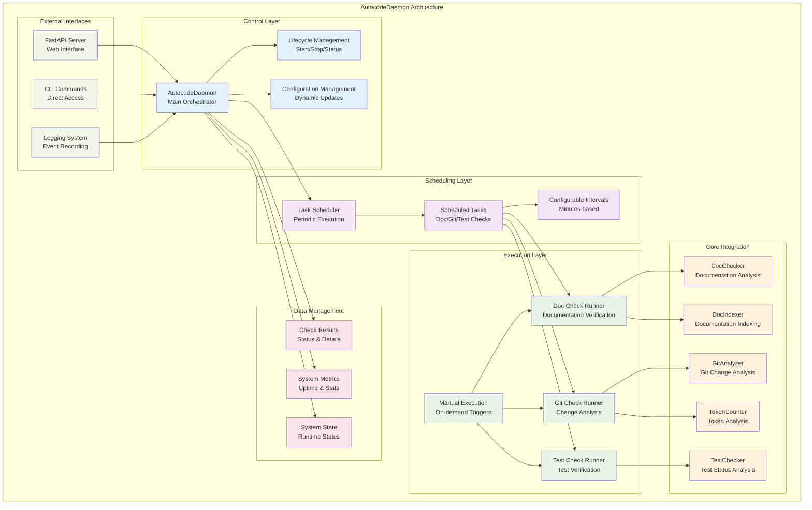
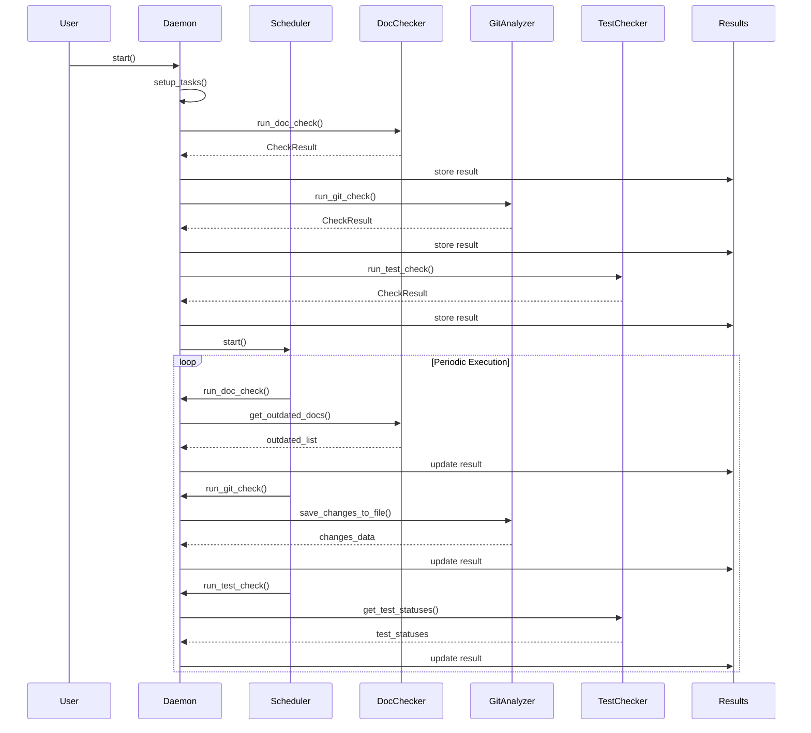
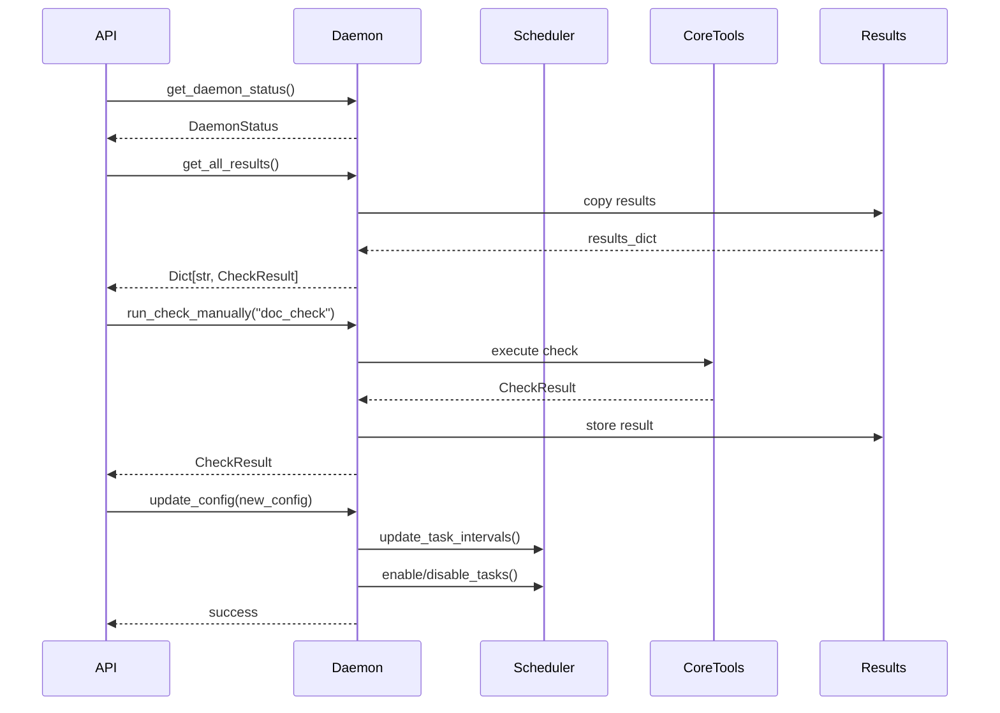

# AutocodeDaemon - Sistema de Monitoreo Continuo

## 🎯 Propósito

AutocodeDaemon es el orquestador central del sistema autocode que ejecuta verificaciones periódicas automatizadas y coordina todas las operaciones de monitoreo. Su responsabilidad principal es mantener el sistema funcionando de manera continua, ejecutar verificaciones programadas, y proporcionar una interfaz unificada para el estado del sistema.

## 🏗️ Arquitectura



## 📋 Responsabilidades

### Orquestación Central
- **Coordinación de verificaciones** usando DocChecker, GitAnalyzer y TestChecker
- **Gestión del scheduler** para ejecución periódica automatizada
- **Mantenimiento del estado** del sistema y resultados de verificaciones
- **Interfaz unificada** para todas las operaciones del sistema

### Gestión de Ciclo de Vida
- **Inicialización** del daemon y todos sus componentes
- **Shutdown graceful** con limpieza de recursos
- **Monitoreo de uptime** y estadísticas de funcionamiento
- **Recovery automático** en caso de errores no fatales

### Ejecución de Verificaciones
- **Verificación de documentación** con DocChecker + DocIndexer automático
- **Análisis de cambios git** con GitAnalyzer + conteo de tokens
- **Verificación de tests** con TestChecker + ejecución opcional
- **Triggers manuales** para ejecución bajo demanda

### Gestión de Configuración
- **Configuración dinámica** sin necesidad de reinicio
- **Actualización de intervalos** de tareas programadas
- **Habilitación/deshabilitación** de verificaciones específicas
- **Persistencia de configuración** entre reinicios

## 🔗 Dependencias

### Internas
- **autocode.core.doc_checker**: DocChecker para verificación de documentación
- **autocode.core.git_analyzer**: GitAnalyzer para análisis de cambios
- **autocode.core.doc_indexer**: DocIndexer para generación de índices
- **autocode.core.test_checker**: TestChecker para verificación de tests
- **autocode.core.token_counter**: TokenCounter para análisis de tokens (opcional)
- **autocode.orchestration.scheduler**: Scheduler para tareas programadas
- **autocode.api.models**: Modelos Pydantic para estructuras de datos

### Externas
- **asyncio**: Programación asíncrona y manejo de tasks
- **logging**: Sistema de logging para eventos y errores
- **pathlib**: Manipulación de rutas de archivos
- **typing**: Type hints para mejor documentación del código
- **datetime**: Manejo de fechas y tiempos
- **time**: Medición de duración y timestamps

## 🚀 Inicialización y Configuración

### Constructor
```python
def __init__(self, project_root: Path = None, config: AutocodeConfig = None):
    """Initialize the daemon.
    
    Args:
        project_root: Project root directory
        config: Daemon configuration
    """
    self.project_root = project_root or Path.cwd()
    self.config = config or AutocodeConfig()
```

**Parámetros**:
- `project_root`: Directorio raíz del proyecto (default: directorio actual)
- `config`: Configuración del daemon (default: configuración por defecto)

### Inicialización de Componentes
```python
# Initialize components
self.doc_checker = DocChecker(self.project_root)
self.git_analyzer = GitAnalyzer(self.project_root)
self.test_checker = TestChecker(self.project_root, self.config.tests)
self.scheduler = Scheduler()

# State
self.start_time = None
self.total_checks_run = 0
self.results: Dict[str, CheckResult] = {}
```

### Setup de Tareas Programadas
```python
def _setup_tasks(self):
    """Setup scheduled tasks."""
    # Add doc check task
    if self.config.daemon.doc_check.enabled:
        self.scheduler.add_task(
            name="doc_check",
            func=self.run_doc_check,
            interval_seconds=self.config.daemon.doc_check.interval_minutes * 60,
            enabled=True
        )
    
    # Add git check task
    if self.config.daemon.git_check.enabled:
        self.scheduler.add_task(
            name="git_check",
            func=self.run_git_check,
            interval_seconds=self.config.daemon.git_check.interval_minutes * 60,
            enabled=True
        )
    
    # Add test check task
    if self.config.daemon.test_check.enabled:
        self.scheduler.add_task(
            name="test_check",
            func=self.run_test_check,
            interval_seconds=self.config.daemon.test_check.interval_minutes * 60,
            enabled=True
        )
```

## 🔍 Verificaciones Implementadas

### Verificación de Documentación
```python
def run_doc_check(self) -> CheckResult:
    """Run documentation check using existing DocChecker."""
```

**Proceso**:
1. **Ejecutar DocChecker** para detectar documentación desactualizada
2. **Generar índice automático** si está habilitado (`doc_index.auto_generate`)
3. **Formatear resultados** con estadísticas y detalles
4. **Generar CheckResult** con status apropiado

**Outputs**:
- **Success**: "✅ All documentation is up to date! + Index updated"
- **Warning**: "⚠️ X documents need attention"
- **Error**: "❌ Error running documentation check"

**Detalles incluidos**:
- `outdated_count`: Número de documentos desactualizados
- `files`: Lista detallada de archivos que necesitan atención
- `doc_index_generated`: Path del índice generado (si aplicable)
- `doc_index_stats`: Estadísticas del índice generado

### Análisis de Cambios Git
```python
def run_git_check(self) -> CheckResult:
    """Run git analysis and generate git_changes.json with token counting."""
```

**Proceso**:
1. **Generar git_changes.json** usando GitAnalyzer
2. **Contar tokens** en el archivo generado (si está habilitado)
3. **Verificar umbrales** de tokens y generar alertas
4. **Formatear estadísticas** de cambios y tokens

**Outputs**:
- **Success**: "✅ No changes detected"
- **Warning**: "📊 X files changed" o "⚠️ TOKEN ALERT: tokens > threshold"
- **Error**: "❌ Error running git analysis"

**Alertas de tokens**:
```python
token_warning = {
    "message": "Token count exceeds threshold!",
    "current": token_count,
    "threshold": threshold,
    "percentage": (token_count / threshold) * 100,
    "tokens_over": token_count - threshold
}
```

### Verificación de Tests
```python
def run_test_check(self) -> CheckResult:
    """Run test check using existing TestChecker."""
```

**Proceso**:
1. **Ejecutar TestChecker** para obtener estado de tests
2. **Categorizar tests** por estado (missing, passing, failing, orphaned)
3. **Ejecutar tests automáticamente** si está habilitado (`auto_execute`)
4. **Generar estadísticas** detalladas por tipo de test

**Outputs**:
- **Success**: "✅ All tests found and passing (X tests)"
- **Warning**: "⚠️ X tests missing" o "✅ All tests found, X orphaned tests detected"
- **Error**: "❌ X tests failing, X tests missing"

**Estadísticas incluidas**:
- Conteos por estado: missing, passing, failing, orphaned
- Breakdown por tipo: unit tests vs integration tests
- Resultados de ejecución (si `auto_execute` está habilitado)

## 💻 API de Gestión

### Ejecución Manual
```python
def run_check_manually(self, check_name: str) -> CheckResult:
    """Run a specific check manually.
    
    Args:
        check_name: Name of the check to run ('doc_check', 'git_check', 'test_check')
        
    Returns:
        CheckResult object
    """
```

### Estado del Daemon
```python
def get_daemon_status(self) -> DaemonStatus:
    """Get current daemon status."""
    uptime = None
    if self.start_time:
        uptime = time.time() - self.start_time
    
    last_check_run = None
    if self.results:
        last_check_run = max(result.timestamp for result in self.results.values())
    
    return DaemonStatus(
        is_running=self.scheduler.is_running(),
        uptime_seconds=uptime,
        last_check_run=last_check_run,
        total_checks_run=self.total_checks_run
    )
```

### Resultados de Verificaciones
```python
def get_all_results(self) -> Dict[str, CheckResult]:
    """Get all check results."""
    return self.results.copy()
```

### Actualización de Configuración
```python
def update_config(self, config: AutocodeConfig):
    """Update daemon configuration."""
    self.config = config
    
    # Update scheduler tasks
    for check_name in ["doc_check", "git_check", "test_check"]:
        if check_name in self.scheduler.tasks:
            task_config = getattr(config.daemon, check_name)
            self.scheduler.update_task_interval(
                check_name,
                task_config.interval_minutes * 60
            )
            if task_config.enabled:
                self.scheduler.enable_task(check_name)
            else:
                self.scheduler.disable_task(check_name)
```

## 🔄 Ciclo de Vida del Daemon

### Inicio del Daemon
```python
async def start(self):
    """Start the daemon."""
    self.logger.info("Starting autocode daemon")
    self.start_time = time.time()
    
    # Run initial checks
    self.logger.info("Running initial checks")
    self.run_doc_check()
    self.run_git_check()
    self.run_test_check()
    
    # Start scheduler
    await self.scheduler.start()
```

**Secuencia de inicio**:
1. **Log inicio** del daemon
2. **Registrar start_time** para cálculo de uptime
3. **Ejecutar verificaciones iniciales** para tener estado base
4. **Iniciar scheduler** para verificaciones periódicas

### Parada del Daemon
```python
def stop(self):
    """Stop the daemon."""
    self.logger.info("Stopping autocode daemon")
    self.scheduler.stop()
    self.start_time = None
```

**Secuencia de parada**:
1. **Log parada** del daemon
2. **Detener scheduler** y todas las tareas programadas
3. **Reset start_time** para indicar que no está funcionando

### Verificación de Estado
```python
def is_running(self) -> bool:
    """Check if daemon is running."""
    return self.scheduler.is_running()
```

## 📊 Gestión de Resultados y Estado

### Estructura de Resultados
```python
self.results: Dict[str, CheckResult] = {
    "doc_check": CheckResult(
        check_name="doc_check",
        status="success|warning|error",
        message="Mensaje descriptivo",
        details={"outdated_count": 0, "files": []},
        timestamp=datetime.now(),
        duration_seconds=2.5
    ),
    "git_check": CheckResult(...),
    "test_check": CheckResult(...)
}
```

### Métricas del Sistema
```python
# State tracking
self.start_time: Optional[float] = None      # Unix timestamp del inicio
self.total_checks_run: int = 0               # Contador total de verificaciones
self.results: Dict[str, CheckResult] = {}    # Resultados de la última ejecución
```

### Cálculo de Uptime
```python
uptime_seconds = time.time() - self.start_time if self.start_time else None
```

### Última Verificación
```python
last_check_run = max(result.timestamp for result in self.results.values()) if self.results else None
```

## 🔧 Configuración Avanzada

### Configuración por Defecto
```python
config = AutocodeConfig(
    daemon=DaemonConfig(
        doc_check=CheckConfig(enabled=True, interval_minutes=10),
        git_check=CheckConfig(enabled=True, interval_minutes=5),
        test_check=CheckConfig(enabled=True, interval_minutes=5),
        token_alerts=TokenConfig(enabled=True, threshold=50000, model="gpt-4")
    ),
    api=ApiConfig(port=8080, host="127.0.0.1"),
    doc_index=DocIndexConfig(enabled=True, auto_generate=True),
    tests=TestConfig(enabled=True, auto_execute=True)
)
```

### Configuración Dinámica
```python
# Cambiar intervalos sin reiniciar
daemon.update_config(AutocodeConfig(
    daemon=DaemonConfig(
        doc_check=CheckConfig(enabled=True, interval_minutes=15),  # Cambio
        git_check=CheckConfig(enabled=False, interval_minutes=5),  # Deshabilitar
        test_check=CheckConfig(enabled=True, interval_minutes=3)   # Más frecuente
    )
))
```

### Variables de Entorno
```env
# Configuración del daemon
AUTOCODE_DOC_CHECK_INTERVAL=10
AUTOCODE_GIT_CHECK_INTERVAL=5
AUTOCODE_TEST_CHECK_INTERVAL=5
AUTOCODE_TOKEN_THRESHOLD=50000
AUTOCODE_TOKEN_MODEL=gpt-4

# Configuración de indexación
AUTOCODE_DOC_INDEX_ENABLED=true
AUTOCODE_DOC_INDEX_AUTO_GENERATE=true
AUTOCODE_DOC_INDEX_PATH=.clinerules/docs_index.json

# Configuración de tests
AUTOCODE_TESTS_ENABLED=true
AUTOCODE_TESTS_AUTO_EXECUTE=true
```

## 💡 Patrones de Uso

### Uso Básico (CLI)
```python
# Inicializar y ejecutar daemon
daemon = AutocodeDaemon()
await daemon.start()

# El daemon ejecutará verificaciones automáticamente
# según los intervalos configurados
```

### Uso con API (FastAPI)
```python
# En el servidor FastAPI
daemon = AutocodeDaemon()

@app.on_event("startup")
async def startup():
    await daemon.start()

@app.on_event("shutdown")
async def shutdown():
    daemon.stop()
```

### Ejecución Manual
```python
# Ejecutar verificación específica
doc_result = daemon.run_check_manually("doc_check")
git_result = daemon.run_check_manually("git_check")
test_result = daemon.run_check_manually("test_check")

# Obtener estado actual
status = daemon.get_daemon_status()
all_results = daemon.get_all_results()
```

### Configuración Personalizada
```python
# Configuración personalizada
custom_config = AutocodeConfig(
    daemon=DaemonConfig(
        doc_check=CheckConfig(enabled=True, interval_minutes=30),
        git_check=CheckConfig(enabled=True, interval_minutes=10),
        test_check=CheckConfig(enabled=False),  # Deshabilitar tests
        token_alerts=TokenConfig(enabled=True, threshold=100000, model="gpt-3.5-turbo")
    ),
    doc_index=DocIndexConfig(enabled=True, auto_generate=True),
    tests=TestConfig(enabled=False, auto_execute=False)
)

daemon = AutocodeDaemon(config=custom_config)
```

## ⚠️ Consideraciones Especiales

### Manejo de Errores
- **Errores no fatales**: Las verificaciones que fallan no detienen el daemon
- **Logging detallado**: Todos los errores se registran con contexto completo
- **Recovery automático**: El scheduler continúa ejecutando otras tareas
- **Estado de error**: Los CheckResult reflejan errores para debugging

### Performance y Recursos
- **Ejecución asíncrona**: Todas las operaciones son no-bloqueantes
- **Memory usage**: Resultados se mantienen en memoria para acceso rápido
- **CPU usage**: Las verificaciones son IO-bound, no CPU-intensive
- **Disk usage**: Se generan archivos temporales (git_changes.json, índices)

### Concurrencia
- **Thread safety**: El daemon está diseñado para un solo proceso
- **Async operations**: Compatible con event loops de asyncio
- **Scheduler isolation**: Cada tarea se ejecuta independientemente
- **State consistency**: El estado se actualiza atómicamente por verificación

### Integración con Core Tools
- **DocChecker**: Utiliza la implementación existente sin modificaciones
- **GitAnalyzer**: Aprovecha funcionalidad de save_changes_to_file
- **TestChecker**: Usa configuración propia para directorios y exclusiones
- **TokenCounter**: Integración opcional dependiente de tiktoken
- **DocIndexer**: Generación automática de índices de documentación

## 🧪 Testing del Daemon

### Unit Tests
```python
def test_daemon_initialization():
    daemon = AutocodeDaemon()
    assert daemon.project_root == Path.cwd()
    assert isinstance(daemon.config, AutocodeConfig)
    assert daemon.total_checks_run == 0

def test_manual_check_execution():
    daemon = AutocodeDaemon()
    result = daemon.run_check_manually("doc_check")
    assert isinstance(result, CheckResult)
    assert result.check_name == "doc_check"
    assert daemon.total_checks_run == 1
```

### Integration Tests
```python
async def test_daemon_lifecycle():
    daemon = AutocodeDaemon()
    
    # Test start
    await daemon.start()
    assert daemon.is_running()
    assert daemon.start_time is not None
    
    # Test stop
    daemon.stop()
    assert not daemon.is_running()
    assert daemon.start_time is None

def test_configuration_update():
    daemon = AutocodeDaemon()
    
    new_config = AutocodeConfig(
        daemon=DaemonConfig(
            doc_check=CheckConfig(enabled=False, interval_minutes=20)
        )
    )
    
    daemon.update_config(new_config)
    assert daemon.config.daemon.doc_check.interval_minutes == 20
    assert not daemon.config.daemon.doc_check.enabled
```

### Mock Tests
```python
from unittest.mock import MagicMock, patch

def test_doc_check_with_mock():
    daemon = AutocodeDaemon()
    
    # Mock DocChecker
    with patch.object(daemon.doc_checker, 'get_outdated_docs') as mock_check:
        mock_check.return_value = []  # No outdated docs
        
        result = daemon.run_doc_check()
        
        assert result.status == "success"
        assert "All documentation is up to date" in result.message
        mock_check.assert_called_once()
```

## 🔄 Flujo de Datos Completo

### Inicialización → Verificaciones → Resultados


### API Integration Flow


## 📈 Métricas y Monitoreo

### Métricas del Daemon
- **Uptime**: Tiempo total de funcionamiento
- **Total checks**: Número total de verificaciones ejecutadas
- **Success rate**: Porcentaje de verificaciones exitosas
- **Average duration**: Duración promedio de verificaciones

### Métricas por Verificación
- **Execution count**: Número de ejecuciones por tipo de verificación
- **Success/Warning/Error rate**: Distribución de estados por verificación
- **Average duration**: Tiempo promedio por tipo de verificación
- **Last execution**: Timestamp de la última ejecución

### Health Monitoring
```python
def get_health_metrics(self) -> Dict[str, Any]:
    """Get comprehensive health metrics."""
    return {
        "daemon": {
            "is_running": self.is_running(),
            "uptime_seconds": time.time() - self.start_time if self.start_time else 0,
            "total_checks_run": self.total_checks_run
        },
        "checks": {
            check_name: {
                "last_status": result.status,
                "last_execution": result.timestamp.isoformat(),
                "duration_seconds": result.duration_seconds
            } for check_name, result in self.results.items()
        },
        "scheduler": {
            "is_running": self.scheduler.is_running(),
            "active_tasks": len(self.scheduler.get_active_tasks()),
            "task_statuses": self.scheduler.get_all_tasks_status()
        }
    }
```

## 🚀 Extensibilidad

### Añadir Nueva Verificación
```python
def run_custom_check(self) -> CheckResult:
    """Run custom verification check."""
    start_time = time.time()
    
    try:
        # Custom verification logic
        result_data = self.custom_checker.perform_check()
        
        if result_data.is_success:
            status = "success"
            message = "✅ Custom check passed"
        else:
            status = "warning"
            message = f"⚠️ Custom check found {len(result_data.issues)} issues"
        
        result = CheckResult(
            check_name="custom_check",
            status=status,
            message=message,
            details={"issues": result_data.issues},
            timestamp=datetime.now(),
            duration_seconds=time.time() - start_time
        )
        
        self.results["custom_check"] = result
        self.total_checks_run += 1
        return result
        
    except Exception as e:
        self.logger.error(f"Custom check failed: {e}")
        result = CheckResult(
            check_name="custom_check",
            status="error",
            message=f"❌ Error running custom check: {str(e)}",
            details={"error": str(e)},
            timestamp=datetime.now(),
            duration_seconds=time.time() - start_time
        )
        self.results["custom_check"] = result
        self.total_checks_run += 1
        return result

# Añadir al setup de tareas
def _setup_tasks(self):
    # ... existing tasks ...
    
    if self.config.daemon.custom_check.enabled:
        self.scheduler.add_task(
            name="custom_check",
            func=self.run_custom_check,
            interval_seconds=self.config.daemon.custom_check.interval_minutes * 60,
            enabled=True
        )
```

### Custom Event Handlers
```python
def on_check_completed(self, check_name: str, result: CheckResult):
    """Handle check completion events."""
    # Send notifications
    if result.status == "error":
        self.send_error_notification(check_name, result)
    
    # Update metrics
    self.update_check_metrics(check_name, result)
    
    # Trigger dependent actions
    if check_name == "git_check" and result.status == "warning":
        self.trigger_analysis_update()

def send_error_notification(self, check_name: str, result: CheckResult):
    """Send error notification to external systems."""
    # Implementation for notifications (email, Slack, etc.)
    pass
```

### Plugin System
```python
class CheckPlugin:
    """Base class for check plugins."""
    
    def __init__(self, daemon: AutocodeDaemon):
        self.daemon = daemon
    
    def execute(self) -> CheckResult:
        """Execute the plugin check."""
        raise NotImplementedError
    
    def get_config(self) -> CheckConfig:
        """Get plugin configuration."""
        raise NotImplementedError

def register_plugin(self, plugin_class: Type[CheckPlugin], name: str):
    """Register a new check plugin."""
    plugin = plugin_class(self)
    config = plugin.get_config()
    
    if config.enabled:
        self.scheduler.add_task(
            name=name,
            func=plugin.execute,
            interval_seconds=config.interval_minutes * 60,
            enabled=True
        )
