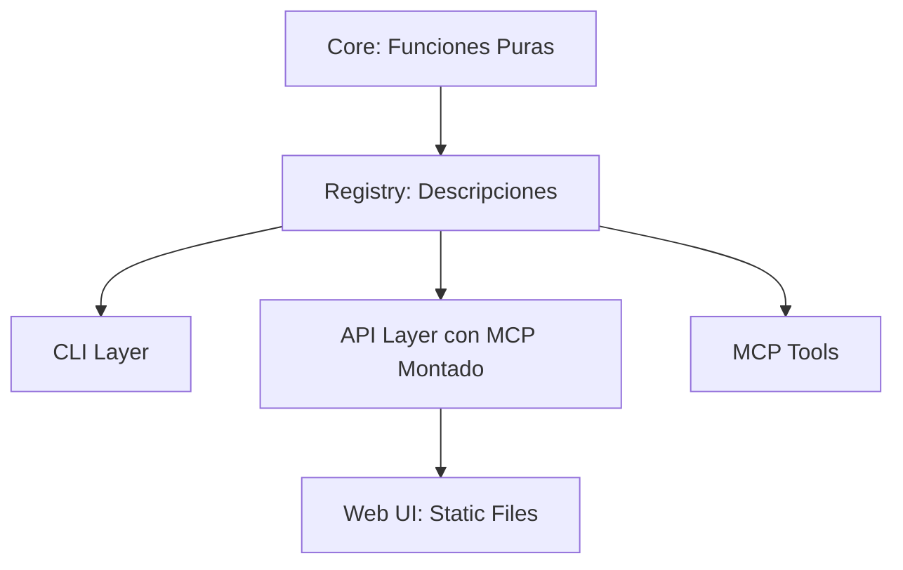

# Autocode: Framework Minimalista para Herramientas de Calidad de Código

## Visión General
Autocode es un proyecto simplificado para automatizar verificaciones y análisis de código (documentación, tests, cambios Git, análisis AI, etc.). La visión es crear un sistema puro, reutilizable y minimalista, con un núcleo de funciones puras en Python que se exponen a través de "thin layers" (interfaces delgadas) para CLI, API, MCP y una UI web básica. 

Principios clave:
- **Simplicidad Máxima**: Código síncrono, lineal y puro. Evitar complejidad innecesaria (e.g., no asincronía a menos que sea esencial).
- **Reutilización**: Funciones del core son puras y se exponen automáticamente vía un registry central.
- **Minimalismo en Layers**: Las interfaces son wrappers delgados, semi-automatizados por el registry, sin lógica de negocio.
- **Escalabilidad**: Estructura flexible para crecer sin over-engineering.
- **Dependencias**: Gestionadas con uv (ver .clinerules/dependencies_uv.md). Core usa solo stdlib + libs puras.

El proyecto surge de la necesidad de simplificar un codebase anterior que acumulaba complejidad, enfocándonos en un "hello world" inicial para validar la arquitectura.

## Arquitectura
Adopta un enfoque de "Functional Core / Imperative Shell":
- **Core**: Lógica pura (funciones inmutables, sin I/O).
- **Interfaces (Thin Layers)**: Exposición minimalista de core funcs vía CLI, API, MCP.
- **Web UI**: Consumo simple (static files servidos por API).
- **Registry**: Puente central que describe funcs y permite semi-automatización.

Diagrama simple (en Mermaid):


- **Sincronicidad**: Todo síncrono. Tareas largas usan threading si necesario.
- **Servidores**: Flexibles - pueden ejecutarse por separado (`autocode serve-api`, `autocode serve-mcp`) o unificados (`autocode serve`).

## Estructura de Directorios
```
autocode/                           # Proyecto root
├── autocode/                       # Paquete Python principal  
│   ├── autocode/                   # Módulo interno
│   │   ├── core/                   # Lógica pura
│   │   │   ├── hello/              # Ejemplo: hello_world.py
│   │   │   │   ├── __init__.py
│   │   │   │   └── hello_world.py
│   │   │   └── __init__.py
│   │   ├── interfaces/             # Exposición layers + registry
│   │   │   ├── __init__.py
│   │   │   ├── registry.py         # Dict FUNCTION_REGISTRY para automatización
│   │   │   ├── cli.py              # CLI con comandos dinámicos + serve-*
│   │   │   ├── api.py              # API server independiente
│   │   │   └── mcp.py              # MCP server independiente
│   │   ├── web/                    # UI estática dentro del paquete
│   │   │   ├── __init__.py
│   │   │   └── index.html          # HTML/JS simple que llama API
│   │   └── __init__.py
│   └── __init__.py
├── docs/                           # Documentación
├── tests/                          # Tests unitarios
│   └── core/
│       └── test_hello.py
├── pyproject.toml                  # Configuración del paquete
├── README_USAGE.md                 # Guía de uso
└── uv.lock                        # Lock file de dependencias
```

## Sistema de Modelos

Todas las funciones registradas en Autocode **DEBEN** retornar `GenericOutput` o una subclase. Esta restricción asegura consistencia en las respuestas de API, CLI y MCP.

### GenericOutput (Modelo Base)

Ubicación: `autocode/interfaces/models.py`

```python
class GenericOutput(BaseModel):
    result: Any           # Resultado principal de la función
    success: bool         # Estado de la operación (True/False)
    message: Optional[str] # Mensaje descriptivo (opcional)
```

| Campo | Tipo | Descripción |
|-------|------|-------------|
| `result` | `Any` | El output semántico de la función (lo que el usuario pidió) |
| `success` | `bool` | Indica si la operación fue exitosa |
| `message` | `Optional[str]` | Mensaje legible para humanos (errores, info adicional) |

### DspyOutput (Para operaciones AI/DSPy)

Ubicación: `autocode/core/ai/models.py`

Extiende `GenericOutput` con metadata de ejecución para operaciones DSPy:

```python
class DspyOutput(GenericOutput):
    # Campos heredados: result, success, message
    reasoning: Optional[str]      # Chain of thought (CoT)
    completions: Optional[List]   # Alternativas generadas
    trajectory: Optional[Dict]    # Trazas de ReAct
    history: Optional[List]       # Historial de llamadas al LM
```

**Nota:** Los campos adicionales de `DspyOutput` son **metadata de ejecución**, no parte del resultado semántico. El campo `result` contiene el output principal; los demás campos describen *cómo* se llegó a ese resultado.

### Validación Automática

El registry (`autocode/interfaces/registry.py`) valida automáticamente al registrar una función:

1. **Anotación requerida**: La función DEBE tener anotación de tipo de retorno
2. **Tipo válido**: Debe ser `GenericOutput` o una subclase
3. **Union types**: Se soporta `GenericOutput | None`

```python
# ✅ Correcto
@register_function()
def mi_funcion(x: int) -> GenericOutput:
    return GenericOutput(result=x * 2, success=True)

# ✅ Correcto (subclase)
@register_function()
def mi_funcion_ai(prompt: str) -> DspyOutput:
    return DspyOutput(result="respuesta", success=True, reasoning="...")

# ❌ Incorrecto - Lanza RegistryError al registrar
@register_function()
def mi_funcion(x: int) -> int:
    return x * 2

# ❌ Incorrecto - Lanza RegistryError (sin anotación)
@register_function()
def mi_funcion(x: int):
    return x * 2
```

### Extender Modelos

Para funciones especializadas, crea subclases de `GenericOutput`:

```python
from autocode.interfaces.models import GenericOutput

class MiOutputEspecializado(GenericOutput):
    campo_extra: str = Field(description="Mi campo adicional")
    metricas: Dict[str, float] = Field(default_factory=dict)
```

## Diseño Detallado
- **Core**:
  - Funciones puras: Toman datos inmutables y retornan `GenericOutput` (e.g., `def hello_world(name: str) -> GenericOutput`).
  - Dependencias mínimas (stdlib + pydantic para modelos).
- **Registry (autocode/interfaces/registry.py)**:
  - Dict FUNCTION_REGISTRY que describe cada func: nombre, ref, descripción y parámetros explícitos (sin inferencia).
  - Parámetros definidos explícitamente como ExplicitParam con name, type, default, required, description.
  - Permite loops en layers para generar comandos/endpoints/tools automáticamente usando datos explícitos.
- **CLI (autocode/interfaces/cli.py)**: 
  - Usa Click. Genera comandos dinámicos del registry usando parámetros explícitos.
  - Comandos de servidor: `serve` (unificado), `serve-api` (solo API), `serve-mcp` (solo MCP).
  - Entry point: `uv run autocode [comando]`.
- **API (autocode/interfaces/api.py)**: 
  - FastAPI app independiente. Genera endpoints del registry.
  - Sirve archivos estáticos desde autocode/web/.
  - Función `create_api_app()` para instanciación independiente.
- **MCP (autocode/interfaces/mcp.py)**: 
  - FastAPI app independiente con fastapi_mcp.
  - Función `create_mcp_app()` para instanciación independiente.
  - Se integra vía `setup_mcp()` en modo unificado.
- **Web UI (autocode/web/)**: 
  - Static HTML/JS que consume API (e.g., fetch a /hello).
  - Incluido dentro del paquete Python para distribución.
  - Minimalista, sin frameworks pesados.
- **Configuración**: Central en core/config/. Inyectada como params en funcs.

## Prácticas de Desarrollo
- **Añadir Función**:
  1. Crea en core/ (e.g., new_func.py).
  2. Registra en registry.py.
  3. Añade tests en tests/core/.
  4. Verifica: uv sync + CLI checks.
- **Testing**: 100% coverage con pytest. Tests puras en core/.
- **Docs**: Cada módulo tiene _module.md. Usa CLI check-docs.
- **Dependencias**: Siempre uv add + uv sync (nunca pip).
- **Errores**: Exceptions custom, propagadas a layers.
- **Lanzamiento**: `autocode serve` (unificado).

## Visión Futura
- Expandir con más funcs (e.g., migrar checker.py de docs/).
- Si crece, refactor layers a subdirs (fácil).
- Integrar AI (e.g., OpenCode) como funcs puras.
- Mantener minimalismo: Si algo añade complejidad, evalúa si es esencial.

Para implementación, ve implementation-steps.md.
