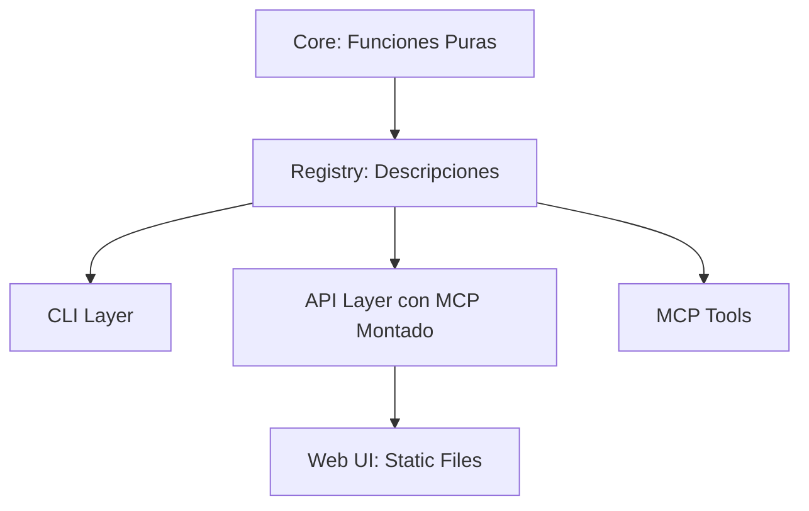

# Autocode: Framework Minimalista para Herramientas de Calidad de Código

## Visión General
Autocode es un proyecto simplificado para automatizar verificaciones y análisis de código (documentación, tests, cambios Git, análisis AI, etc.). La visión es crear un sistema puro, reutilizable y minimalista, con un núcleo de funciones puras en Python que se exponen a través de "thin layers" (interfaces delgadas) para CLI, API, MCP y una UI web básica. 

Principios clave:
- **Simplicidad Máxima**: Código síncrono, lineal y puro. Evitar complejidad innecesaria (e.g., no asincronía a menos que sea esencial).
- **Reutilización**: Funciones del core son puras y se exponen automáticamente vía un registry central.
- **Minimalismo en Layers**: Las interfaces son wrappers delgados, semi-automatizados por el registry, sin lógica de negocio.
- **Escalabilidad**: Estructura flexible para crecer sin over-engineering.
- **Dependencias**: Gestionadas con uv (ver .clinerules/dependencies_uv.md). Core usa solo stdlib + libs puras.

El proyecto surge de la necesidad de simplificar un codebase anterior que acumulaba complejidad, enfocándonos en un "hello world" inicial para validar la arquitectura.

## Arquitectura
Adopta un enfoque de "Functional Core / Imperative Shell":
- **Core**: Lógica pura (funciones inmutables, sin I/O).
- **Interfaces (Thin Layers)**: Exposición minimalista de core funcs vía CLI, API, MCP.
- **Web UI**: Consumo simple (static files servidos por API).
- **Registry**: Puente central que describe funcs y permite semi-automatización.

Diagrama simple (en Mermaid):


- **Sincronicidad**: Todo síncrono. Tareas largas usan threading si necesario.
- **Servidores**: Combinados en un FastAPI app (API + MCP + UI estática) para simplicidad, lanzados vía CLI `autocode serve`.

## Estructura de Directorios
```
autocode/
├── core/                # Lógica pura
│   ├── hello/           # Ejemplo: hello_world.py
│   ├── config/          # Opcional: Configuración central
│   └── __init__.py
├── interfaces/          # Exposición layers + registry
│   ├── registry.py      # Dict INTERFACES para semi-automatización
│   ├── cli.py           # CLI con comandos incl. 'serve'
│   ├── api.py           # API server (sirve UI, monta MCP)
│   └── mcp.py           # MCP setup (montado en api.app)
├── web/                 # UI estática (consumo)
│   └── index.html       # HTML/JS simple que llama API
├── docs/                # Documentación (e.g., este .md)
├── tests/               # Tests unitarios
└── __init__.py
```

## Diseño Detallado
- **Core**:
  - Funciones puras: Toman/retornan datos inmutables (e.g., def hello_world(name: str) -> str).
  - No dependencias externas (solo stdlib).
- **Registry (interfaces/registry.py)**:
  - Dict que describe cada func: nombre, ref, metadata (desc, params para CLI/API/MCP).
  - Permite loops en layers para generar comandos/endpoints/tools automáticamente.
- **CLI (interfaces/cli.py)**: Usa Typer. Genera comandos dinámicos del registry + `serve` para lanzar server.
- **API (interfaces/api.py)**: FastAPI app. Genera endpoints del registry, sirve web/ como static, monta MCP.
- **MCP (interfaces/mcp.py)**: Usa fastapi_mcp montado en API app. Registra tools del registry.
- **Web UI (web/)**: Static HTML/JS que consume API (e.g., fetch a /hello). Minimalista, sin frameworks pesados.
- **Configuración**: Central en core/config/. Inyectada como params en funcs.

## Prácticas de Desarrollo
- **Añadir Función**:
  1. Crea en core/ (e.g., new_func.py).
  2. Registra en registry.py.
  3. Añade tests en tests/core/.
  4. Verifica: uv sync + CLI checks.
- **Testing**: 100% coverage con pytest. Tests puras en core/.
- **Docs**: Cada módulo tiene _module.md. Usa CLI check-docs.
- **Dependencias**: Siempre uv add + uv sync (nunca pip).
- **Errores**: Exceptions custom, propagadas a layers.
- **Lanzamiento**: `autocode serve` (unificado).

## Visión Futura
- Expandir con más funcs (e.g., migrar checker.py de docs/).
- Si crece, refactor layers a subdirs (fácil).
- Integrar AI (e.g., OpenCode) como funcs puras.
- Mantener minimalismo: Si algo añade complejidad, evalúa si es esencial.

Para implementación, ve implementation-steps.md.
