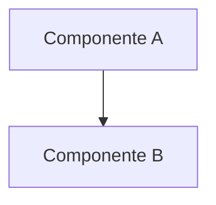

# Arquitectura de [Nombre del Módulo]

[Breve descripción de una línea sobre qué hace este módulo]

## 🏗️ Visión General

[1-2 párrafos explicando el propósito del módulo, qué problema resuelve y su filosofía de diseño.]

### Diagrama de Arquitectura
[Espacio para diagrama Mermaid]

## 🧩 Componentes Principales

### 1. `ComponentePrincipal`
[Descripción]
*   **Responsabilidad:** ...
*   **Interacción:** ...

### 2. `ComponenteSecundario`
[Descripción]

## 🏛️ Principios de Diseño

*   **Principio 1:** Explicación.
*   **Principio 2:** Explicación.

## 🔄 Flujo de Datos

[Descripción de cómo fluyen los datos a través del módulo]

1.  Paso 1
2.  Paso 2

## 🛠️ Guía de Desarrollo

### Extensión vs Estabilidad
[Definir si este módulo está diseñado para ser extendido frecuentemente o si es infraestructura estable]

*   **Extensión:** Cómo añadir nueva funcionalidad.
*   **Estabilidad:** Qué partes NO se deberían tocar.

### Patrones Comunes
*   Patrón A
*   Patrón B

## ⚠️ Consideraciones Técnicas

*   **Dependencias:** ...
*   **Performance:** ...
*   **Seguridad:** ...
