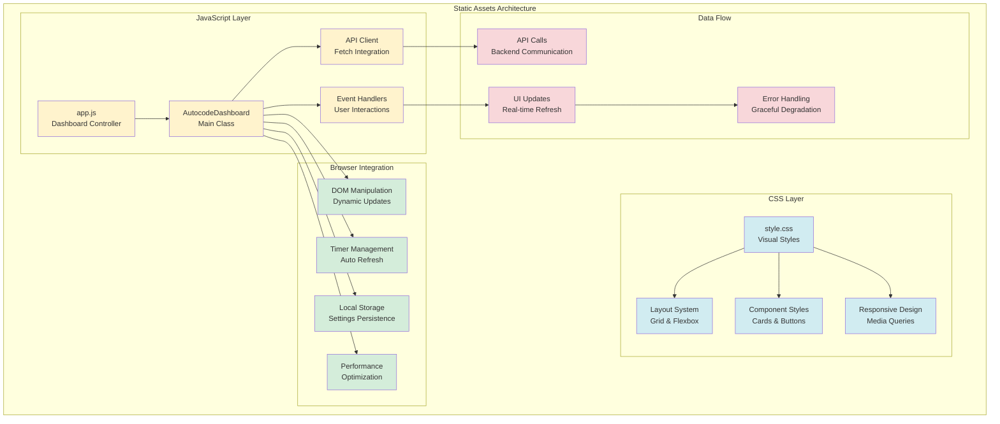
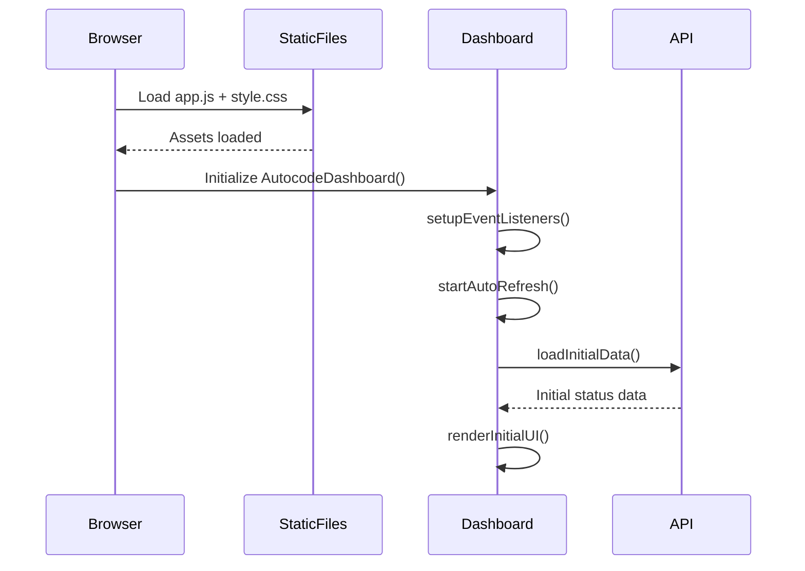
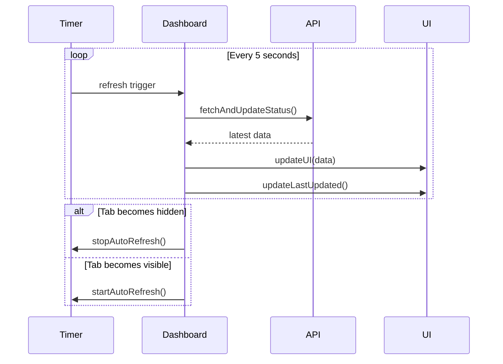
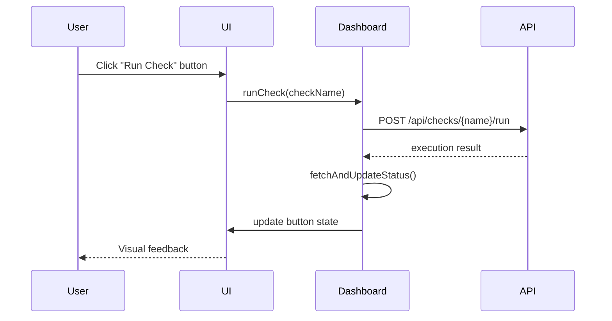

# Autocode Web Static Module - Documentación

## 🎯 Propósito del Módulo

El módulo `autocode/web/static` contiene todos los assets estáticos necesarios para la interfaz web del dashboard autocode. Su responsabilidad principal es proporcionar los recursos client-side (JavaScript, CSS) que implementan la funcionalidad interactiva del dashboard de monitoreo en tiempo real, optimizados para performance y compatibilidad cross-browser.

## 🏗️ Arquitectura del Módulo



## 📁 Componentes del Módulo

### `app.js` - Dashboard JavaScript Interactivo
**Propósito**: Implementa toda la lógica client-side del dashboard con funcionalidades avanzadas
**Documentación**: [app.js.md](app.js.md)

**Funcionalidades principales**:
- **AutocodeDashboard Class**: Controlador principal del dashboard
- **API Client Integration**: Comunicación robusta con backend FastAPI
- **Real-time Updates**: Auto-refresh cada 5 segundos con gestión inteligente
- **Interactive Controls**: Botones para ejecutar checks y modificar configuración
- **Keyboard Shortcuts**: Space (refresh), R (toggle auto-refresh)
- **Performance Optimization**: Pausa automática cuando tab no está visible
- **Error Handling**: Gestión graceful de errores de red y timeouts

### `style.css` - Estilos CSS del Dashboard
**Propósito**: Proporciona todo el diseño visual, layout y responsive design del dashboard
**Documentación**: [style.css.md](style.css.md)

**Características principales**:
- **Responsive Layout**: Diseño adaptativo para desktop, tablet y mobile
- **Component Library**: Estilos para cards, buttons, indicators y forms
- **Color System**: Esquema de colores consistente para estados y feedback
- **Typography**: Jerarquía tipográfica clara y legible
- **Animations**: Transiciones suaves para mejora de UX
- **Accessibility**: Contraste adecuado y soporte para screen readers

## 🔗 Dependencias del Módulo

### Dependencias de Browser APIs
- **Fetch API**: Para comunicación HTTP con backend
- **DOM APIs**: Para manipulación dinámica de elementos
- **Timer APIs**: setInterval/clearInterval para auto-refresh
- **Storage APIs**: localStorage para persistir configuraciones
- **Visibility API**: Para optimización cuando tab no está activo
- **Performance API**: Para monitoreo de performance

### Compatibilidad Requerida
- **JavaScript ES6+**: Classes, async/await, arrow functions
- **CSS3 Features**: Grid, Flexbox, Custom Properties, Media Queries
- **Modern Browsers**: Chrome 60+, Firefox 55+, Safari 12+, Edge 79+

### Integración con Backend
- **FastAPI Static Files**: Servidos automáticamente por FastAPI
- **API Endpoints**: Consume endpoints REST del servidor autocode
- **JSON Data Format**: Procesamiento de respuestas JSON estructuradas

## 💡 Flujo de Trabajo Típico

### Carga Inicial del Dashboard


### Ciclo de Auto-Refresh


### Gestión de Interacciones del Usuario


## 🔧 Configuración del Módulo

### Estructura de Archivos
```
autocode/web/static/
├── app.js          # Dashboard JavaScript logic
└── style.css       # Visual styles and layout
```

### Configuración de Servicio (FastAPI)
```python
# En autocode/api/server.py
from fastapi.staticfiles import StaticFiles

app.mount("/static", StaticFiles(directory="autocode/web/static"), name="static")
```

### Variables de Configuración JavaScript
```javascript
// En app.js - configuración del dashboard
class AutocodeDashboard {
    constructor() {
        this.refreshInterval = 5000; // 5 segundos
        this.apiBaseUrl = '/api';
        this.enableKeyboardShortcuts = true;
        this.enableAutoRefresh = true;
        this.enableVisibilityPause = true;
    }
}
```

### Variables CSS Custom Properties
```css
/* En style.css - configuración de tema */
:root {
    /* Colores principales */
    --success-color: #28a745;
    --warning-color: #ffc107;
    --error-color: #dc3545;
    --info-color: #17a2b8;
    
    /* Layout */
    --dashboard-padding: 1rem;
    --card-border-radius: 0.375rem;
    --animation-duration: 0.3s;
}
```

## ⚠️ Consideraciones Especiales

### Performance y Optimización
- **Bundle Size**: Archivos optimizados para carga rápida
- **Memory Management**: Limpieza automática de timers y event listeners
- **Lazy Loading**: Carga diferida de componentes no críticos
- **Browser Caching**: Headers apropiados para cacheo eficiente
- **Visibility Optimization**: Pausa automática cuando no está visible

### Compatibilidad Cross-Browser
- **Polyfills**: Para features no soportadas en browsers antiguos
- **Graceful Degradation**: Funcionalidad básica en browsers limitados
- **Progressive Enhancement**: Mejoras para browsers modernos
- **Feature Detection**: Verificación de APIs disponibles

### Seguridad Client-Side
- **XSS Prevention**: Sanitización de contenido dinámico
- **CSP Compliance**: Compatible con Content Security Policy
- **Input Validation**: Validación de datos antes de envío
- **Error Information**: No exposición de información sensible

### Accesibilidad
- **Semantic HTML**: Uso correcto de elementos semánticos
- **ARIA Attributes**: Soporte para screen readers
- **Keyboard Navigation**: Navegación completa por teclado
- **Color Contrast**: Cumplimiento de estándares WCAG

## 🧪 Testing y Validación

### Testing en Diferentes Navegadores
```bash
# Testing manual
# 1. Chrome DevTools
open -a "Google Chrome" --args --auto-open-devtools-for-tabs http://localhost:8080

# 2. Firefox Developer Tools
open -a "Firefox Developer Edition" http://localhost:8080

# 3. Safari Web Inspector
open -a "Safari" http://localhost:8080
```

### Validación de JavaScript
```javascript
// Console testing
// Verificar carga de clases
console.log(typeof AutocodeDashboard !== 'undefined');

// Verificar API connectivity
fetch('/api/status').then(r => console.log('API OK:', r.ok));

// Verificar event listeners
console.log('Event listeners active:', !!dashboard);
```

### Validación de CSS
```css
/* Verificar custom properties */
.test-element {
    color: var(--success-color);
    border-radius: var(--card-border-radius);
}
```

### Performance Testing
```javascript
// Medir tiempo de carga inicial
performance.mark('dashboard-start');
// ... después de inicialización
performance.mark('dashboard-end');
performance.measure('dashboard-init', 'dashboard-start', 'dashboard-end');
```

## 🔄 Flujo de Datos y Estados

### Estado del Módulo JavaScript
```javascript
{
    // AutocodeDashboard instance state
    refreshInterval: number,
    refreshTimer: number | null,
    isLoading: boolean,
    connectionStatus: 'connected' | 'error' | 'loading',
    lastUpdated: Date,
    
    // Configuration state
    autoRefreshEnabled: boolean,
    keyboardShortcutsEnabled: boolean,
    
    // UI state
    activeTab: string,
    expandedCards: string[],
    notifications: Array<{type, message, timestamp}>
}
```

### Ciclo de Vida del Dashboard
1. **Initialization**: Carga de scripts y setup inicial
2. **Setup**: Configuración de event listeners y timers
3. **Data Loading**: Fetch inicial de datos del API
4. **Rendering**: Renderizado inicial de UI
5. **Active Loop**: Ciclo de auto-refresh y user interactions
6. **Cleanup**: Limpieza al cerrar/navegar (beforeunload)

### Gestión de Errores
```javascript
// Error handling patterns
try {
    const response = await fetch('/api/status');
    if (!response.ok) throw new Error(`HTTP ${response.status}`);
    // ... handle success
} catch (error) {
    console.error('API Error:', error);
    this.handleError(error);
    this.showErrorMessage('Connection failed. Retrying...');
}
```

## 📊 Métricas y Monitoreo Client-Side

### Métricas de Performance
- **Load Time**: Tiempo de carga inicial de assets
- **API Response Time**: Latencia de llamadas al backend
- **DOM Update Time**: Tiempo de actualización de UI
- **Memory Usage**: Uso de memoria del dashboard
- **Error Rate**: Frecuencia de errores JavaScript/API

### Analytics de Uso (futuro)
```javascript
// User interaction tracking
class UsageAnalytics {
    trackButtonClick(buttonName) {
        // Track user interactions
    }
    
    trackApiCall(endpoint, duration) {
        // Track API performance
    }
    
    trackError(error, context) {
        // Track error occurrences
    }
}
```

## 🚀 Extensibilidad

### Añadir Nuevas Funcionalidades
```javascript
// Extender AutocodeDashboard
class ExtendedDashboard extends AutocodeDashboard {
    constructor() {
        super();
        this.customFeatures = true;
    }
    
    addCustomWidget(widgetConfig) {
        // Implementar nuevo widget
    }
}
```

### Personalización de Estilos
```css
/* Custom theme override */
.dashboard-theme-dark {
    --success-color: #4ade80;
    --error-color: #f87171;
    --background-color: #1f2937;
}
```

### Plugins y Extensiones
```javascript
// Plugin system
class DashboardPlugin {
    constructor(dashboard) {
        this.dashboard = dashboard;
    }
    
    initialize() {
        // Plugin initialization
    }
    
    render() {
        // Plugin UI rendering
    }
}
```

## 🔧 Debugging y Desarrollo

### Modo Debug
```javascript
// Habilitar debug mode
window.DEBUG = true;
dashboard.enableDebugMode();

// Logs detallados
console.log('Dashboard state:', dashboard.getState());
console.log('API calls:', dashboard.apiCallHistory);
```

### Developer Tools
```javascript
// Exponer utilidades de desarrollo
window.dashboardUtils = {
    forceRefresh: () => dashboard.fetchAndUpdateStatus(),
    simulateError: () => dashboard.handleError(new Error('Test error')),
    getState: () => dashboard.getState(),
    clearCache: () => localStorage.clear()
};
```

### Hot Reload (desarrollo)
```javascript
// Development hot reload
if (process.env.NODE_ENV === 'development') {
    new EventSource('/dev/reload').onmessage = () => location.reload();
}
```

## 📖 Navegación Detallada

### Archivos del Módulo
- [JavaScript Dashboard](app.js.md) - Lógica completa del dashboard
- [CSS Styles](style.css.md) - Diseño visual y responsive

### Recursos Relacionados
- [Web Module Overview](../_module.md) - Módulo web completo
- [Templates Module](../templates/_module.md) - Templates HTML
- [API Integration](../../api/_module.md) - Backend integration

## 🔄 Integración con Otros Módulos

### Integración con FastAPI Backend
- **Static File Serving**: Automático via FastAPI StaticFiles mount
- **API Consumption**: Consume todos los endpoints REST disponibles
- **Error Coordination**: Manejo coordinado de errores frontend/backend

### Integración con Templates
- **HTML Structure**: CSS styles aplicados a estructura HTML
- **JavaScript Binding**: JS bind automático a elementos del DOM
- **Dynamic Content**: Actualización de contenido via JavaScript

### Futuras Integraciones
- **Build System**: Webpack/Vite para bundling optimizado
- **TypeScript**: Migración a TypeScript para mejor type safety
- **CSS Preprocessors**: SASS/LESS para estilos más avanzados
- **Testing Framework**: Jest/Cypress para testing automatizado
