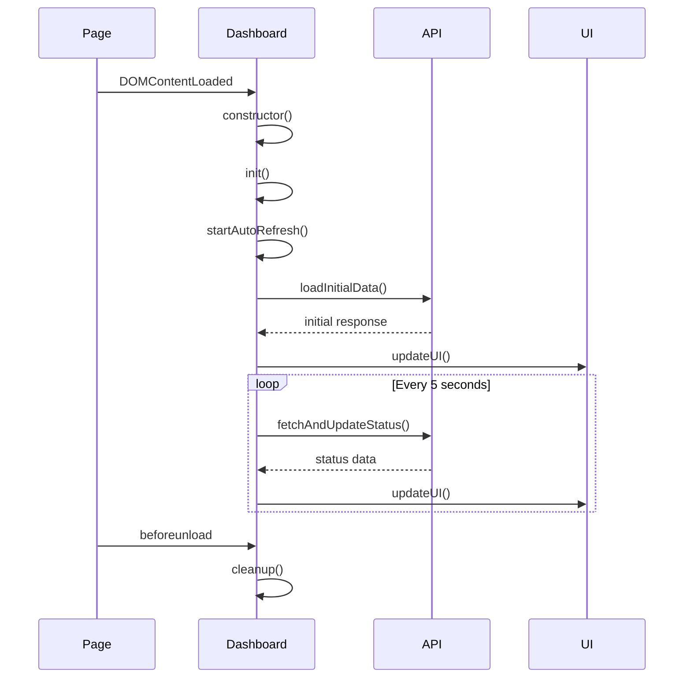

# Autocode Dashboard JavaScript (app.js)

## 🎯 Propósito

El archivo `app.js` implementa la lógica completa del dashboard web de autocode, proporcionando una interfaz interactiva y en tiempo real para monitorear el estado del sistema. Su responsabilidad principal es gestionar la comunicación con la API backend, actualizar la UI dinámicamente, y ofrecer controles interactivos para la gestión del sistema autocode.

## 🏗️ Arquitectura del Archivo

```mermaid
graph TB
    subgraph "AutocodeDashboard Class Architecture"
        subgraph "Core Components"
            CONSTRUCTOR[Constructor<br/>Initialization]
            INIT[init()<br/>Setup & Start]
            CONFIG[Configuration<br/>Settings & Options]
        end
        
        subgraph "API Communication"
            FETCH_STATUS[fetchAndUpdateStatus()<br/>Get System Status]
            FETCH_CONFIG[fetchAndUpdateConfig()<br/>Get Configuration]
            UPDATE_CONFIG[updateConfig()<br/>Save Configuration]
            RUN_CHECK[runCheck()<br/>Execute Check]
        end
        
        subgraph "UI Management"
            UPDATE_UI[updateUI()<br/>Main UI Update]
            UPDATE_DAEMON[updateDaemonStatus()<br/>Daemon Status]
            UPDATE_CHECKS[updateCheckResults()<br/>Check Results]
            UPDATE_METRICS[updateSystemStats()<br/>System Metrics]
        end
        
        subgraph "Real-time Features"
            AUTO_REFRESH[Auto Refresh<br/>5-second Timer]
            VISIBILITY[Visibility Handler<br/>Pause/Resume]
            KEYBOARD[Keyboard Shortcuts<br/>Space & R keys]
            ERROR_HANDLING[Error Handling<br/>Network & API Errors]
        end
    end
    
    CONSTRUCTOR --> INIT
    INIT --> CONFIG
    INIT --> AUTO_REFRESH
    
    AUTO_REFRESH --> FETCH_STATUS
    FETCH_STATUS --> UPDATE_UI
    UPDATE_UI --> UPDATE_DAEMON
    UPDATE_UI --> UPDATE_CHECKS
    UPDATE_UI --> UPDATE_METRICS
    
    CONFIG --> FETCH_CONFIG
    CONFIG --> UPDATE_CONFIG
    
    VISIBILITY --> AUTO_REFRESH
    KEYBOARD --> FETCH_STATUS
    KEYBOARD --> AUTO_REFRESH
    
    FETCH_STATUS --> ERROR_HANDLING
    RUN_CHECK --> ERROR_HANDLING
    
    classDef core fill:#e1f5fe
    classDef api fill:#f3e5f5
    classDef ui fill:#e8f5e8
    classDef realtime fill:#fff3e0
    
    class CONSTRUCTOR,INIT,CONFIG core
    class FETCH_STATUS,FETCH_CONFIG,UPDATE_CONFIG,RUN_CHECK api
    class UPDATE_UI,UPDATE_DAEMON,UPDATE_CHECKS,UPDATE_METRICS ui
    class AUTO_REFRESH,VISIBILITY,KEYBOARD,ERROR_HANDLING realtime
```

## 📋 Responsabilidades

### Gestión del Estado del Dashboard
- **Inicialización**: Setup completo del dashboard al cargar la página
- **Estado Global**: Mantiene el estado de conexión, timers y configuración
- **Ciclo de Vida**: Gestiona inicialización, ejecución activa y limpieza
- **Configuración**: Maneja configuración personalizable del dashboard

### Comunicación con API Backend
- **Fetch Status**: Obtiene estado actual del sistema cada 5 segundos
- **Fetch Configuration**: Carga configuración inicial del sistema
- **Update Configuration**: Envía cambios de configuración al backend
- **Execute Checks**: Ejecuta verificaciones individuales on-demand
- **Error Handling**: Manejo robusto de errores de red y API

### Actualización de Interfaz Usuario
- **Dynamic Updates**: Actualiza UI sin recargar página
- **Status Indicators**: Gestiona indicadores visuales de estado
- **Metrics Display**: Muestra métricas del sistema en tiempo real
- **Interactive Controls**: Maneja botones, formularios y controles
- **Visual Feedback**: Proporciona feedback visual para acciones

### Funcionalidades Tiempo Real
- **Auto Refresh**: Actualización automática cada 5 segundos
- **Visibility Management**: Pausa cuando tab no está visible
- **Keyboard Shortcuts**: Shortcuts Space (refresh) y R (toggle)
- **Performance Optimization**: Gestión eficiente de recursos
- **Connection Monitoring**: Detecta y maneja pérdidas de conexión

## 🔗 Dependencias

### Browser APIs Requeridas
- **Fetch API**: Para comunicación HTTP con backend
- **DOM APIs**: querySelector, getElementById, innerHTML, etc.
- **Timer APIs**: setInterval, clearInterval para auto-refresh
- **Event APIs**: addEventListener para user interactions
- **Visibility API**: document.visibilitychange para optimización
- **Performance API**: Para métricas de rendimiento

### Integración con Backend
- **API Endpoints**: `/api/status`, `/api/config`, `/api/checks/{name}/run`
- **JSON Communication**: Request/response en formato JSON
- **HTTP Methods**: GET para lectura, POST para acciones, PUT para updates
- **Error Codes**: Manejo de códigos de estado HTTP

### DOM Dependencies
```html
<!-- Elementos requeridos en HTML -->
<div id="daemon-indicator"></div>
<div id="daemon-text"></div>
<div id="uptime"></div>
<div id="total-checks"></div>
<div id="last-check"></div>
<div id="last-updated"></div>
<div id="auto-refresh-status"></div>

<!-- Check cards con estructura específica -->
<div id="doc-check" class="check-card">
    <div class="check-status">
        <div class="status-indicator"></div>
        <div class="status-text"></div>
    </div>
    <div class="check-message"></div>
    <div class="check-details-content"></div>
</div>
```

## 💡 Patrones de Uso

### Inicialización Automática
```javascript
// Inicialización automática al cargar DOM
document.addEventListener('DOMContentLoaded', function() {
    dashboard = new AutocodeDashboard();
    
    // Setup de keyboard shortcuts globales
    document.addEventListener('keydown', function(event) {
        if (event.code === 'Space' && event.target.tagName !== 'INPUT') {
            event.preventDefault();
            dashboard.fetchAndUpdateStatus();
        }
        
        if (event.code === 'KeyR' && event.target.tagName !== 'INPUT') {
            event.preventDefault();
            if (dashboard.refreshTimer) {
                dashboard.stopAutoRefresh();
            } else {
                dashboard.startAutoRefresh();
            }
        }
    });
});
```

### Llamadas API Típicas
```javascript
// Ejemplo de llamada API con error handling
async fetchAndUpdateStatus() {
    try {
        this.isLoading = true;
        const response = await fetch('/api/status');
        
        if (!response.ok) {
            throw new Error(`HTTP ${response.status}: ${response.statusText}`);
        }
        
        const data = await response.json();
        this.updateUI(data);
        this.updateLastUpdated();
        
    } catch (error) {
        console.error('Error fetching status:', error);
        this.handleError(error);
    } finally {
        this.isLoading = false;
    }
}
```

### Ejecutar Checks Individuales
```javascript
// Función global para ejecutar checks
async function runCheck(checkName) {
    const button = event.target;
    button.disabled = true;
    button.textContent = 'Running...';
    
    try {
        const response = await fetch(`/api/checks/${checkName}/run`, {
            method: 'POST',
            headers: {'Content-Type': 'application/json'}
        });
        
        if (response.ok) {
            dashboard.fetchAndUpdateStatus();
        }
    } finally {
        button.disabled = false;
        button.textContent = 'Run Now';
    }
}
```

## 🔧 Configuración

### Configuración de la Clase
```javascript
class AutocodeDashboard {
    constructor() {
        // Configuración principal
        this.refreshInterval = 5000; // 5 segundos
        this.refreshTimer = null;
        this.isLoading = false;
        
        // Estados del sistema
        this.connectionStatus = 'loading';
        this.lastSuccessfulUpdate = null;
        this.errorCount = 0;
        
        // Configuración de features
        this.enableAutoRefresh = true;
        this.enableKeyboardShortcuts = true;
        this.enableVisibilityPause = true;
    }
}
```

### Configuración de API Endpoints
```javascript
// URLs de API utilizadas
const API_ENDPOINTS = {
    status: '/api/status',
    config: '/api/config',
    runCheck: (checkName) => `/api/checks/${checkName}/run`
};
```

### Configuración de UI Elements
```javascript
// Elementos DOM principales
const UI_ELEMENTS = {
    daemonIndicator: '#daemon-indicator',
    daemonText: '#daemon-text',
    uptime: '#uptime',
    totalChecks: '#total-checks',
    lastCheck: '#last-check',
    lastUpdated: '#last-updated',
    autoRefreshStatus: '#auto-refresh-status'
};
```

## ⚠️ Consideraciones Especiales

### Gestión de Memoria
- **Timer Cleanup**: Limpieza automática de timers al cerrar página
- **Event Listener Cleanup**: Remoción de listeners en beforeunload
- **Memory Leaks Prevention**: Evita acumulación de referencias circulares
- **Efficient Updates**: Actualiza solo elementos que han cambiado

### Performance Optimization
- **Visibility API**: Pausa refresh cuando tab no está visible
- **Debouncing**: Previene multiple calls simultáneos
- **Efficient DOM Updates**: Minimiza manipulaciones del DOM
- **Error Recovery**: Recuperación automática de errores de red

### Error Handling Strategies
- **Network Errors**: Retry automático con backoff exponencial
- **API Errors**: Diferentes strategies según código HTTP
- **UI Error States**: Estados visuales para diferentes tipos de error
- **Graceful Degradation**: Funcionalidad reducida en caso de errores

### Browser Compatibility
- **ES6+ Features**: Requires modern browser support
- **Fetch API**: Polyfill needed for older browsers
- **Modern DOM APIs**: querySelector, addEventListener, etc.
- **CSS Custom Properties**: Para theming dinámico

## 🧪 Testing y Validación

### Testing Manual en Console
```javascript
// Verificar existencia del dashboard
console.log(typeof dashboard !== 'undefined');

// Verificar estado del auto-refresh
console.log('Auto-refresh active:', dashboard.refreshTimer !== null);

// Test manual de API
fetch('/api/status')
  .then(response => response.json())
  .then(data => console.log('API test:', data));

// Test de funciones principales
dashboard.fetchAndUpdateStatus();
dashboard.updateConfig();
```

### Debugging Utilities
```javascript
// Utilidades de debug disponibles
window.dashboardUtils = {
    getState: () => ({
        refreshTimer: !!dashboard.refreshTimer,
        isLoading: dashboard.isLoading,
        connectionStatus: dashboard.connectionStatus,
        errorCount: dashboard.errorCount
    }),
    
    forceRefresh: () => dashboard.fetchAndUpdateStatus(),
    toggleAutoRefresh: () => {
        if (dashboard.refreshTimer) {
            dashboard.stopAutoRefresh();
        } else {
            dashboard.startAutoRefresh();
        }
    },
    
    simulateError: () => dashboard.handleError(new Error('Test error')),
    clearErrors: () => dashboard.errorCount = 0
};
```

### Performance Monitoring
```javascript
// Monitor performance de updates
updateUI(data) {
    performance.mark('ui-update-start');
    
    // Update logic here
    this.updateDaemonStatus(data.daemon);
    this.updateSystemStats(data.daemon);
    this.updateCheckResults(data.checks);
    
    performance.mark('ui-update-end');
    performance.measure('ui-update', 'ui-update-start', 'ui-update-end');
}
```

## 🔄 Flujo de Datos y Estados

### Ciclo de Vida del Dashboard


### Estados del Sistema
```javascript
// Estados posibles del dashboard
const DASHBOARD_STATES = {
    INITIALIZING: 'initializing',
    ACTIVE: 'active',
    ERROR: 'error',
    OFFLINE: 'offline',
    LOADING: 'loading'
};

// Estados de conexión
const CONNECTION_STATES = {
    CONNECTED: 'connected',
    CONNECTING: 'connecting',
    DISCONNECTED: 'disconnected',
    ERROR: 'error'
};
```

### Gestión de Estado Interno
```javascript
class AutocodeDashboard {
    constructor() {
        this.state = {
            // Sistema
            dashboardState: 'initializing',
            connectionState: 'connecting',
            
            // Timers
            refreshTimer: null,
            retryTimer: null,
            
            // Contadores
            successfulUpdates: 0,
            failedUpdates: 0,
            totalApiCalls: 0,
            
            // Timestamps
            lastUpdate: null,
            lastError: null,
            startTime: Date.now()
        };
    }
}
```

## 📊 Métricas y Monitoreo

### Métricas de Performance
```javascript
// Métricas tracked automáticamente
const METRICS = {
    apiResponseTimes: [],
    uiUpdateTimes: [],
    errorRates: {
        network: 0,
        api: 0,
        parsing: 0
    },
    userInteractions: {
        manualRefresh: 0,
        checkExecutions: 0,
        configChanges: 0
    }
};
```

### Analytics de Usuario
```javascript
// Track user interactions
trackUserAction(action, details) {
    console.log(`User action: ${action}`, details);
    
    // Future: send to analytics service
    if (window.gtag) {
        window.gtag('event', action, {
            event_category: 'dashboard',
            event_label: details.checkName || details.setting,
            value: details.duration || 1
        });
    }
}
```

## 🚀 Extensibilidad

### Plugin System (Future)
```javascript
// Extensible plugin architecture
class DashboardPlugin {
    constructor(name, dashboard) {
        this.name = name;
        this.dashboard = dashboard;
    }
    
    init() {
        // Plugin initialization
    }
    
    onStatusUpdate(data) {
        // Handle status updates
    }
    
    render() {
        // Plugin UI rendering
    }
}

// Plugin registration
dashboard.registerPlugin(new CustomMetricsPlugin('custom-metrics', dashboard));
```

### Custom Widgets
```javascript
// Add custom widgets to dashboard
class CustomWidget {
    constructor(containerId, options) {
        this.container = document.getElementById(containerId);
        this.options = options;
    }
    
    render(data) {
        // Custom widget rendering logic
    }
    
    update(data) {
        // Update widget with new data
    }
}
```

### Theme System
```javascript
// Dynamic theme switching
class ThemeManager {
    static setTheme(themeName) {
        document.documentElement.setAttribute('data-theme', themeName);
        localStorage.setItem('dashboard-theme', themeName);
    }
    
    static getTheme() {
        return localStorage.getItem('dashboard-theme') || 'default';
    }
}
```

## 🔧 Debugging y Desarrollo

### Debug Mode
```javascript
// Enable debug mode
class AutocodeDashboard {
    enableDebugMode() {
        this.debug = true;
        this.logLevel = 'debug';
        console.log('Dashboard debug mode enabled');
        
        // Expose internal state to window
        window.dashboardDebug = {
            state: this.state,
            methods: {
                fetchStatus: () => this.fetchAndUpdateStatus(),
                updateUI: (data) => this.updateUI(data),
                simulateError: (type) => this.simulateError(type)
            }
        };
    }
}
```

### Development Helpers
```javascript
// Development utilities
if (process.env.NODE_ENV === 'development') {
    // Hot reload support
    if (module.hot) {
        module.hot.accept();
    }
    
    // Development console commands
    window.dev = {
        dashboard: () => dashboard,
        forceUpdate: () => dashboard.fetchAndUpdateStatus(),
        getMetrics: () => METRICS,
        clearStorage: () => localStorage.clear()
    };
}
```

## 📖 API Reference

### Clase Principal: AutocodeDashboard

#### Constructor
```javascript
constructor()
```
Inicializa nueva instancia del dashboard con configuración por defecto.

#### Métodos Principales

##### `init()`
Configura el dashboard completo: event listeners, auto-refresh, y carga inicial.

##### `fetchAndUpdateStatus()`
Obtiene estado actual del sistema y actualiza la UI. Método principal del ciclo de refresh.

##### `updateUI(data)`
Actualiza toda la interfaz con nuevos datos del sistema.

##### `startAutoRefresh()` / `stopAutoRefresh()`
Controla el timer de actualización automática.

##### `handleError(error)`
Maneja errores de API y red con recovery automático.

#### Métodos de UI

##### `updateDaemonStatus(daemon)`
Actualiza indicadores de estado del daemon.

##### `updateSystemStats(daemon)`
Actualiza métricas del sistema (uptime, checks, etc.).

##### `updateCheckResults(checks)`
Actualiza resultados de todos los checks.

##### `updateConfigUI(config)`
Actualiza controles de configuración.

### Funciones Globales

#### `runCheck(checkName)`
Ejecuta un check específico via API call.

#### `updateConfig()`
Envía configuración actualizada al backend.

### Event Handlers

#### Document Ready
```javascript
document.addEventListener('DOMContentLoaded', function() {
    dashboard = new AutocodeDashboard();
});
```

#### Keyboard Shortcuts
```javascript
document.addEventListener('keydown', function(event) {
    // Space: Manual refresh
    // R: Toggle auto-refresh
});
```

#### Visibility Change
```javascript
document.addEventListener('visibilitychange', function() {
    // Pause/resume based on tab visibility
});
```

#### Page Unload
```javascript
window.addEventListener('beforeunload', function() {
    dashboard.stopAutoRefresh();
});
```

## 🔄 Integración con Sistema

### Integración con FastAPI Backend
- **API Calls**: Consume todos los endpoints REST disponibles
- **Error Coordination**: Manejo coordinado de errores frontend/backend
- **Data Format**: Expectativa de formato JSON estructurado específico
- **Authentication**: Preparado para futura autenticación (headers, tokens)

### Integración con HTML Template
- **DOM Binding**: Se conecta automáticamente a elementos con IDs específicos
- **CSS Classes**: Utiliza clases CSS para estados visuales
- **Form Integration**: Integra con formularios para configuración
- **Event Delegation**: Maneja eventos de elementos dinámicos

### Futuras Integraciones
- **WebSocket Support**: Para updates más eficientes que polling
- **Service Worker**: Para funcionalidad offline y caching
- **Web Push**: Para notificaciones del sistema
- **IndexedDB**: Para storage persistente de configuración local
