# Autocode Dashboard CSS Styles (style.css)

## 🎯 Propósito

El archivo `style.css` define todos los estilos visuales del dashboard web de autocode, proporcionando un diseño moderno, responsivo y accesible. Su responsabilidad principal es crear una experiencia visual cohesiva que facilite la lectura de métricas, el reconocimiento de estados del sistema, y la interacción eficiente con los controles del dashboard.

## 🏗️ Arquitectura del Archivo

```mermaid
graph TB
    subgraph "CSS Architecture"
        subgraph "Foundation Layer"
            RESET[CSS Reset<br/>Normalize Styles]
            VARIABLES[CSS Variables<br/>Theme System]
            TYPOGRAPHY[Typography<br/>Font System]
            BASE[Base Styles<br/>Global Elements]
        end
        
        subgraph "Layout System"
            GRID[CSS Grid<br/>Main Layout]
            FLEXBOX[Flexbox<br/>Component Layout]
            RESPONSIVE[Media Queries<br/>Responsive Design]
            SPACING[Spacing System<br/>Consistent Margins]
        end
        
        subgraph "Component Styles"
            CARDS[Card Components<br/>Metric Cards]
            BUTTONS[Button Styles<br/>Interactive Elements]
            FORMS[Form Elements<br/>Configuration]
            INDICATORS[Status Indicators<br/>Visual Feedback]
        end
        
        subgraph "State & Theme"
            STATUS[Status Colors<br/>Success/Error/Warning]
            ANIMATIONS[Animations<br/>Transitions & Effects]
            DARK_MODE[Dark Mode<br/>Theme Variants]
            ACCESSIBILITY[Accessibility<br/>A11y Enhancements]
        end
    end
    
    RESET --> VARIABLES
    VARIABLES --> TYPOGRAPHY
    TYPOGRAPHY --> BASE
    
    BASE --> GRID
    GRID --> FLEXBOX
    FLEXBOX --> RESPONSIVE
    RESPONSIVE --> SPACING
    
    SPACING --> CARDS
    CARDS --> BUTTONS
    BUTTONS --> FORMS
    FORMS --> INDICATORS
    
    INDICATORS --> STATUS
    STATUS --> ANIMATIONS
    ANIMATIONS --> DARK_MODE
    DARK_MODE --> ACCESSIBILITY
    
    classDef foundation fill:#e1f5fe
    classDef layout fill:#f3e5f5
    classDef components fill:#e8f5e8
    classDef theme fill:#fff3e0
    
    class RESET,VARIABLES,TYPOGRAPHY,BASE foundation
    class GRID,FLEXBOX,RESPONSIVE,SPACING layout
    class CARDS,BUTTONS,FORMS,INDICATORS components
    class STATUS,ANIMATIONS,DARK_MODE,ACCESSIBILITY theme
```



## 📋 Responsabilidades

### Sistema de Design Foundations
- **CSS Variables**: Sistema de tokens de design para consistencia
- **Typography Scale**: Jerarquía tipográfica clara y legible
- **Color Palette**: Paleta de colores semántica para estados y feedback
- **Spacing System**: Sistema de espaciado consistente y escalable
- **Border Radius**: Consistencia en bordes redondeados

### Layout y Estructura
- **Grid System**: Layout principal usando CSS Grid
- **Flexbox Components**: Layout de componentes internos
- **Responsive Design**: Adaptación a diferentes tamaños de pantalla
- **Container Queries**: Queries para componentes responsive (futuro)
- **Aspect Ratios**: Mantenimiento de proporciones en elementos

### Componentes UI
- **Card System**: Estilos para cards de métricas y checks
- **Button Variants**: Diferentes tipos de botones (primary, secondary, danger)
- **Form Controls**: Estilos para inputs, selects y controles
- **Status Indicators**: Indicadores visuales para estados del sistema
- **Navigation Elements**: Estilos para navegación y breadcrumbs

### Estados y Feedback Visual
- **Status Colors**: Verde (success), rojo (error), amarillo (warning)
- **Loading States**: Animaciones y estilos para estados de carga
- **Hover & Focus**: Estilos de interacción y accesibilidad
- **Disabled States**: Estilos para elementos deshabilitados
- **Active States**: Feedback visual para elementos activos

## 🔗 Dependencias

### CSS Features Utilizadas
- **CSS Grid**: Para layout principal del dashboard
- **Flexbox**: Para layout de componentes internos
- **CSS Custom Properties**: Para sistema de theming
- **CSS Transitions**: Para animaciones suaves
- **Media Queries**: Para responsive design
- **CSS Logical Properties**: Para soporte multi-direccional

### Browser Support Target
- **Modern Browsers**: Chrome 60+, Firefox 55+, Safari 12+, Edge 79+
- **CSS Grid Support**: Requerido para layout principal
- **Custom Properties**: Para theming dinámico
- **Flexbox**: Amplio soporte en browsers modernos

### Integration Dependencies
```html
<!-- HTML structure esperada -->
<div class="dashboard-container">
    <header class="dashboard-header"></header>
    <main class="dashboard-main">
        <div class="dashboard-content">
            <div class="check-card success">
                <div class="status-indicator"></div>
                <div class="check-content"></div>
            </div>
        </div>
    </main>
</div>
```

## 💡 Patrones de Uso

### CSS Variables (Design Tokens)
```css
:root {
    /* Color Palette */
    --color-primary: #007bff;
    --color-success: #28a745;
    --color-warning: #ffc107;
    --color-danger: #dc3545;
    --color-info: #17a2b8;
    
    /* Neutral Colors */
    --color-gray-50: #f8f9fa;
    --color-gray-100: #e9ecef;
    --color-gray-200: #dee2e6;
    --color-gray-300: #ced4da;
    --color-gray-500: #6c757d;
    --color-gray-700: #495057;
    --color-gray-900: #212529;
    
    /* Spacing Scale */
    --space-xs: 0.25rem;   /* 4px */
    --space-sm: 0.5rem;    /* 8px */
    --space-md: 1rem;      /* 16px */
    --space-lg: 1.5rem;    /* 24px */
    --space-xl: 2rem;      /* 32px */
    --space-2xl: 3rem;     /* 48px */
    
    /* Typography */
    --font-size-xs: 0.75rem;
    --font-size-sm: 0.875rem;
    --font-size-base: 1rem;
    --font-size-lg: 1.125rem;
    --font-size-xl: 1.25rem;
    --font-size-2xl: 1.5rem;
    
    /* Borders */
    --border-radius-sm: 0.25rem;
    --border-radius-md: 0.375rem;
    --border-radius-lg: 0.5rem;
    --border-width: 1px;
    
    /* Shadows */
    --shadow-sm: 0 1px 2px 0 rgba(0, 0, 0, 0.05);
    --shadow-md: 0 4px 6px -1px rgba(0, 0, 0, 0.1);
    --shadow-lg: 0 10px 15px -3px rgba(0, 0, 0, 0.1);
    
    /* Transitions */
    --transition-fast: 150ms ease-in-out;
    --transition-normal: 250ms ease-in-out;
    --transition-slow: 350ms ease-in-out;
}
```

### Component Pattern Examples
```css
/* Card Component Pattern */
.check-card {
    background: white;
    border: var(--border-width) solid var(--color-gray-200);
    border-radius: var(--border-radius-md);
    padding: var(--space-lg);
    box-shadow: var(--shadow-sm);
    transition: box-shadow var(--transition-normal);
}

.check-card:hover {
    box-shadow: var(--shadow-md);
}

/* Status Color Variants */
.check-card.success {
    border-left: 4px solid var(--color-success);
}

.check-card.warning {
    border-left: 4px solid var(--color-warning);
}

.check-card.error {
    border-left: 4px solid var(--color-danger);
}
```

### Responsive Design Patterns
```css
/* Mobile First Approach */
.dashboard-content {
    display: grid;
    grid-template-columns: 1fr;
    gap: var(--space-md);
}

/* Tablet */
@media (min-width: 768px) {
    .dashboard-content {
        grid-template-columns: repeat(2, 1fr);
        gap: var(--space-lg);
    }
}

/* Desktop */
@media (min-width: 1024px) {
    .dashboard-content {
        grid-template-columns: repeat(3, 1fr);
        gap: var(--space-xl);
    }
}
```

## 🔧 Configuración

### Theme Configuration
```css
/* Light Theme (Default) */
:root {
    --bg-primary: #ffffff;
    --bg-secondary: #f8f9fa;
    --text-primary: #212529;
    --text-secondary: #6c757d;
    --border-color: #dee2e6;
}

/* Dark Theme */
[data-theme="dark"] {
    --bg-primary: #1a1a1a;
    --bg-secondary: #2d2d2d;
    --text-primary: #ffffff;
    --text-secondary: #a0a0a0;
    --border-color: #404040;
}
```

### Layout Configuration
```css
.dashboard-container {
    min-height: 100vh;
    display: grid;
    grid-template-rows: auto 1fr auto;
    max-width: 1200px;
    margin: 0 auto;
    padding: var(--space-md);
}

.dashboard-header {
    margin-bottom: var(--space-lg);
}

.dashboard-main {
    display: grid;
    grid-template-columns: 250px 1fr;
    gap: var(--space-lg);
}

@media (max-width: 768px) {
    .dashboard-main {
        grid-template-columns: 1fr;
    }
}
```

### Component Configuration
```css
/* Button System */
.btn {
    display: inline-flex;
    align-items: center;
    justify-content: center;
    padding: var(--space-sm) var(--space-md);
    border: var(--border-width) solid transparent;
    border-radius: var(--border-radius-md);
    font-size: var(--font-size-sm);
    font-weight: 500;
    text-decoration: none;
    cursor: pointer;
    transition: all var(--transition-fast);
}

.btn-primary {
    background-color: var(--color-primary);
    color: white;
}

.btn-secondary {
    background-color: var(--color-gray-100);
    color: var(--color-gray-700);
}

.btn:disabled {
    opacity: 0.6;
    cursor: not-allowed;
}
```

## ⚠️ Consideraciones Especiales

### Performance Optimizations
- **Efficient Selectors**: Uso de clases específicas sobre selectors complejos
- **Minimal Repaints**: Propiedades que no causan layout thrashing
- **CSS Containment**: Isolation de componentes para mejor performance
- **GPU Acceleration**: Uso de transform/opacity para animaciones smooth

### Accessibility (A11y)
- **High Contrast**: Ratios de contraste WCAG AA compliant
- **Focus Indicators**: Estilos claros para navegación por teclado
- **Reduced Motion**: Respeto por prefers-reduced-motion
- **Screen Reader Support**: Estilos que no interfieren con SR navigation

### Browser Compatibility
- **Fallbacks**: Fallbacks para features no soportadas
- **Progressive Enhancement**: Funcionalidad básica sin CSS avanzado
- **Vendor Prefixes**: Prefijos donde sea necesario
- **Feature Queries**: @supports para feature detection

### Maintainability
- **Consistent Naming**: Metodología BEM para naming
- **Modular Architecture**: Separación lógica de componentes
- **Documentation**: Comentarios claros para secciones complejas
- **Linting**: Estructura compatible con stylelint

## 🧪 Testing y Validación

### CSS Validation
```bash
# Validar CSS con W3C Validator
curl -F "file=@autocode/web/static/style.css" \
     https://jigsaw.w3.org/css-validator/validator

# Verificar con stylelint
npx stylelint autocode/web/static/style.css
```

### Responsive Testing
```css
/* Test de responsive design */
@media (max-width: 320px) {
    /* Móvil pequeño */
}

@media (min-width: 321px) and (max-width: 768px) {
    /* Móvil/Tablet */
}

@media (min-width: 769px) and (max-width: 1024px) {
    /* Tablet/Desktop pequeño */
}

@media (min-width: 1025px) {
    /* Desktop */
}
```

### Accessibility Testing
```css
/* Test de accesibilidad */
.focus-visible:focus {
    outline: 2px solid var(--color-primary);
    outline-offset: 2px;
}

@media (prefers-reduced-motion: reduce) {
    * {
        animation-duration: 0.01ms !important;
        animation-iteration-count: 1 !important;
        transition-duration: 0.01ms !important;
    }
}

@media (prefers-contrast: high) {
    .check-card {
        border: 2px solid var(--text-primary);
    }
}
```

### Browser Testing
```javascript
// Test de features en browser console
// CSS Grid support
console.log('CSS Grid:', CSS.supports('display', 'grid'));

// Custom properties support
console.log('CSS Variables:', CSS.supports('color', 'var(--test)'));

// Flexbox support
console.log('Flexbox:', CSS.supports('display', 'flex'));
```

## 🔄 Flujo de Datos y Estados

### State Management via CSS
```css
/* Estados del dashboard */
.dashboard-container[data-state="loading"] {
    .check-card {
        opacity: 0.6;
        pointer-events: none;
    }
}

.dashboard-container[data-state="error"] {
    .dashboard-header::after {
        content: "⚠️ Connection Error";
        color: var(--color-danger);
    }
}

.dashboard-container[data-state="offline"] {
    filter: grayscale(1);
}
```

### Component State Variants
```css
/* Status indicators */
.status-indicator {
    width: 12px;
    height: 12px;
    border-radius: 50%;
    display: inline-block;
}

.status-indicator.success {
    background-color: var(--color-success);
}

.status-indicator.warning {
    background-color: var(--color-warning);
}

.status-indicator.error {
    background-color: var(--color-danger);
    animation: pulse 2s infinite;
}

@keyframes pulse {
    0%, 100% { opacity: 1; }
    50% { opacity: 0.5; }
}
```

### Interactive States
```css
/* Button states */
.btn {
    /* Default state */
}

.btn:hover {
    transform: translateY(-1px);
    box-shadow: var(--shadow-md);
}

.btn:active {
    transform: translateY(0);
    box-shadow: var(--shadow-sm);
}

.btn:focus-visible {
    outline: 2px solid var(--color-primary);
    outline-offset: 2px;
}
```

## 📊 Métricas y Monitoreo Visual

### Performance Metrics
```css
/* Optimized animations */
.check-card {
    will-change: transform;
    backface-visibility: hidden;
}

.fade-in {
    animation: fadeIn 300ms ease-out;
}

@keyframes fadeIn {
    from {
        opacity: 0;
        transform: translateY(10px);
    }
    to {
        opacity: 1;
        transform: translateY(0);
    }
}
```

### Visual Hierarchy
```css
/* Typography scale para jerarquía */
h1 { font-size: var(--font-size-2xl); font-weight: 700; }
h2 { font-size: var(--font-size-xl); font-weight: 600; }
h3 { font-size: var(--font-size-lg); font-weight: 500; }

/* Color hierarchy */
.text-primary { color: var(--text-primary); }
.text-secondary { color: var(--text-secondary); }
.text-muted { color: var(--color-gray-500); }
```

### Status Communication
```css
/* Sistema de colores semántico */
.text-success { color: var(--color-success); }
.text-warning { color: var(--color-warning); }
.text-danger { color: var(--color-danger); }
.text-info { color: var(--color-info); }

.bg-success { background-color: var(--color-success); }
.bg-warning { background-color: var(--color-warning); }
.bg-danger { background-color: var(--color-danger); }
.bg-info { background-color: var(--color-info); }
```

## 🚀 Extensibilidad

### Theme System Extension
```css
/* Extensible theme system */
[data-theme="dark"] {
    --bg-primary: #1a1a1a;
    --bg-secondary: #2d2d2d;
    /* ... otras variables */
}

[data-theme="high-contrast"] {
    --color-success: #00ff00;
    --color-danger: #ff0000;
    --border-width: 2px;
}

/* Seasonal themes */
[data-theme="christmas"] {
    --color-primary: #c41e3a;
    --color-secondary: #228b22;
}
```

### Component Variants
```css
/* Extendible component system */
.check-card--large {
    padding: var(--space-xl);
    font-size: var(--font-size-lg);
}

.check-card--compact {
    padding: var(--space-sm);
    font-size: var(--font-size-sm);
}

.btn--large {
    padding: var(--space-md) var(--space-lg);
    font-size: var(--font-size-base);
}

.btn--small {
    padding: var(--space-xs) var(--space-sm);
    font-size: var(--font-size-xs);
}
```

### Custom Properties API
```css
/* Extensible via CSS custom properties */
.custom-widget {
    --widget-bg: var(--bg-primary);
    --widget-border: var(--border-color);
    --widget-padding: var(--space-md);
    
    background: var(--widget-bg);
    border: 1px solid var(--widget-border);
    padding: var(--widget-padding);
}
```

## 🔧 Debugging y Desarrollo

### CSS Debugging Utilities
```css
/* Debug mode styles */
[data-debug="true"] * {
    outline: 1px solid red !important;
}

[data-debug="true"] .grid-container {
    background-image: 
        linear-gradient(rgba(255,0,0,0.1) 1px, transparent 1px),
        linear-gradient(90deg, rgba(255,0,0,0.1) 1px, transparent 1px);
    background-size: 20px 20px;
}

/* Layout debugging */
.debug-grid {
    display: grid;
    grid-template-columns: repeat(12, 1fr);
    gap: var(--space-sm);
    opacity: 0.3;
    position: absolute;
    top: 0;
    left: 0;
    right: 0;
    bottom: 0;
    pointer-events: none;
}

.debug-grid::before {
    content: "";
    background: rgba(255, 0, 0, 0.1);
    grid-column: 1 / -1;
}
```

### Development Helpers
```css
/* Development-only styles */
@media screen and (min-width: 0px) {
    .dev-only {
        display: block;
    }
}

/* Print styles debugging */
@media print {
    .no-print { display: none !important; }
    .print-only { display: block !important; }
}

/* Animation debugging */
.debug-animations * {
    animation-duration: 10s !important;
    animation-iteration-count: infinite !important;
}
```

## 📖 CSS Architecture Reference

### File Organization Pattern
```css
/* 1. CSS Reset & Normalize */
/* 2. CSS Custom Properties */
/* 3. Base & Typography */
/* 4. Layout System */
/* 5. Components */
/* 6. Utilities */
/* 7. State & Theme Variants */
/* 8. Media Queries */
/* 9. Print Styles */
/* 10. Debug Utilities */
```

### Naming Convention (BEM)
```css
/* Block */
.dashboard-card { }

/* Element */
.dashboard-card__header { }
.dashboard-card__body { }
.dashboard-card__footer { }

/* Modifier */
.dashboard-card--large { }
.dashboard-card--success { }
.dashboard-card--loading { }

/* State */
.dashboard-card.is-active { }
.dashboard-card.is-disabled { }
.dashboard-card.is-loading { }
```

### CSS Logical Properties
```css
/* Modern CSS for internationalization */
.component {
    margin-block-start: var(--space-md);
    margin-block-end: var(--space-md);
    margin-inline-start: var(--space-sm);
    margin-inline-end: var(--space-sm);
    
    border-inline-start: 2px solid var(--color-primary);
    padding-inline: var(--space-md);
    padding-block: var(--space-sm);
}
```

## 🔄 Integración con Sistema

### Integration with JavaScript
```css
/* CSS classes managed by JavaScript */
.dashboard-container.js-loading {
    .check-card {
        opacity: 0.6;
    }
}

.dashboard-container.js-error {
    .status-indicator {
        animation: shake 0.5s ease-in-out;
    }
}

@keyframes shake {
    0%, 100% { transform: translateX(0); }
    25% { transform: translateX(-5px); }
    75% { transform: translateX(5px); }
}
```

### Integration with HTML Templates
```css
/* Styles for Jinja2 template classes */
.template-loading { opacity: 0.5; }
.template-error { border-color: var(--color-danger); }
.template-success { border-color: var(--color-success); }

/* Dynamic content styling */
.dynamic-content {
    animation: slideIn 300ms ease-out;
}

@keyframes slideIn {
    from { transform: translateY(-10px); opacity: 0; }
    to { transform: translateY(0); opacity: 1; }
}
```

### Future Enhancements
```css
/* Container queries (future) */
@container (min-width: 400px) {
    .check-card {
        grid-template-columns: auto 1fr;
    }
}

/* Subgrid support (future) */
.dashboard-grid {
    display: grid;
    grid-template-columns: subgrid;
}

/* CSS Nesting (future) */
.check-card {
    padding: var(--space-md);
    
    & .status-indicator {
        margin-right: var(--space-sm);
    }
    
    &:hover {
        box-shadow: var(--shadow-md);
    }
}
