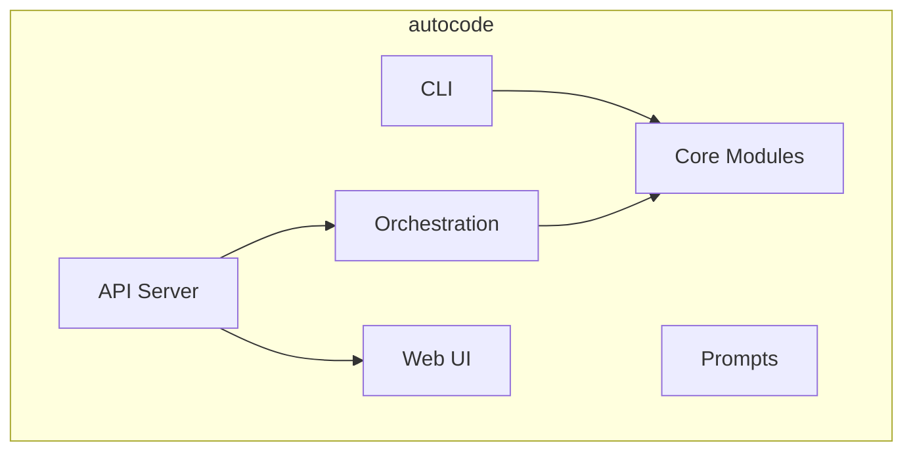

# Módulo: Autocode

## 🎯 Propósito del Módulo
`autocode` es el módulo raíz que contiene toda la lógica de la aplicación. Su propósito es proporcionar una plataforma integrada que combina la verificación de documentación, el análisis de cambios en Git, la validación de tests y un sistema de monitoreo en tiempo real, todo a través de una arquitectura modular y extensible.

## 🏗️ Arquitectura del Módulo
La arquitectura de `autocode` está dividida en capas y módulos con responsabilidades claras:

-   **`cli.py`**: El punto de entrada para la interacción del usuario a través de la línea de comandos.
-   **`core`**: Contiene la lógica de negocio principal y las herramientas de análisis.
-   **`orchestration`**: Gestiona la ejecución periódica y automatizada de las herramientas del `core`.
-   **`api`**: Expone la funcionalidad del `orchestration` y del `core` a través de una API RESTful.
-   **`web`**: Contiene los archivos estáticos (JS, CSS) y las plantillas HTML para el dashboard de monitoreo.
-   **`prompts`**: Almacena las plantillas de prompts para las interacciones con IA.

## 📁 Componentes del Módulo
### `cli.py` - Interfaz de Línea de Comandos
**Propósito**: Proporciona los comandos para que los usuarios interactúen con el sistema.
**Documentación**: [cli.md](cli.md)

### `/core` - Módulo Core
**Propósito**: Contiene la lógica de negocio fundamental para todas las verificaciones y análisis.
**Documentación**: [core/_module.md](core/_module.md)

### `/orchestration` - Módulo de Orquestación
**Propósito**: Gestiona la ejecución programada y continua de las verificaciones.
**Documentación**: [orchestration/_module.md](orchestration/_module.md)

### `/api` - Módulo de API
**Propósito**: Proporciona la interfaz web y la API RESTful para el monitoreo.
**Documentación**: [api/_module.md](api/_module.md)

### `/web` - Módulo Web
**Propósito**: Contiene los assets del frontend para el dashboard de monitoreo.
**Documentación**: [web/_module.md](web/_module.md)

### `/prompts` - Módulo de Prompts
**Propósito**: Almacena plantillas de texto para ser usadas en análisis de IA.
**Documentación**: [prompts/_module.md](prompts/_module.md)

## 💡 Flujo de Trabajo Típico
Un usuario puede interactuar con `autocode` de dos maneras principales:
1.  **Vía CLI**: Ejecutando comandos como `autocode check-docs` para obtener un informe inmediato.
2.  **Vía Web**: Ejecutando `autocode daemon` para iniciar el servidor y accediendo al dashboard en un navegador para un monitoreo continuo.
