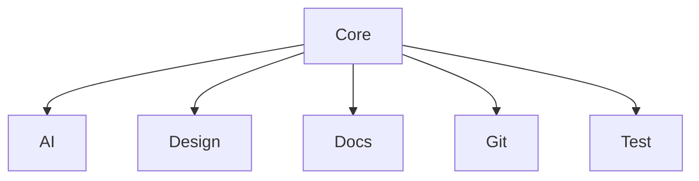

# Módulo: Core

## 🎯 Propósito del Módulo
El módulo `core` contiene la lógica de negocio y las funcionalidades fundamentales del sistema `autocode`. Su responsabilidad es proporcionar todos los componentes necesarios para el análisis y la verificación automatizada del código, la documentación y los tests de un proyecto.

## 🏗️ Arquitectura del Módulo
El `core` está organizado en submódulos, cada uno enfocado en un área de responsabilidad específica.

## 📁 Componentes del Módulo
### `/ai` - Módulo de Inteligencia Artificial
**Propósito**: Contiene herramientas para interactuar con LLMs y otras capacidades de IA.
**Documentación**: [ai/_module.md](ai/_module.md)

### `/design` - Módulo de Generación de Diseño
**Propósito**: Sistema para analizar código y generar documentación de diseño visual.
**Documentación**: [design/_module.md](design/_module.md)

### `/docs` - Módulo de Verificación de Documentación
**Propósito**: Herramientas para verificar el estado de la documentación del proyecto.
**Documentación**: [docs/_module.md](docs/_module.md)

### `/git` - Módulo de Análisis de Git
**Propósito**: Componente para analizar el estado de un repositorio de Git.
**Documentación**: [git/_module.md](git/_module.md)

### `/test` - Módulo de Verificación de Tests
**Propósito**: Herramientas para verificar la cobertura y el estado de los tests.
**Documentación**: [test/_module.md](test/_module.md)

## 💡 Flujo de Trabajo Típico
Los componentes del `core` son invocados por las capas superiores de la aplicación, como la `cli` o la `api`, para ejecutar las tareas de análisis y verificación. Por ejemplo, el comando `autocode check-all` utilizaría secuencialmente `DocChecker`, `TestChecker` y `GitAnalyzer` para obtener un informe completo del estado del proyecto.
