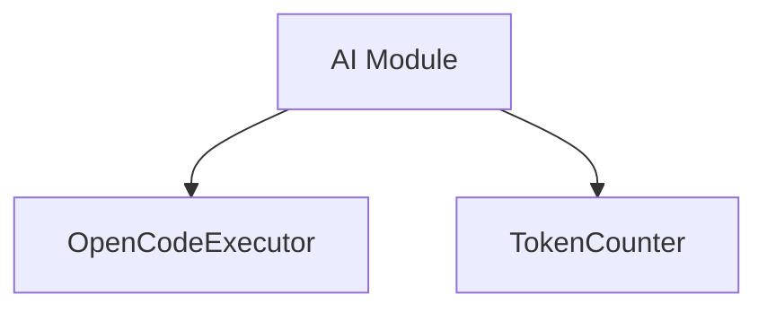

# Módulo: AI

## 🎯 Propósito del Módulo
Este módulo agrupa las funcionalidades relacionadas con la interacción con modelos de lenguaje grandes (LLM) y herramientas de inteligencia artificial. Su propósito es abstraer la complejidad de estas interacciones, proporcionando una interfaz sencilla para tareas como la ejecución de análisis de código con IA y el conteo de tokens.

## 🏗️ Arquitectura del Módulo
El módulo está compuesto por componentes independientes que se enfocan en tareas de IA específicas.

## 📁 Componentes del Módulo
### `opencode_executor.py` - Ejecutor de OpenCode
**Propósito**: Proporciona una interfaz para ejecutar la herramienta `opencode` en modo "headless", gestionando la configuración y la captura de resultados.
**Documentación**: [opencode_executor.md](opencode_executor.md)

### `token_counter.py` - Contador de Tokens
**Propósito**: Ofrece utilidades para contar tokens en textos y archivos usando `tiktoken`, esencial para estimar costos y gestionar los límites de contexto de los LLM.
**Documentación**: [token_counter.md](token_counter.md)

## 🔗 Dependencias del Módulo
### Internas
- `autocode.prompts`: Utilizado por `OpenCodeExecutor` para cargar los prompts.

### Externas
- `PyYAML`: Para la configuración de `OpenCodeExecutor`.
- `tiktoken`: Utilizado por `TokenCounter` para la tokenización.

## 💡 Flujo de Trabajo Típico
Los componentes de este módulo son utilizados por otras partes del sistema que necesitan interactuar con capacidades de IA. Por ejemplo, el `cli.py` puede usar `OpenCodeExecutor` para lanzar un análisis de IA, o `GitAnalyzer` podría usar `TokenCounter` para asegurar que los diffs no excedan el límite de tokens de un LLM antes de generar un mensaje de commit.
