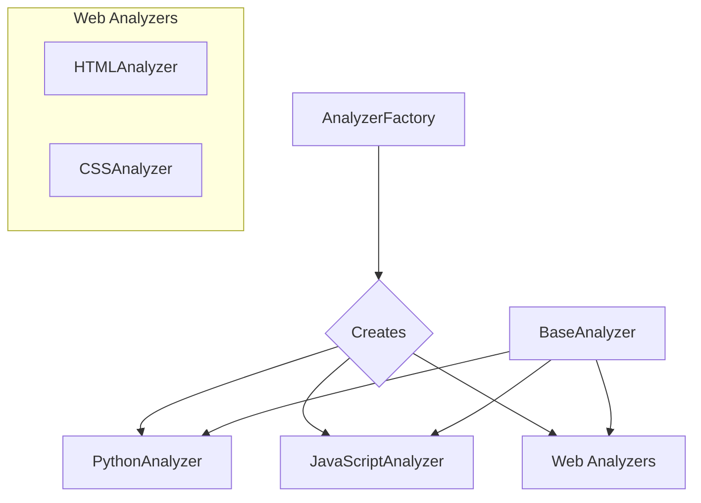

# Módulo: Analyzers

## 🎯 Propósito del Módulo
Este módulo es el corazón del sistema de análisis de código. Su propósito es proporcionar un framework extensible para analizar diferentes lenguajes de programación y extraer su estructura en un formato de datos estandarizado. Contiene la lógica para la creación dinámica de analizadores y las implementaciones concretas para cada lenguaje.

## 🏗️ Arquitectura del Módulo
La arquitectura se basa en el **Patrón de Factoría** y el **Patrón de Estrategia**, donde `CodeToDesign` (el contexto) utiliza diferentes estrategias (los analizadores) para procesar el código.

## 📁 Componentes del Módulo
### `base_analyzer.py` - Interfaz del Analizador
**Propósito**: Define la clase base abstracta `BaseAnalyzer` que todos los analizadores deben implementar, garantizando una interfaz consistente.
**Documentación**: [base_analyzer.md](base_analyzer.md)

### `analyzer_factory.py` - Factoría de Analizadores
**Propósito**: Crea dinámicamente las instancias de los analizadores correctos basándose en la configuración o en las extensiones de los archivos encontrados.
**Documentación**: [analyzer_factory.md](analyzer_factory.md)

### `/python` - Analizador de Python
**Propósito**: Contiene la implementación del analizador para código Python, utilizando el módulo `ast`.
**Documentación**: [python/_module.md](python/_module.md)

### `/javascript` - Analizador de JavaScript
**Propósito**: Contiene la implementación del analizador para JavaScript y TypeScript, basado en expresiones regulares.
**Documentación**: [javascript/_module.md](javascript/_module.md)

### `/web` - Analizadores Web
**Propósito**: Contiene los analizadores para tecnologías web como HTML y CSS.
**Documentación**: [web/_module.md](web/_module.md)

## 🔗 Dependencias del Módulo
- `ast`: Para el análisis de Python.
- `beautifulsoup4`: Para el análisis de HTML.
- `re`: Para los analizadores basados en expresiones regulares.

## 💡 Flujo de Trabajo Típico
1.  `CodeToDesign` solicita a `AnalyzerFactory` que cree los analizadores necesarios para un directorio.
2.  La factoría detecta los tipos de archivo y devuelve un diccionario de analizadores instanciados (ej. `{'python': PythonAnalyzer(), 'javascript': JavaScriptAnalyzer()}`).
3.  `CodeToDesign` itera sobre este diccionario, ejecutando el método `analyze_directory` de cada analizador.
4.  Los resultados de todos los analizadores se fusionan en una única estructura de datos que representa el diseño completo del código analizado.
