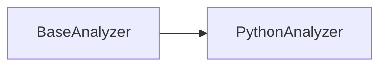

# Módulo: Python Analyzer

## 🎯 Propósito del Módulo
Este módulo contiene el analizador de código especializado para Python. Su único propósito es implementar la lógica necesaria para parsear archivos de código fuente de Python (`.py` y `.pyi`) y extraer una representación estructurada de su contenido.

## 🏗️ Arquitectura del Módulo
El módulo consiste en una única clase, `PythonAnalyzer`, que hereda de `BaseAnalyzer`. Utiliza el módulo `ast` de Python para realizar un análisis sintáctico preciso.

## 📁 Componentes del Módulo
### `analyzer.py` - Analizador de Python
**Propósito**: Parsea el código Python en un Árbol de Sintaxis Abstracta (AST) para extraer información detallada sobre clases, funciones, imports y atributos.
**Documentación**: [analyzer.md](analyzer.md)

## 🔗 Dependencias del Módulo
### Internas
- `autocode.core.design.analyzers.base_analyzer`: Proporciona la interfaz base.

### Externas
- `ast`: Módulo incorporado de Python para el análisis de código.

## 💡 Flujo de Trabajo Típico
`AnalyzerFactory` instancia `PythonAnalyzer` cuando detecta archivos `.py`. `CodeToDesign` utiliza esta instancia para analizar los archivos y obtener los datos estructurados, que luego se usan para generar la documentación de diseño y los diagramas.
