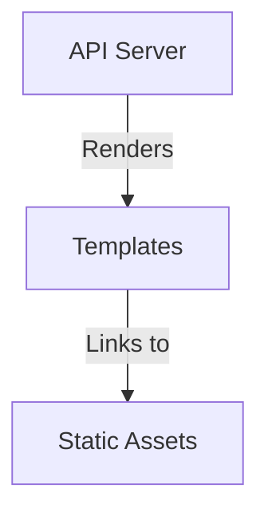

# Módulo: Web

## 🎯 Propósito del Módulo
Este módulo contiene todos los componentes necesarios para construir y servir el frontend del dashboard de monitoreo de `autocode`. Su responsabilidad es proporcionar una interfaz de usuario web moderna e interactiva para la visualización en tiempo real del estado del sistema.

## 🏗️ Arquitectura del Módulo
El módulo `web` está dividido en dos submódulos principales que separan la estructura (HTML) de los assets (CSS, JS).

-   **`/templates`**: Contiene las plantillas HTML que definen la estructura de la página.
-   **`/static`**: Contiene los archivos CSS y JavaScript que son servidos al navegador para dar estilo e interactividad a las plantillas.

## 📁 Componentes del Módulo
### `/static` - Assets Estáticos
**Propósito**: Contiene los archivos CSS y JS que definen la apariencia y el comportamiento del frontend.
**Documentación**: [static/_module.md](static/_module.md)

### `/templates` - Plantillas HTML
**Propósito**: Contiene las plantillas HTML (Jinja2) que estructuran la interfaz de usuario.
**Documentación**: [templates/_module.md](templates/_module.md)

## 💡 Flujo de Trabajo Típico
El `api/server.py` utiliza el contenido de este módulo para servir la interfaz web. Cuando un usuario accede al dashboard, el servidor renderiza la plantilla `index.html` desde `/templates` y el navegador del usuario descarga los archivos correspondientes desde `/static` para construir la página interactiva.
