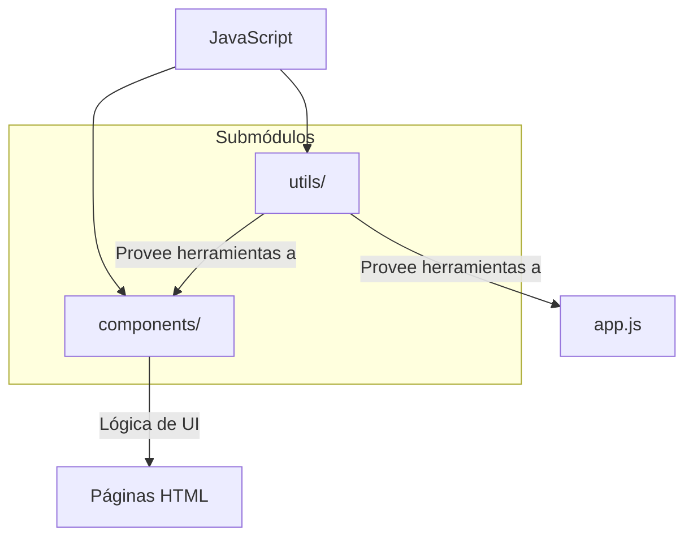

# Módulo: JavaScript del Frontend

## 🎯 Propósito del Módulo
Este módulo contiene todo el código JavaScript del lado del cliente para la aplicación `autocode`. Su responsabilidad general es hacer que la interfaz web sea interactiva y dinámica, manejando la lógica de la aplicación en el navegador, la comunicación con el servidor y la manipulación del DOM.

## 🏗️ Arquitectura del Módulo
El código está estructurado en subdirectorios que separan las incumbencias, principalmente entre componentes de UI y funciones de utilidad.

## 📁 Componentes del Módulo
### `/components` - Lógica de Componentes de UI
**Propósito**: Contiene los scripts que controlan la lógica específica de los componentes de la interfaz de usuario.
**Documentación**: [components/_module.md](components/_module.md)

### `/utils` - Utilidades
**Propósito**: Agrupa funciones y clases de utilidad reutilizables, como el cliente de API.
**Documentación**: [utils/_module.md](utils/_module.md)

## 🔗 Dependencias del Módulo
### Internas
- **`autocode.web.templates`**: El código de este módulo está intrínsecamente ligado a las plantillas HTML, ya que las manipula.

### Externas
- **`fetch API`**: Para la comunicación con el backend.
- **`mermaid.js`**: Para el renderizado de diagramas.

## 💡 Flujo de Trabajo Típico
1. La plantilla `base.html` carga los scripts principales (como `app.js` y las utilidades).
2. Una plantilla de página específica (e.g., `pages/ui_designer.html`) carga el script de su componente correspondiente (`components/ui_designer.js`).
3. Los scripts se inicializan y comienzan a interactuar con el DOM y la API para crear una experiencia de usuario dinámica.
