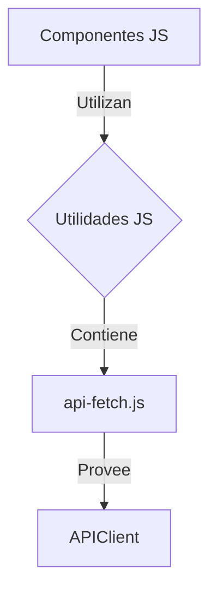

# Módulo: Utilidades de JavaScript

## 🎯 Propósito del Módulo
Este módulo agrupa scripts de JavaScript que proporcionan funcionalidades de utilidad de propósito general, diseñadas para ser reutilizadas por otros componentes del frontend. Su objetivo es encapsular lógica común, como la comunicación con la API, para evitar la duplicación de código y facilitar el mantenimiento.

## 🏗️ Arquitectura del Módulo
Las utilidades de este módulo están diseñadas para ser autocontenidas y, a menudo, exponen su funcionalidad a través de una instancia global o una clase para un fácil acceso desde otros scripts.

## 📁 Componentes del Módulo
### `api-fetch.js` - Cliente de API
**Propósito**: Proporciona una clase `APIClient` que simplifica las peticiones `fetch` al backend de `autocode`, manejando la configuración, los errores y la serialización de datos.
**Documentación**: [api-fetch.md](api-fetch.md)

## 🔗 Dependencias del Módulo
### Internas (otros módulos del proyecto)
- Este módulo está diseñado para no tener dependencias de otros módulos de JavaScript, pero es una dependencia **para** otros módulos (como `js/components` y `app.js`).

### Externas
- `fetch API`: Depende de la API `fetch` nativa del navegador.

## 💡 Flujo de Trabajo Típico
1. Un script de utilidad, como `api-fetch.js`, se carga en `base.html`.
2. Crea una instancia global (e.g., `window.apiClient`).
3. Cualquier otro script del frontend (componentes, lógica de la aplicación) puede acceder a esta instancia global para utilizar su funcionalidad sin necesidad de importarla explícitamente.
