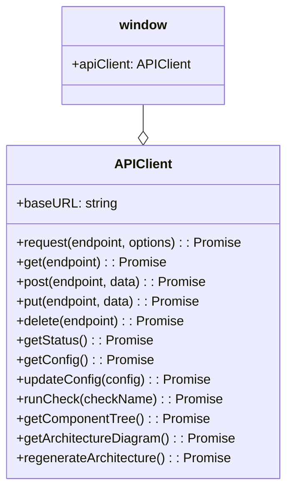

# APIClient Utility

## 🎯 Propósito
Este script proporciona una clase `APIClient` que actúa como un cliente HTTP reutilizable para interactuar con la API del backend de `autocode`. Su objetivo es centralizar y simplificar la lógica de las peticiones `fetch`, gestionar errores de manera consistente y ofrecer métodos de conveniencia para los endpoints específicos de la aplicación.

## 🏗️ Arquitectura
El script define una única clase, `APIClient`, que encapsula toda la funcionalidad. Al final del archivo, se crea una instancia global (`window.apiClient`) para que pueda ser accedida fácilmente desde cualquier otro componente de JavaScript del frontend sin necesidad de importaciones o reinicializaciones.



## 📋 Responsabilidades
- **Abstraer `fetch`**: Oculta la complejidad de la API `fetch` nativa del navegador.
- **Centralizar la URL base**: Permite configurar una URL base para todas las peticiones (por defecto `/api`).
- **Gestionar cabeceras**: Añade automáticamente la cabecera `Content-Type: application/json`.
- **Manejar errores**: Captura errores de red y respuestas no exitosas (status != 2xx) en un único lugar.
- **Serializar datos**: Convierte automáticamente los objetos de datos de JavaScript a formato JSON para las peticiones `POST` y `PUT`.
- **Proporcionar métodos de conveniencia**: Ofrece métodos directos para los verbos HTTP (get, post, put, delete) y para endpoints específicos de la aplicación.

## 🔗 Dependencias
### Internas
- Ninguna. Es un script de utilidad autocontenido.

### Externas
- `fetch API`: Depende de la API `fetch` nativa del navegador para realizar las peticiones HTTP.

## 📊 Interfaces Públicas
### Clase `APIClient`
- `constructor(baseURL)`: Crea una nueva instancia del cliente.
- `request(endpoint, options)`: Método base para realizar cualquier tipo de petición.
- `get(endpoint)`: Realiza una petición GET.
- `post(endpoint, data)`: Realiza una petición POST con datos.
- `put(endpoint, data)`: Realiza una petición PUT con datos.
- `delete(endpoint)`: Realiza una petición DELETE.
- **Métodos específicos**: `getStatus()`, `getConfig()`, `updateConfig(config)`, `runCheck(checkName)`, `getComponentTree()`, `getArchitectureDiagram()`, `regenerateArchitecture()`.

### Instancia Global
- `window.apiClient`: Una instancia de `APIClient` disponible globalmente.

## 💡 Patrones de Uso
En cualquier otro script del frontend, se puede utilizar la instancia global `window.apiClient` para realizar llamadas a la API de forma sencilla.

```javascript
// Ejemplo: Obtener el estado del sistema desde otro script
async function displaySystemStatus() {
    try {
        const status = await window.apiClient.getStatus();
        console.log('Estado del sistema:', status);
        // Lógica para mostrar el estado en la UI
    } catch (error) {
        console.error('No se pudo obtener el estado:', error);
        // Lógica para mostrar un error en la UI
    }
}

// Ejemplo: Ejecutar una verificación
async function triggerDocCheck() {
    try {
        const result = await window.apiClient.runCheck('docs');
        console.log('Resultado de la verificación:', result);
    } catch (error) {
        console.error('Falló la verificación de documentos:', error);
    }
}
```

## ⚠️ Consideraciones
- **Gestión de Errores**: El cliente lanza una excepción si la petición falla. El código que lo utiliza es responsable de capturar estos errores con un bloque `try...catch`.
- **Global Scope**: La creación de una instancia global (`window.apiClient`) es conveniente pero puede introducir dependencias implícitas. Es un patrón común en aplicaciones más pequeñas, pero en sistemas más grandes podría considerarse el uso de módulos ES6.
- **Seguridad**: No maneja autenticación ni tokens. Es adecuado para una API interna que no requiere autenticación.

## 🧪 Testing
Para probar este componente:
1. Ejecutar el servidor de `autocode`.
2. Abrir la consola del navegador en cualquier página de la aplicación.
3. Ejecutar llamadas usando la instancia `window.apiClient`, por ejemplo: `await window.apiClient.getStatus()`.
4. Verificar que las respuestas son las esperadas y que los errores (ej. peticiones a endpoints inexistentes) son capturados correctamente.
