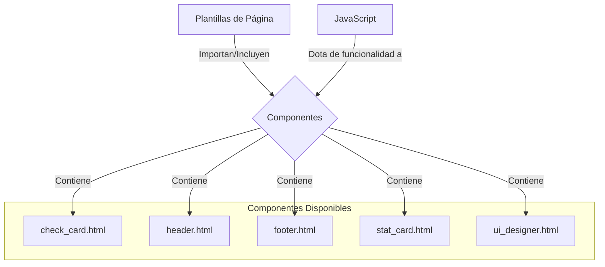

# Módulo: Componentes de Plantillas

## 🎯 Propósito del Módulo
Este módulo contiene todos los componentes de UI reutilizables de la aplicación, definidos como plantillas de Jinja2. Su propósito es encapsular fragmentos de HTML en piezas modulares y configurables (a menudo como macros) que pueden ser fácilmente incluidas o importadas en las plantillas de página principales. Esto promueve la reutilización de código y un desarrollo de la interfaz más limpio y mantenible.

## 🏗️ Arquitectura del Módulo
La arquitectura se basa en la componentización de la UI. Los archivos de este módulo son o bien macros de Jinja2 (`.html` que definen ``) o bien fragmentos de HTML simples diseñados para ser insertados con ``.

## 📁 Componentes del Módulo
### `check_card.html` - Tarjeta de Verificación
**Propósito**: Muestra el estado y los detalles de una verificación del sistema (Docs, Test, Git).
**Documentación**: [check_card.md](check_card.md)

### `footer.html` - Pie de Página
**Propósito**: Define el pie de página global de la aplicación.
**Documentación**: [footer.md](footer.md)

### `header.html` - Cabecera
**Propósito**: Define la cabecera global de la aplicación.
**Documentación**: [header.md](header.md)

### `stat_card.html` - Tarjeta de Estadística
**Propósito**: Un componente atómico para mostrar un par etiqueta-valor.
**Documentación**: [stat_card.md](stat_card.md)

### `ui_designer.html` - Visor de Diseño
**Propósito**: Proporciona la estructura principal para la interfaz del visor de documentación de diseño.
**Documentación**: [ui_designer.md](ui_designer.md)

## 🔗 Dependencias del Módulo
### Internas
- Estos componentes están diseñados para ser utilizados por las plantillas del módulo `autocode.web.templates.pages`.

### Externas
- **JavaScript**: La mayoría de estos componentes son solo la estructura estática y dependen críticamente de los scripts en `autocode.web.static.js` para ser funcionales.

## 💡 Flujo de Trabajo Típico
1. Una plantilla de página (e.g., `dashboard.html`) necesita un componente.
2. Si el componente es una macro (como `check_card`), lo importa usando ``.
3. Si el componente es un simple fragmento (como `header.html`), lo incluye usando ``.
4. La plantilla renderiza el HTML del componente.
5. El JavaScript correspondiente se encarga de hacer el componente interactivo.
