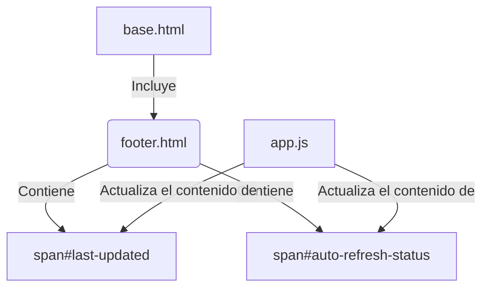

# Componente: Footer (footer.html)

## 🎯 Propósito
Este archivo define el componente de pie de página (`<footer>`) para la interfaz web de `autocode`. Su propósito es mostrar información dinámica sobre el estado de la aplicación, como la hora de la última actualización y el estado del refresco automático.

## 🏗️ Arquitectura
Es un componente HTML simple y autocontenido, diseñado para ser incluido en plantillas más grandes (como `base.html`). No utiliza macros de Jinja2, ya que su contenido es estático en el momento de la renderización inicial, pero contiene elementos `<span>` con IDs específicos para ser actualizados por JavaScript.



## 📋 Responsabilidades
- **Proporcionar una estructura de pie de página**: Define el elemento semántico `<footer>`.
- **Mostrar la hora de la última actualización**: Contiene un placeholder para la marca de tiempo de la última actualización de datos.
- **Mostrar el estado del auto-refresco**: Indica si la funcionalidad de auto-refresco está activada o desactivada.
- **Proporcionar hooks para JavaScript**: Utiliza IDs (`last-updated`, `auto-refresh-status`) para que el contenido pueda ser manipulado dinámicamente desde el frontend.

## 🔗 Dependencias
### Internas
- **`base.html`**: Este componente está diseñado para ser incluido por la plantilla base.

### Externas
- **JavaScript (`app.js`)**: Es fundamental para la funcionalidad de este componente. `app.js` es responsable de:
    - Obtener los datos de estado de la API.
    - Actualizar el contenido de los `<span>` con la información recibida.

## 📊 Interfaces Públicas
Este componente no tiene una interfaz pública en el sentido de una API o macro. Su "interfaz" son los IDs de los elementos que expone para la manipulación por parte de JavaScript:
- `id="last-updated"`: El `<span>` que mostrará la fecha y hora de la última actualización.
- `id="auto-refresh-status"`: El `<span>` que mostrará el estado del refresco automático (e.g., "ON" o "OFF").

## 💡 Patrones de Uso
Este componente se utiliza incluyéndolo directamente en otra plantilla, típicamente al final del `<body>`.

```jinja
{# En base.html o cualquier otra plantilla de layout #}
<body>
    ...
    <main>
        ...
    </main>
    
    
</body>
```

## ⚠️ Consideraciones
- **Contenido Dinámico**: El contenido mostrado es puramente dinámico y depende de que `app.js` funcione correctamente. Sin JavaScript, los valores por defecto ("--" y "ON") serán los únicos visibles.
- **Estilo**: El estilo visual del pie de página se define en los archivos CSS globales (`style.css`).

## 🧪 Testing
Para verificar este componente:
1. Cargar cualquier página de la aplicación que incluya `base.html`.
2. Observar el pie de página al final de la página.
3. Verificar que, después de la carga inicial de datos por `app.js`, los valores de "Last updated" y "Auto-refresh" se actualizan correctamente.
4. Desactivar el refresco automático (si la UI lo permite) y confirmar que el estado en el pie de página cambia.
