# Documento de Diseño: AI Operations Pipelines Module

## Resumen Ejecutivo

El módulo `pipelines.py` proporciona funciones de orquestación de alto nivel que combinan operaciones de I/O de archivos con generación de contenido mediante DSPy. Su propósito principal es facilitar workflows completos de transformación bidireccional entre documentos de diseño y código Python, además de ofrecer capacidades genéricas de generación de IA con múltiples signatures y módulos DSPy.

### Capacidades Clave

- **Conversión texto-a-código**: Transforma documentos de diseño en código Python ejecutable
- **Conversión código-a-diseño**: Genera documentación técnica completa desde código fuente
- **Generación genérica**: Interfaz flexible para ejecutar cualquier signature DSPy con configuración personalizada
- **Integración con registro**: Todas las funciones están registradas para exposición HTTP
- **Manejo robusto de errores**: Validación y captura de excepciones en todos los flujos

## Componentes Principales

### 1. Tipos y Constantes

#### `SignatureType`
```python
SignatureType = Literal['code_generation', 'design_document', 'qa']
```
- **Propósito**: Define los tipos de signatures disponibles para selección en UI
- **Valores**: `code_generation`, `design_document`, `qa`
- **Uso**: Validación de entrada en función `generate()`

#### `SIGNATURE_MAP`
```python
SIGNATURE_MAP = {
    'code_generation': CodeGenerationSignature,
    'design_document': DesignDocumentSignature,
    'qa': QASignature
}
```
- **Propósito**: Mapeo entre strings de tipo y clases de signature reales
- **Estructura**: Dict[str, Type[Signature]]
- **Uso**: Resolución dinámica de signatures en tiempo de ejecución

### 2. Funciones de Pipeline Completo

#### `text_to_code()`
```python
@register_function(http_methods=["GET", "POST"])
def text_to_code(
    input_path: str,
    output_path: str,
    model: ModelType = 'openrouter/openai/gpt-4o'
) -> str
```

**Propósito**: Pipeline completo de conversión de documento de diseño a código Python.

**Flujo de Ejecución**:
1. Lee documento de diseño desde `input_path` usando `read_design_document()`
2. Invoca `generate_with_dspy()` con `CodeGenerationSignature`
3. Extrae campo `python_code` del resultado
4. Escribe código en `output_path` usando `write_python_file()`
5. Retorna mensaje de éxito con estadísticas

**Parámetros**:
- `input_path`: Ruta al archivo de entrada (Markdown u otro texto)
- `output_path`: Ruta destino para archivo .py generado
- `model`: Modelo LLM a utilizar (default: GPT-4o via OpenRouter)

**Retorno**: String con mensaje de éxito/error y estadísticas de líneas

**Excepciones Manejadas**:
- `ValueError`: Errores de validación de entrada
- `FileNotFoundError`: Archivo de entrada no existe
- `IOError`: Errores de lectura/escritura
- `Exception`: Errores inesperados genéricos

#### `code_to_design()`
```python
@register_function(http_methods=["GET", "POST"])
def code_to_design(
    input_path: str,
    output_path: str,
    include_diagrams: bool = True,
    model: ModelType = 'openrouter/openai/gpt-4o'
) -> str
```

**Propósito**: Pipeline completo de generación de documentación desde código Python.

**Flujo de Ejecución**:
1. Lee código Python desde `input_path` usando `read_file()`
2. Invoca `generate_with_dspy()` con `DesignDocumentSignature`
3. Extrae campo `design_document` del resultado
4. Escribe documento en `output_path` usando `write_file()` con tipo 'markdown'
5. Retorna mensaje de éxito con estadísticas

**Parámetros**:
- `input_path`: Ruta al archivo .py fuente
- `output_path`: Ruta destino para archivo .md generado
- `include_diagrams`: Flag para incluir diagramas Mermaid (default: True)
- `model`: Modelo LLM a utilizar

**Retorno**: String con mensaje de éxito/error, estadísticas y estado de diagramas

**Excepciones Manejadas**: Mismas que `text_to_code()`

### 3. Funciones Genéricas

#### `generate()`
```python
@register_function(http_methods=["GET", "POST"])
def generate(
    signature_type: SignatureType,
    inputs: Dict[str, Any],
    model: ModelType = 'openrouter/openai/gpt-4o',
    module_type: ModuleType = 'ChainOfThought',
    module_kwargs: Optional[Dict[str, Any]] = None,
    max_tokens: int = 16000,
    temperature: float = 0.7
) -> Dict[str, Any]
```

**Propósito**: Wrapper genérico para ejecutar cualquier signature DSPy con configuración completa.

**Características**:
- Selección dinámica de signature mediante `signature_type`
- Configuración de módulo DSPy (Predict, ChainOfThought, ReAct, etc.)
- Control de parámetros LLM (max_tokens, temperature)
- Retorno de diccionario completo con todos los outputs

**Parámetros**:
- `signature_type`: Tipo de signature ('code_generation', 'design_document', 'qa')
- `inputs`: Dict con parámetros específicos de la signature
- `model`: Modelo LLM
- `module_type`: Tipo de módulo DSPy (default: ChainOfThought)
- `module_kwargs`: Parámetros adicionales del módulo (ej: tools para ReAct)
- `max_tokens`: Límite de tokens (default: 16000)
- `temperature`: Control de aleatoriedad (default: 0.7)

**Ejemplos de Inputs por Signature**:
- `code_generation`: `{"design_text": "Create a function that..."}`
- `design_document`: `{"python_code": "def foo()...", "include_diagrams": true}`
- `qa`: `{"question": "What is...?"}`

**Ejemplos de module_kwargs**:
- ReAct: `{"tools": [func1, func2], "max_iters": 5}`
- Predict: `{"n": 5}` (múltiples completions)

**Retorno**: Dict[str, Any] con todos los campos de salida de la signature

#### `generate_code()`
```python
@register_function(http_methods=["GET", "POST"])
def generate_code(
    design_text: str,
    model: ModelType = 'openrouter/openai/gpt-4o'
) -> str
```

**Propósito**: Función especializada para generar código desde texto de diseño.

**Simplificación**: Wrapper sobre `generate_with_dspy()` con `CodeGenerationSignature` que extrae directamente el campo `python_code`.

#### `generate_design()`
```python
@register_function(http_methods=["GET", "POST"])
def generate_design(
    python_code: str,
    include_diagrams: bool = True,
    model: ModelType = 'openrouter/openai/gpt-4o'
) -> str
```

**Propósito**: Función especializada para generar documentación desde código.

**Simplificación**: Wrapper sobre `generate_with_dspy()` con `DesignDocumentSignature` que extrae directamente el campo `design_document`.

#### `generate_answer()`
```python
@register_function(http_methods=["GET", "POST"])
def generate_answer(
    question: str,
    model: ModelType = 'openrouter/openai/gpt-4o'
) -> str
```

**Propósito**: Función especializada para responder preguntas con razonamiento.

**Simplificación**: Wrapper sobre `generate_with_dspy()` con `QASignature` que extrae directamente el campo `answer`.

## Flujos y Procesos Clave

### Flujo 1: Conversión Texto-a-Código

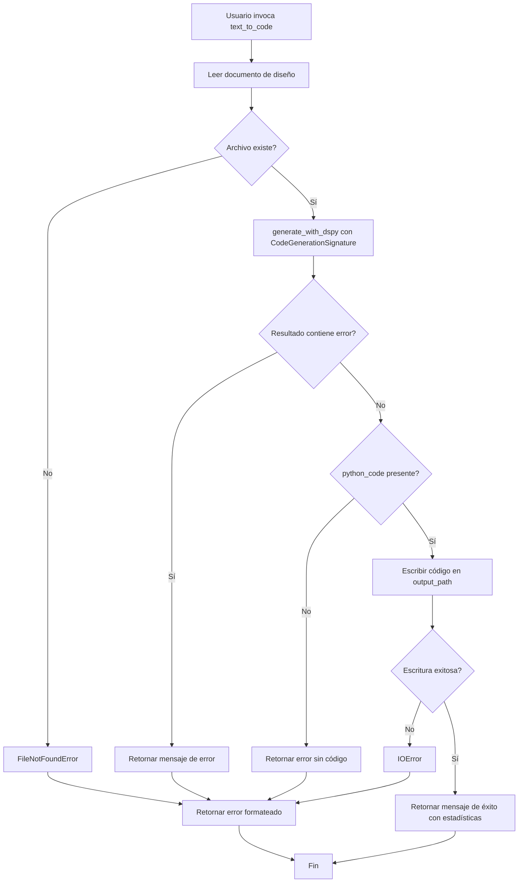

### Flujo 2: Conversión Código-a-Diseño

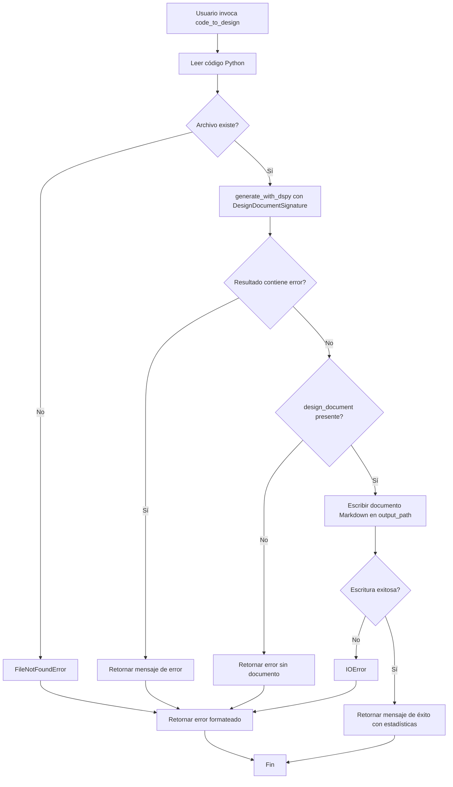

### Flujo 3: Generación Genérica

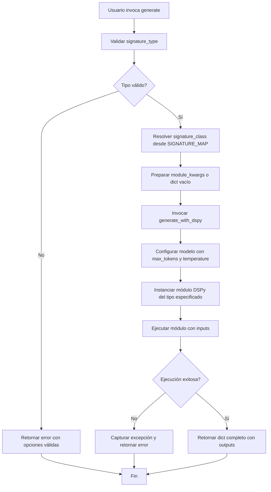

### Flujo 4: Generación Especializada

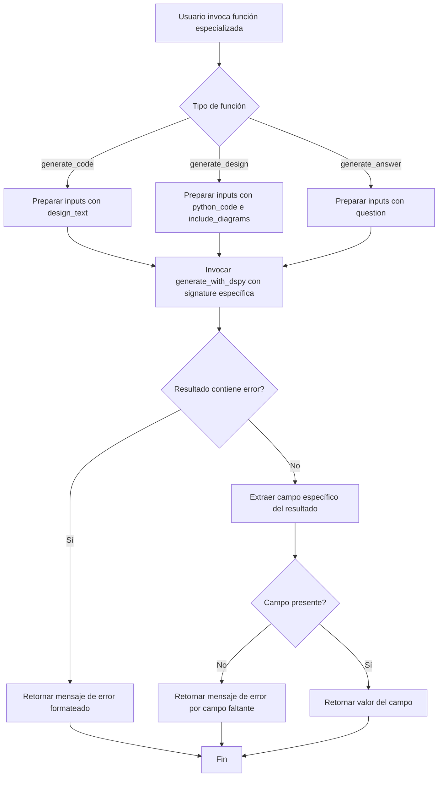

## Dependencias y Relaciones

### Dependencias Internas

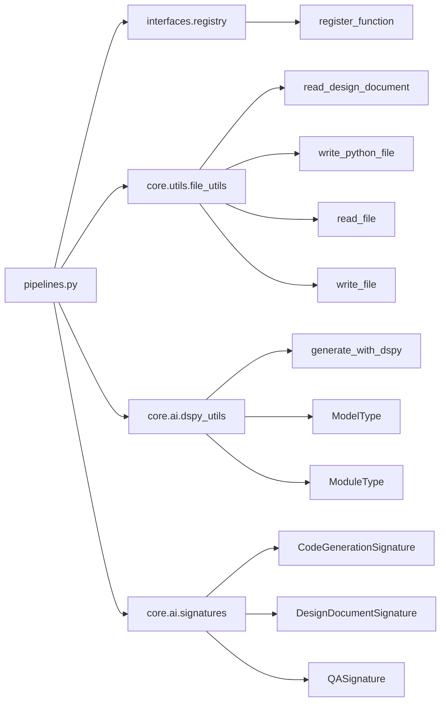

### Dependencias Externas

- **DSPy Framework**: Para ejecución de módulos de IA (Predict, ChainOfThought, ReAct, etc.)
- **LLM Providers**: OpenRouter, OpenAI u otros proveedores configurados
- **Sistema de Archivos**: Para operaciones de lectura/escritura

### Relaciones de Datos

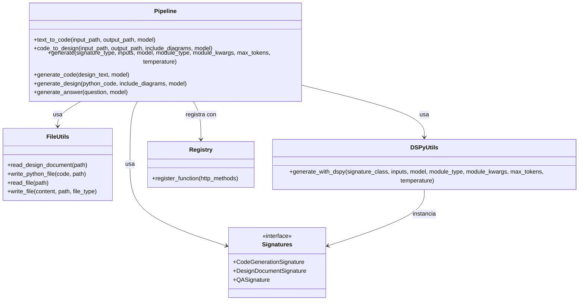

## Gestión de Estado y Recursos

### Estado

El módulo es **stateless** a nivel de funciones:
- No mantiene estado entre invocaciones
- Cada llamada es independiente y autocontenida
- No hay variables globales mutables

### Recursos

#### Archivos
- **Lectura**: Archivos de diseño (.md, .txt) y código (.py)
- **Escritura**: Archivos generados (.py, .md)
- **Gestión**: Delegada a `file_utils` con manejo de excepciones

#### Conexiones LLM
- **Creación**: Gestionada por `dspy_utils.generate_with_dspy()`
- **Configuración**: Via parámetros `model`, `max_tokens`, `temperature`
- **Ciclo de vida**: Por request (no se mantienen conexiones persistentes)

#### Memoria
- **Inputs**: Carga completa de archivos en memoria (potencial limitación para archivos grandes)
- **Outputs**: Generación completa antes de escritura
- **Consideración**: Sin streaming, todo el contenido se procesa en memoria

## Artefactos de Entrada y Salida

### Entradas

#### `text_to_code()`
- **Archivo de entrada**: Documento de diseño (Markdown, texto plano)
- **Formato**: Texto con especificaciones, requisitos, descripciones
- **Ejemplo**:
  ```markdown
  # Función de Ordenamiento
  Crear una función que ordene una lista de números usando quicksort.
  Debe manejar listas vacías y retornar una nueva lista ordenada.
  ```

#### `code_to_design()`
- **Archivo de entrada**: Código Python (.py)
- **Formato**: Código fuente Python válido
- **Ejemplo**:
  ```python
  def quicksort(arr):
      if len(arr) <= 1:
          return arr
      pivot = arr[len(arr) // 2]
      left = [x for x in arr if x < pivot]
      middle = [x for x in arr if x == pivot]
      right = [x for x in arr if x > pivot]
      return quicksort(left) + middle + quicksort(right)
  ```

#### `generate()`
- **Inputs dinámicos**: Dict con campos específicos de la signature
- **Ejemplos**:
  - Code generation: `{"design_text": "..."}`
  - Design document: `{"python_code": "...", "include_diagrams": True}`
  - QA: `{"question": "..."}`

### Salidas

#### `text_to_code()`
- **Archivo de salida**: Código Python (.py)
- **Formato**: Código Python ejecutable y sintácticamente válido
- **Mensaje de retorno**: String con estadísticas
  ```
  Código generado exitosamente:
  - Input: design.md
  - Output: implementation.py
  - Líneas: 42
  ```

#### `code_to_design()`
- **Archivo de salida**: Documento Markdown (.md)
- **Formato**: Markdown con secciones estructuradas, opcionalmente con diagramas Mermaid
- **Mensaje de retorno**: String con estadísticas
  ```
  Documento de diseño generado exitosamente:
  - Input: implementation.py
  - Output: design.md
  - Líneas: 156
  - Diagramas: Sí
  ```

#### `generate()`
- **Salida**: Dict[str, Any] con todos los campos de la signature
- **Ejemplo para CodeGenerationSignature**:
  ```python
  {
      "reasoning": "Análisis del problema...",
      "python_code": "def foo():...",
      "test_cases": "assert foo() == ..."
  }
  ```

#### Funciones Especializadas
- **Salida**: String con el campo específico extraído
- `generate_code()`: Código Python como string
- `generate_design()`: Documento Markdown como string
- `generate_answer()`: Respuesta como string

### Diagrama de Entrada/Salida

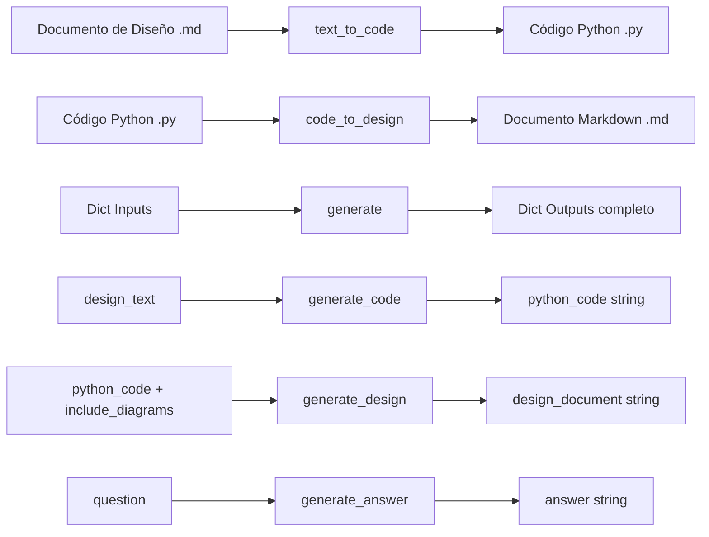

## Diagramas Mermaid

### Diagrama de Secuencia: text_to_code

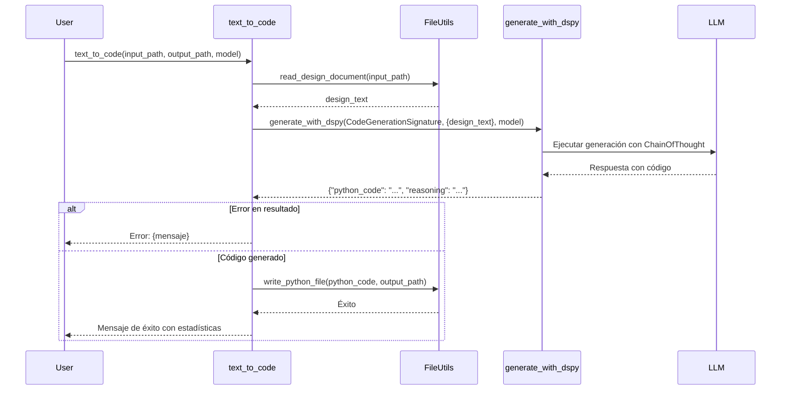

### Diagrama de Secuencia: code_to_design

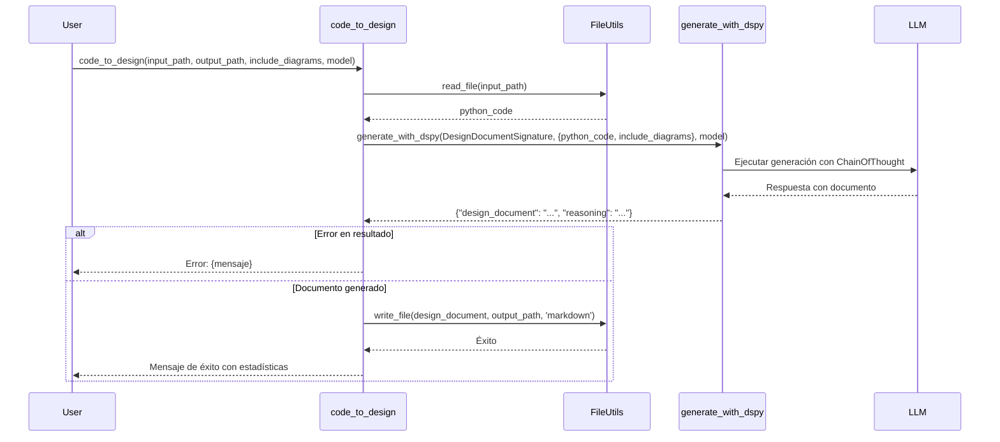

### Diagrama de Secuencia: generate (Genérico)

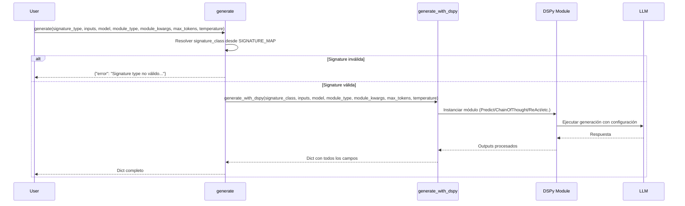

### Diagrama de Estados: Ciclo de Vida de Request

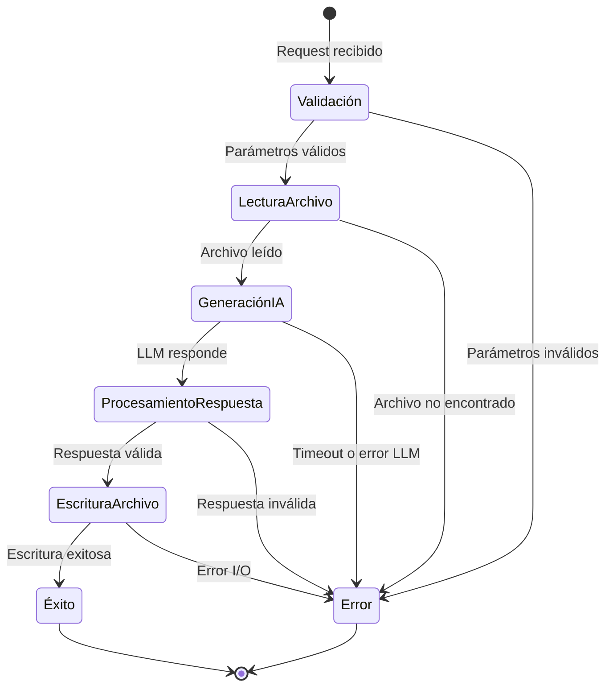

### Diagrama de Clases: Modelo Conceptual

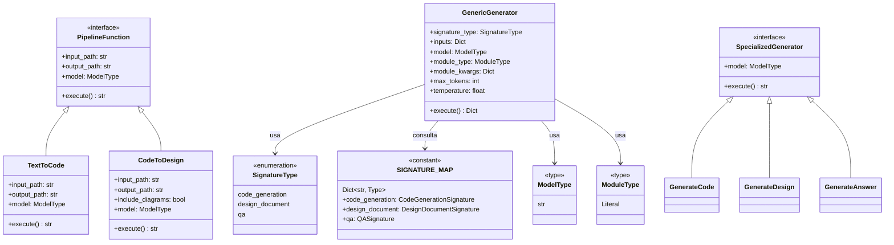

## Ejemplos de Uso

### Ejemplo 1: Conversión Texto-a-Código

```python
from autocode.core.ai.pipelines import text_to_code

# Generar implementación desde especificación
result = text_to_code(
    input_path="specs/sorting_algorithm.md",
    output_path="src/sorting.py",
    model="openrouter/openai/gpt-4o"
)

print(result)
# Output:
# Código generado exitosamente:
# - Input: specs/sorting_algorithm.md
# - Output: src/sorting.py
# - Líneas: 45
```

### Ejemplo 2: Conversión Código-a-Diseño

```python
from autocode.core.ai.pipelines import code_to_design

# Documentar código existente
result = code_to_design(
    input_path="src/sorting.py",
    output_path="docs/sorting_design.md",
    include_diagrams=True,
    model="openrouter/anthropic/claude-3-opus"
)

print(result)
# Output:
# Documento de diseño generado exitosamente:
# - Input: src/sorting.py
# - Output: docs/sorting_design.md
# - Líneas: 234
# - Diagramas: Sí
```

### Ejemplo 3: Generación Genérica con ChainOfThought

```python
from autocode.core.ai.pipelines import generate

# Generar código con razonamiento explícito
result = generate(
    signature_type='code_generation',
    inputs={'design_text': 'Create a binary search function with error handling'},
    model='openrouter/openai/gpt-4o',
    module_type='ChainOfThought',
    max_tokens=8000,
    temperature=0.5
)

print(result['reasoning'])
print(result['python_code'])
```

### Ejemplo 4: Generación con ReAct y Herramientas

```python
from autocode.core.ai.pipelines import generate

def search_docs(query: str) -> str:
    """Simula búsqueda en documentación"""
    return f"Documentación encontrada para: {query}"

def run_tests(code: str) -> str:
    """Simula ejecución de tests"""
    return "Tests passed"

# Generar código con capacidad de búsqueda y testing
result = generate(
    signature_type='code_generation',
    inputs={'design_text': 'Implement a cache with LRU eviction'},
    model='openrouter/openai/gpt-4o',
    module_type='ReAct',
    module_kwargs={
        'tools': [search_docs, run_tests],
        'max_iters': 5
    },
    max_tokens=16000,
    temperature=0.7
)

print(result)
```

### Ejemplo 5: Funciones Especializadas

```python
from autocode.core.ai.pipelines import (
    generate_code,
    generate_design,
    generate_answer
)

# Generar código directamente
code = generate_code(
    design_text="Create a function to validate email addresses",
    model="openrouter/openai/gpt-4o"
)

# Generar documentación directamente
docs = generate_design(
    python_code=code,
    include_diagrams=True,
    model="openrouter/anthropic/claude-3-opus"
)

# Responder pregunta sobre el código
answer = generate_answer(
    question="What regex pattern should I use for email validation?",
    model="openrouter/openai/gpt-4o"
)

print(f"Code:\n{code}\n")
print(f"Docs:\n{docs}\n")
print(f"Answer:\n{answer}")
```

### Ejemplo 6: Múltiples Completions con Predict

```python
from autocode.core.ai.pipelines import generate

# Generar múltiples variantes de código
result = generate(
    signature_type='code_generation',
    inputs={'design_text': 'Create a function to parse JSON with error handling'},
    model='openrouter/openai/gpt-4o',
    module_type='Predict',
    module_kwargs={'n': 3},  # Generar 3 variantes
    max_tokens=4000,
    temperature=0.9  # Mayor creatividad
)

# result contendrá múltiples completions si el módulo lo soporta
print(result)
```

## Manejo de Errores y Casos Límite

### Estrategia de Manejo de Errores

Todas las funciones implementan un patrón consistente:

1. **Try-Catch Jerárquico**: Captura específica de excepciones comunes seguida de catch genérico
2. **Mensajes Informativos**: Errores formateados con contexto útil
3. **Propagación Controlada**: Conversión de excepciones a strings de error
4. **Validación Temprana**: Verificación de precondiciones antes de operaciones costosas

### Errores por Función

#### `text_to_code()` y `code_to_design()`

```python
try:
    # Operaciones principales
except ValueError as e:
    return f"Error: {str(e)}"  # Validación de entrada
except (FileNotFoundError, IOError) as e:
    return f"Error: {str(e)}"  # Problemas de archivo
except Exception as e:
    return f"Error inesperado: {str(e)}"  # Catch-all
```

**Casos Manejados**:
- Archivo de entrada no existe
- Permisos insuficientes de lectura/escritura
- Ruta de salida inválida
- Disco lleno durante escritura
- Formato de archivo inválido
- Error en generación LLM
- Respuesta vacía o malformada del LLM

#### `generate()`

```python
signature_class = SIGNATURE_MAP.get(signature_type)
if not signature_class:
    return {
        "error": f"Signature type '{signature_type}' no válido. "
                 f"Opciones: {list(SIGNATURE_MAP.keys())}"
    }
```

**Casos Manejados**:
- `signature_type` no válido
- `inputs` faltantes o incorrectos
- Error en instanciación de módulo DSPy
- Timeout de LLM
- Respuesta del LLM con formato incorrecto

#### Funciones Especializadas

```python
# Verificar errores
if 'error' in result:
    return f"Error: {result['error']}"

# Verificar campo esperado
campo = result.get('campo_esperado', '')
if not campo:
    return "Error: No se generó {campo_esperado}"
```

**Casos Manejados**:
- Error propagado desde `generate_with_dspy()`
- Campo esperado ausente en respuesta
- Respuesta vacía

### Casos Límite

#### Archivos Grandes
**Problema**: Carga completa en memoria puede causar `MemoryError`
**Mitigación Actual**: Ninguna (limitación conocida)
**Recomendación**: Implementar streaming o procesamiento por chunks para archivos > 10MB

#### Respuestas Truncadas
**Problema**: `max_tokens` insuficiente puede truncar código o documentación
**Mitigación**: Parámetro configurable `max_tokens` (default: 16000)
**Detección**: No hay validación automática de truncamiento
**Recomendación**: Usuario debe ajustar `max_tokens` si ve truncamiento

#### Código Inválido Generado
**Problema**: LLM puede generar código con errores de sintaxis
**Mitigación Actual**: Ninguna
**Recomendación**: Implementar validación post-generación con `ast.parse()`

#### Diagramas Mermaid Inválidos
**Problema**: Sintaxis Mermaid incorrecta en documentación generada
**Mitigación Actual**: Ninguna
**Recomendación**: Validador de sintaxis Mermaid post-generación

#### Rate Limiting de LLM
**Problema**: Demasiadas requests pueden causar errores 429
**Mitigación**: Delegada a `dspy_utils` (no gestionada en este módulo)
**Recomendación**: Implementar retry con backoff exponencial

#### Formato de Inputs Incorrecto
**Problema**: Dict `inputs` con claves incorrectas para la signature
**Mitigación**: Validación en `generate_with_dspy()`
**Comportamiento**: Error retornado en dict de respuesta

### Tabla de Errores y Respuestas

| Error | Causa | Respuesta | Código HTTP (si aplicable) |
|-------|-------|-----------|---------------------------|
| `FileNotFoundError` | Archivo de entrada no existe | `"Error: {mensaje}"` | 404 |
| `IOError` | Error lectura/escritura | `"Error: {mensaje}"` | 500 |
| `ValueError` | Validación de entrada | `"Error: {mensaje}"` | 400 |
| Signature inválida | `signature_type` no en SIGNATURE_MAP | `{"error": "Signature type ... no válido..."}` | 400 |
| Error LLM | Timeout, rate limit, etc. | `"Error: {mensaje}"` o `{"error": "..."}` | 500 |
| Campo faltante | LLM no generó campo esperado | `"Error: No se generó {campo}"` | 500 |
| Exception genérica | Error inesperado | `"Error inesperado: {mensaje}"` | 500 |

## Consideraciones de Rendimiento y Escalabilidad

### Rendimiento

#### Cuellos de Botella

1. **Latencia de LLM**: 
   - Tiempo de respuesta: 5-60 segundos dependiendo del modelo y complejidad
   - Dominante en el tiempo total de ejecución
   - No paralelizable dentro de una request

2. **I/O de Archivos**:
   - Lectura/escritura síncrona
   - Impacto menor comparado con LLM
   - Puede ser significativo para archivos grandes (>1MB)

3. **Carga en Memoria**:
   - Contenido completo cargado en memoria
   - Problema potencial para archivos grandes
   - Sin límite explícito de tamaño

#### Optimizaciones Actuales

- **Ninguna**: El módulo no implementa optimizaciones específicas
- **Delegación**: Optimizaciones de LLM delegadas a DSPy y providers

#### Optimizaciones Recomendadas

1. **Caché de Resultados**:
   ```python
   # Cachear resultados por hash de input
   from functools import lru_cache
   
   @lru_cache(maxsize=100)
   def _cached_generate(design_text_hash, model):
       # Generación real
       pass
   ```

2. **Procesamiento Asíncrono**:
   ```python
   import asyncio
   
   async def text_to_code_async(input_path, output_path, model):
       # Versión asíncrona con await
       pass
   ```

3. **Streaming de Archivos**:
   ```python
   def read_file_chunked(path, chunk_size=1024*1024):
       with open(path, 'r') as f:
           while chunk := f.read(chunk_size):
               yield chunk
   ```

4. **Batch Processing**:
   ```python
   def text_to_code_batch(input_paths, output_paths, model):
       # Procesar múltiples archivos en paralelo
       with concurrent.futures.ThreadPoolExecutor() as executor:
           futures = [
               executor.submit(text_to_code, inp, out, model)
               for inp, out in zip(input_paths, output_paths)
           ]
           return [f.result() for f in futures]
   ```

### Escalabilidad

#### Límites Actuales

- **Concurrencia**: No hay límite en requests concurrentes (riesgo de sobrecarga)
- **Tamaño de Archivo**: Sin límite explícito (riesgo de OOM)
- **Rate Limiting**: Delegado a provider de LLM
- **Memoria**: Crece linealmente con tamaño de entrada

#### Estrategias de Escalabilidad

1. **Horizontal**:
   - Múltiples instancias del servicio
   - Load balancer para distribuir requests
   - Cada instancia es stateless (facilita escalado)

2. **Vertical**:
   - Más memoria para archivos grandes
   - CPU más rápida tiene poco impacto (I/O bound)

3. **Arquitectura Recomendada**:
   ```
   [Load Balancer]
        |
        +--> [API Instance 1] --> [Redis Cache] --> [LLM Provider]
        |
        +--> [API Instance 2] --> [Redis Cache] --> [LLM Provider]
        |
        +--> [API Instance N] --> [Redis Cache] --> [LLM Provider]
   ```

4. **Queue-Based para Workloads Pesados**:
   ```
   [API] --> [Message Queue] --> [Worker Pool] --> [LLM Provider]
                                      |
                                      +--> [Result Store]
   ```

#### Métricas de Rendimiento Esperadas

| Operación | Tamaño Entrada | Tiempo Esperado | Memoria |
|-----------|----------------|-----------------|---------|
| `text_to_code` | 1KB design | 10-30s | ~50MB |
| `text_to_code` | 10KB design | 20-60s | ~100MB |
| `code_to_design` | 1KB code | 15-45s | ~50MB |
| `code_to_design` | 10KB code | 30-90s | ~100MB |
| `generate` (simple) | 1KB input | 5-20s | ~50MB |
| `generate` (ReAct) | 1KB input | 30-120s | ~100MB |

**Nota**: Tiempos dominados por latencia de LLM. Variabilidad alta dependiendo de:
- Modelo seleccionado (GPT-4 más lento que GPT-3.5)
- Complejidad de la tarea
- Carga del provider
- Parámetros `max_tokens` y `temperature`

## Suposiciones y Limitaciones

### Suposiciones

1. **Formato de Archivos**:
   - Archivos de diseño son texto plano o Markdown válido
   - Código Python de entrada es sintácticamente válido
   - Encoding UTF-8 en todos los archivos

2. **Disponibilidad de Servicios**:
   - LLM provider está disponible y responde
   - Sistema de archivos es accesible y tiene espacio
   - Permisos adecuados para lectura/escritura

3. **Calidad de LLM**:
   - LLM genera código sintácticamente válido
   - Documentación generada es coherente y útil
   - Diagramas Mermaid generados son válidos

4. **Tamaño de Datos**:
   - Archivos caben en memoria (< 100MB)
   - Respuestas LLM caben en `max_tokens` configurado
   - No hay necesidad de procesamiento streaming

5. **Contexto de Ejecución**:
   - Funciones se ejecutan en entorno con DSPy configurado
   - Variables de entorno (API keys) están configuradas
   - Registry está inicializado correctamente

### Limitaciones

#### Técnicas

1. **Carga en Memoria**:
   - Todo el contenido se carga en memoria
   - No soporta archivos > 100MB eficientemente
   - Riesgo de `MemoryError` en archivos grandes

2. **Sin Validación de Salida**:
   - No se valida sintaxis de código generado
   - No se verifica validez de diagramas Mermaid
   - No se comprueba completitud de documentación

3. **Procesamiento Síncrono**:
   - Bloquea hasta completar generación
   - No soporta cancelación de requests
   - Sin progreso incremental

4. **Sin Caché**:
   - Misma entrada genera nueva request a LLM
   - Desperdicio de recursos en requests repetidas
   - Mayor latencia y costo

5. **Manejo de Errores Básico**:
   - No hay retry automático en fallos transitorios
   - No se distinguen errores recuperables de permanentes
   - Mensajes de error pueden ser poco específicos

#### Funcionales

1. **Soporte de Lenguajes**:
   - Solo Python como lenguaje de código
   - No soporta otros lenguajes (JS, Java, etc.)

2. **Formato de Documentación**:
   - Solo Markdown como formato de salida
   - No soporta HTML, PDF, o otros formatos

3. **Personalización Limitada**:
   - Estructura de documentación fija
   - No se puede personalizar plantilla de salida
   - Diagramas Mermaid no configurables

4. **Sin Contexto Persistente**:
   - Cada request es independiente
   - No hay memoria de requests anteriores
   - No se puede refinar iterativamente

5. **Dependencia de LLM**:
   - Calidad depende completamente del LLM
   - No hay fallback si LLM falla
   - Costo y latencia determinados por provider

#### Operacionales

1. **Sin Monitoreo**:
   - No hay métricas de rendimiento
   - No se registran logs estructurados
   - Dificulta debugging en producción

2. **Sin Rate Limiting**:
   - No hay protección contra abuso
   - Riesgo de agotar cuota de LLM provider
   - Puede causar denegación de servicio

3. **Sin Gestión de Cuotas**:
   - No se rastrea uso de tokens
   - No hay alertas de límites
   - Dificulta control de costos

4. **Sin Versionado**:
   - No se registra versión de modelo usado
   - Dificulta reproducibilidad
   - No hay auditoría de cambios

### Mitigaciones Recomendadas

| Limitación | Impacto | Mitigación Sugerida | Prioridad |
|------------|---------|---------------------|-----------|
| Carga en memoria | Alto para archivos grandes | Implementar streaming | Alta |
| Sin validación | Medio | Validador de sintaxis post-generación | Media |
| Sin caché | Alto (costo y latencia) | Redis cache por hash de input | Alta |
| Sin retry | Medio | Retry con backoff exponencial | Media |
| Sin monitoreo | Alto en producción | Logging estructurado + métricas | Alta |
| Sin rate limiting | Alto (costo) | Rate limiter por usuario/IP | Alta |
| Procesamiento síncrono | Medio | API asíncrona con WebSockets | Baja |
| Sin versionado | Bajo | Metadata en outputs | Baja |

## Estrategia de Testing

### Niveles de Testing

#### 1. Unit Tests

**Objetivo**: Validar funciones individuales en aislamiento

**Componentes a Testear**:
- Lógica de validación de parámetros
- Manejo de errores específicos
- Extracción de campos de resultados
- Resolución de signature types

**Estrategia de Mocking**:
```python
from unittest.mock import Mock, patch

def test_text_to_code_success():
    with patch('autocode.core.utils.file_utils.read_design_document') as mock_read, \
         patch('autocode.core.ai.dspy_utils.generate_with_dspy') as mock_generate, \
         patch('autocode.core.utils.file_utils.write_python_file') as mock_write:
        
        mock_read.return_value = "Design text"
        mock_generate.return_value = {'python_code': 'def foo(): pass'}
        
        result = text_to_code('input.md', 'output.py')
        
        assert 'exitosamente' in result
        mock_write.assert_called_once()
```

**Tests Específicos**:
- `test_text_to_code_file_not_found`: Verificar manejo de `FileNotFoundError`
- `test_text_to_code_empty_code`: Verificar manejo de código vacío
- `test_code_to_design_with_diagrams`: Verificar parámetro `include_diagrams`
- `test_generate_invalid_signature`: Verificar error en signature inválida
- `test_generate_code_extraction`: Verificar extracción correcta de campo

#### 2. Integration Tests

**Objetivo**: Validar interacción con dependencias reales

**Componentes a Testear**:
- Integración con `file_utils` (lectura/escritura real)
- Integración con `dspy_utils` (con LLM mock o de prueba)
- Flujo completo end-to-end

**Configuración**:
```python
import pytest
import tempfile
import os

@pytest.fixture
def temp_files():
    """Crea archivos temporales para testing"""
    with tempfile.TemporaryDirectory() as tmpdir:
        input_file = os.path.join(tmpdir, 'input.md')
        output_file = os.path.join(tmpdir, 'output.py')
        
        with open(input_file, 'w') as f:
            f.write('# Design Document\nCreate a hello world function')
        
        yield input_file, output_file

def test_text_to_code_integration(temp_files):
    input_file, output_file = temp_files
    
    # Mock solo el LLM, file_utils es real
    with patch('autocode.core.ai.dspy_utils.generate_with_dspy') as mock_llm:
        mock_llm.return_value = {'python_code': 'def hello():\n    print("Hello")'}
        
        result = text_to_code(input_file, output_file)
        
        assert os.path.exists(output_file)
        with open(output_file, 'r') as f:
            content = f.read()
            assert 'def hello' in content
```

**Tests Específicos**:
- `test_full_pipeline_text_to_code`: Pipeline completo con archivos reales
- `test_full_pipeline_code_to_design`: Pipeline inverso completo
- `test_generate_with_real_dspy`: Con módulo DSPy real (mock LLM)
- `test_error_propagation`: Verificar propagación de errores entre capas

#### 3. End-to-End Tests

**Objetivo**: Validar flujos completos con LLM real (opcional, costoso)

**Configuración**:
```python
@pytest.mark.e2e
@pytest.mark.skipif(not os.getenv('RUN_E2E_TESTS'), reason="E2E tests disabled")
def test_real_text_to_code():
    """Test con LLM real - solo en CI/CD o manualmente"""
    result = text_to_code(
        'tests/fixtures/simple_design.md',
        'tests/output/generated.py',
        model='openrouter/openai/gpt-3.5-turbo'  # Modelo más barato
    )
    
    assert 'exitosamente' in result
    
    # Validar código generado
    with open('tests/output/generated.py', 'r') as f:
        code = f.read()
        # Verificar que compile
        compile(code, 'generated.py', 'exec')
```

**Tests Específicos**:
- `test_e2e_simple_function`: Generar función simple
- `test_e2e_complex_class`: Generar clase con múltiples métodos
- `test_e2e_with_diagrams`: Verificar diagramas Mermaid válidos
- `test_e2e_roundtrip`: text_to_code seguido de code_to_design

#### 4. Performance Tests

**Objetivo**: Medir y validar rendimiento

**Herramientas**: `pytest-benchmark`

```python
def test_text_to_code_performance(benchmark, temp_files):
    input_file, output_file = temp_files
    
    with patch('autocode.core.ai.dspy_utils.generate_with_dspy') as mock_llm:
        mock_llm.return_value = {'python_code': 'def foo(): pass'}
        
        result = benchmark(text_to_code, input_file, output_file)
        
        # Verificar que toma < 100ms (sin LLM real)
        assert benchmark.stats['mean'] < 0.1
```

**Tests Específicos**:
- `test_file_read_performance`: Benchmark de lectura
- `test_file_write_performance`: Benchmark de escritura
- `test_large_file_memory`: Medir uso de memoria con archivos grandes
- `test_concurrent_requests`: Simular múltiples requests concurrentes

### Fixtures y Mocks

```python
# conftest.py

import pytest
from unittest.mock import Mock

@pytest.fixture
def mock_llm_response():
    """Mock estándar de respuesta LLM"""
    return {
        'python_code': 'def example():\n    pass',
        'reasoning': 'Created a simple function',
        'test_cases': 'assert example() is None'
    }

@pytest.fixture
def mock_design_response():
    """Mock de documento de diseño"""
    return {
        'design_document': '# Design\n\nThis is a design document',
        'reasoning': 'Analyzed the code structure'
    }

@pytest.fixture
def mock_generate_with_dspy(mock_llm_response):
    """Mock de generate_with_dspy con respuesta configurable"""
    with patch('autocode.core.ai.dspy_utils.generate_with_dspy') as mock:
        mock.return_value = mock_llm_response
        yield mock
```

### Coverage Goals

- **Unit Tests**: 90%+ coverage de líneas
- **Integration Tests**: 80%+ coverage de flujos principales
- **E2E Tests**: Cobertura de casos de uso críticos
- **Performance Tests**: Baseline establecido para regresiones

### CI/CD Integration

```yaml
# .github/workflows/test.yml
name: Tests

on: [push, pull_request]

jobs:
  test:
    runs-on: ubuntu-latest
    steps:
      - uses: actions/checkout@v2
      - uses: actions/setup-python@v2
      - run: pip install -r requirements-test.txt
      - run: pytest tests/ --cov=autocode --cov-report=xml
      - run: pytest tests/e2e/ -m e2e --maxfail=1
        if: github.event_name == 'push' && github.ref == 'refs/heads/main'
        env:
          RUN_E2E_TESTS: "1"
          OPENROUTER_API_KEY: ${{ secrets.OPENROUTER_API_KEY }}
```

## Inventario de Tests

### Tests Implementados Recomendados

#### Unit Tests (`tests/unit/test_pipelines.py`)

1. **test_text_to_code_success**
   - Mock: `read_design_document`, `generate_with_dspy`, `write_python_file`
   - Verifica: Flujo exitoso, mensaje de éxito, llamadas correctas

2. **test_text_to_code_file_not_found**
   - Mock: `read_design_document` lanza `FileNotFoundError`
   - Verifica: Mensaje de error apropiado

3. **test_text_to_code_empty_code**
   - Mock: `generate_with_dspy` retorna dict sin `python_code`
   - Verifica: Mensaje de error "No se generó código"

4. **test_text_to_code_llm_error**
   - Mock: `generate_with_dspy` retorna `{'error': 'LLM failed'}`
   - Verifica: Error propagado correctamente

5. **test_code_to_design_success**
   - Mock: Todas las dependencias
   - Verifica: Flujo exitoso con `include_diagrams=True`

6. **test_code_to_design_without_diagrams**
   - Mock: Todas las dependencias
   - Verifica: Parámetro `include_diagrams=False` pasado correctamente

7. **test_generate_invalid_signature_type**
   - Sin mocks necesarios
   - Verifica: Error con signature inválida, mensaje con opciones

8. **test_generate_valid_signature**
   - Mock: `generate_with_dspy`
   - Verifica: Resolución correcta de signature, retorno de dict completo

9. **test_generate_code_extraction**
   - Mock: `generate_with_dspy`
   - Verifica: Extracción correcta de campo `python_code`

10. **test_generate_design_extraction**
    - Mock: `generate_with_dspy`
    - Verifica: Extracción correcta de campo `design_document`

11. **test_generate_answer_extraction**
    - Mock: `generate_with_dspy`
    - Verifica: Extracción correcta de campo `answer`

12. **test_signature_map_completeness**
    - Sin mocks
    - Verifica: Todos los valores de `SignatureType` están en `SIGNATURE_MAP`

#### Integration Tests (`tests/integration/test_pipelines_integration.py`)

1. **test_text_to_code_with_real_files**
   - Fixtures: `temp_files`
   - Mock: Solo `generate_with_dspy`
   - Verifica: Lectura/escritura real de archivos

2. **test_code_to_design_with_real_files**
   - Fixtures: `temp_files`
   - Mock: Solo `generate_with_dspy`
   - Verifica: Lectura/escritura real de archivos

3. **test_generate_with_all_signature_types**
   - Mock: `generate_with_dspy`
   - Verifica: Cada signature type funciona correctamente

4. **test_error_propagation_from_file_utils**
   - Sin mocks (usa archivos inválidos)
   - Verifica: Errores de file_utils se propagan correctamente

5. **test_error_propagation_from_dspy_utils**
   - Mock: `generate_with_dspy` lanza excepción
   - Verifica: Errores de dspy_utils se capturan y formatean

#### End-to-End Tests (`tests/e2e/test_pipelines_e2e.py`)

1. **test_e2e_simple_function_generation**
   - LLM real (GPT-3.5)
   - Verifica: Código generado compila y es ejecutable

2. **test_e2e_class_generation**
   - LLM real
   - Verifica: Clase generada es válida

3. **test_e2e_documentation_generation**
   - LLM real
   - Verifica: Markdown generado es válido

4. **test_e2e_mermaid_diagrams**
   - LLM real con `include_diagrams=True`
   - Verifica: Diagramas Mermaid tienen sintaxis válida

5. **test_e2e_roundtrip**
   - LLM real
   - Verifica: design → code → design mantiene semántica

#### Performance Tests (`tests/performance/test_pipelines_performance.py`)

1. **test_text_to_code_benchmark**
   - `pytest-benchmark`
   - Mide: Tiempo sin LLM (solo I/O y procesamiento)

2. **test_large_file_memory**
   - `memory_profiler`
   - Mide: Uso de memoria con archivos de 1MB, 10MB, 50MB

3. **test_concurrent_requests**
   - `concurrent.futures`
   - Mide: Throughput con 10, 50, 100 requests concurrentes

### Matriz de Cobertura

| Función | Unit | Integration | E2E | Performance |
|---------|------|-------------|-----|-------------|
| `text_to_code` | ✓ (5 tests) | ✓ (1 test) | ✓ (2 tests) | ✓ (1 test) |
| `code_to_design` | ✓ (3 tests) | ✓ (1 test) | ✓ (2 tests) | - |
| `generate` | ✓ (3 tests) | ✓ (2 tests) | - | - |
| `generate_code` | ✓ (1 test) | - | - | - |
| `generate_design` | ✓ (1 test) | - | - | - |
| `generate_answer` | ✓ (1 test) | - | - | - |
| Error handling | ✓ (4 tests) | ✓ (2 tests) | - | - |
| Constants/Types | ✓ (1 test) | - | - | - |

### Comandos de Ejecución

```bash
# Todos los tests
pytest tests/

# Solo unit tests
pytest tests/unit/

# Solo integration tests
pytest tests/integration/

# E2E tests (requiere API key)
RUN_E2E_TESTS=1 pytest tests/e2e/ -m e2e

# Performance tests con reporte
pytest tests/performance/ --benchmark-only --benchmark-html=report.html

# Coverage report
pytest tests/ --cov=autocode.core.ai.pipelines --cov-report=html

# Tests específicos de una función
pytest tests/ -k "text_to_code"

# Tests con output verbose
pytest tests/ -v

# Tests con logs
pytest tests/ --log-cli-level=DEBUG
```

[[ ## completed ##