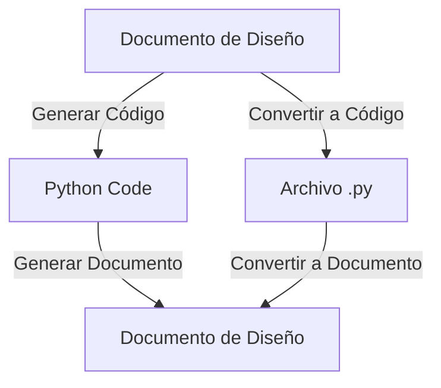

# Documento de Diseño para Funciones de Generación de Código y Documentación

## Resumen Ejecutivo
Este documento describe un conjunto de funciones implementadas en Python que utilizan la biblioteca DSPy para generar código Python a partir de documentos de diseño y viceversa. Las funciones están diseñadas para ser extensibles y permiten la inclusión de diagramas Mermaid en los documentos de diseño generados.

## Componentes Principales por Archivo/Directorio
- **dspy**: Biblioteca utilizada para la generación de código y documentos.
- **autocode.autocode.interfaces.registry**: Módulo para registrar funciones accesibles vía HTTP.
- **autocode.autocode.core.utils.file_utils**: Utilidades para la lectura y escritura de archivos.

## Flujos y Procesos Clave
1. **Generación de Código**: A partir de un documento de diseño, se genera código Python utilizando una firma de generación específica.
2. **Generación de Documentos de Diseño**: A partir de código Python, se genera un documento de diseño en formato Markdown.
3. **Conversión de Archivos**: Funciones para convertir archivos de diseño a código y viceversa, manejando la lectura y escritura de archivos.

## Dependencias y Relaciones
- **DSPy**: Utilizado para la generación de código y documentos mediante modelos de lenguaje.
- **OpenRouter**: Proveedor de modelos de lenguaje, configurado mediante una clave API.

## Gestión de Estado y Recursos
- Uso de variables de entorno para configurar la clave API necesaria para el acceso a los modelos de lenguaje.
- Manejo de contexto para evitar conflictos en tareas asíncronas.

## Artefactos de Entrada y Salida
- **Entrada**: Documentos de diseño en texto y código Python.
- **Salida**: Código Python generado y documentos de diseño en formato Markdown.

## Diagramas Mermaid

## Ejemplos de Uso
- `generate_python_code(design_text)`: Genera código Python a partir de un documento de diseño.
- `generate_design_document(python_code, include_diagrams)`: Genera un documento de diseño a partir de código Python.

## Manejo de Errores y Casos Límite
- Verificación de la configuración de la clave API.
- Manejo de excepciones para errores de archivo y errores inesperados.

## Consideraciones de Rendimiento y Escalabilidad
- Uso de contextos para evitar conflictos en tareas asíncronas.
- Diseño extensible para incorporar aprendizaje de pocos ejemplos en el futuro.

## Suposiciones y Limitaciones
- Se asume que la clave API está correctamente configurada en las variables de entorno.
- La generación de documentos y código depende de la disponibilidad del modelo de lenguaje.

## Estrategia de Testing
- Pruebas unitarias para verificar la correcta generación de código y documentos.
- Pruebas de integración para asegurar la correcta interacción entre componentes.

## Inventario de Tests
- Pruebas para la generación de código a partir de documentos de diseño.
- Pruebas para la generación de documentos de diseño a partir de código Python.
- Pruebas para la conversión de archivos y manejo de errores.